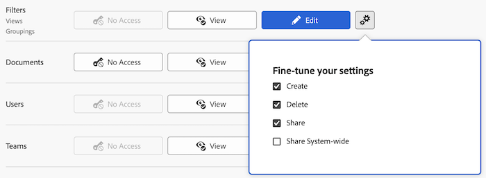

# 授予對篩選器、檢視和群組的存取權

身為Adobe Workfront管理員，您可以使用存取層級來定義使用者對清單與報告的篩選、檢視及群組控制項的存取權，如[存取層級概觀](../../../administration-and-setup/add-users/access-levels-and-object-permissions/access-levels-overview.md)中所述。

如需有關篩選、檢視和群組控制項的資訊，請參閱[報告元素：篩選、檢視和群組](../../../reports-and-dashboards/reports/reporting-elements/reporting-elements-filters-views-groupings.md)。

## 存取需求

+++ 展開以檢視本文中功能的存取需求。

您必須具有下列存取權才能執行本文中的步驟：

<table style="table-layout:auto"> 
 <col> 
 <col> 
 <tbody> 
  <tr> 
   <td role="rowheader">Adobe Workfront計畫</td> 
   <td>任何</td> 
  </tr> 
  <tr> 
   <td role="rowheader">Adobe Workfront授權</td> 
   <td>規劃</td> 
  </tr> 
  <tr> 
   <td role="rowheader">存取層級設定</td> 
   <td> 
您必須是Workfront管理員。
 
<b>注意</b>：如果您還是沒有存取權，請詢問您的Workfront管理員是否對您的存取層級設定了其他限制。 如需Workfront管理員如何修改存取層級的詳細資訊，請參閱<a href="../../../administration-and-setup/add-users/configure-and-grant-access/create-modify-access-levels.md" class="MCXref xref" data-mc-variable-override="">建立或修改自訂存取層級</a>。
 </td> 
  </tr> 
 </tbody> 
</table>

+++

## 使用自訂存取層級設定使用者對篩選器、檢視和群組的存取權

1. 開始建立或編輯存取層級，如[建立或修改自訂存取層級](../../../administration-and-setup/add-users/configure-and-grant-access/create-modify-access-levels.md)中所述。
1. 按一下篩選器右側檢視&#x200B;**或**&#x200B;編輯&#x200B;**按鈕上的齒輪圖示**，然後在&#x200B;**微調您的設定**&#x200B;下選取您要授與的功能。

   

   依預設，擁有「計畫」、「工作」、「稽核者」或「請求」授權的使用者具有完整的「檢視」和「編輯」功能。 擁有外部使用者授權的使用者無權存取篩選器、檢視和群組。

   <!--If this changes, undraft section with table below
   -->

1. （選擇性）若要針對您正在處理的存取層級中的其他物件與區域設定存取設定，請繼續使用[設定對Adobe Workfront的存取權](../../../administration-and-setup/add-users/configure-and-grant-access/configure-access.md)中所列的文章之一，例如[授與對工作的存取權](../../../administration-and-setup/add-users/configure-and-grant-access/grant-access-tasks.md)和[授與對財務資料的存取權](../../../administration-and-setup/add-users/configure-and-grant-access/grant-access-financial.md)。
1. 完成時，按一下&#x200B;**儲存**。

   建立存取層級後，您可以將其指派給使用者。 如需詳細資訊，請參閱[編輯使用者的設定檔](../../../administration-and-setup/add-users/create-and-manage-users/edit-a-users-profile.md)。

<!--## Access to filters, views, and groupings by license type

Drafting out this section for now because the table is redundant since all four license types can do everything.-->

此表格列出Workfront管理員可允許擁有每種授權型別的使用者對篩選器、檢視和群組執行的動作。 如需Workfront授權型別的相關資訊，請參閱[Adobe Workfront授權概觀](../../../administration-and-setup/add-users/access-levels-and-object-permissions/wf-licenses.md)。

<table style="table-layout:auto">
<col>
<col>
<col>
<col>
<col>
<thead>
<tr>
<th> 動作 </th>
<th> 規劃者 </th>
<th> 工作者 </th>
<th> 審閱者 </th>
<th> 請求者 </th>
</tr>
</thead>
<tbody>
<tr>
<td>編輯篩選器、檢視和群組</td>
<td>✓</td>
<td>✓</td>
<td>✓</td>
<td>✓</td>
</tr>
<tr>
<td>建立篩選器、檢視和群組</td>
<td>✓</td>
<td>✓</td>
<td>✓</td>
<td>✓</td>
</tr>
<tr>
<td>檢視篩選器、檢視和群組</td>
<td>✓</td>
<td>✓</td>
<td>✓</td>
<td>✓</td>
</tr>
<tr>
<td>刪除篩選器、檢視和群組</td>
<td>✓</td>
<td>✓</td>
<td>✓</td>
<td>✓</td>
</tr>
<tr>
<td>共用篩選器、檢視和群組</td>
<td>✓</td>
<td>✓</td>
<td>✓</td>
<td>✓</td>
</tr>
<tr>
<td>在整個系統內共用篩選器、檢視和群組</td>
<td>✓</td>
<td>✓</td>
<td>✓</td>
<td>✓</td>
</tr>
</tbody>
</table>
