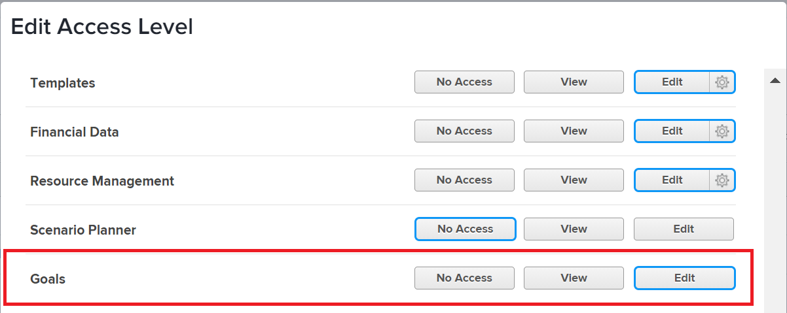

# 授予Adobe Workfront目標的存取權

身為Adobe Workfront管理員，您可以使用存取層級來定義使用者對Adobe Workfront目標的存取權，如[存取層級總覽](../../../administration-and-setup/add-users/access-levels-and-object-permissions/access-levels-overview.md)所述。

## 存取需求

您必須具備下列專案才能授與使用者存取Workfront目標的許可權：

<table style="table-layout:auto"> 
 <col> 
 <col> 
 <tbody> 
  <tr> 
   <td role="rowheader">Workfront計畫</td> 
   <td> 
Pro或更高
 </td> 
  </tr> 
  <tr> 
   <td role="rowheader">Adobe Workfront授權*</td> 
   <td>計劃</td> 
  </tr> 
  <tr> 
   <td role="rowheader">產品</td> 
   <td>Workfront Goals 
請連絡您的Workfront客戶經理，以瞭解Workfront Goals授權。 
 
Workfront目標僅在新的Adobe Workfront體驗中可用。
 </td> 
  </tr> 
  <tr> 
   <td role="rowheader">存取層級設定*</td> 
   <td> 
您必須擁有系統管理員存取層級。
 
<b>注意</b>：如果您還是沒有存取權，請詢問您的Workfront管理員是否對您的存取層級設定了其他限制。 如需Workfront管理員如何修改存取層級的詳細資訊，請參閱<a href="../../../administration-and-setup/add-users/configure-and-grant-access/create-modify-access-levels.md" class="MCXref xref" data-mc-variable-override="">建立或修改自訂存取層級</a>。
 </td> 
  </tr> 
 </tbody> 
</table>

&#42;若要瞭解您擁有的計畫、授權型別或存取層級，請連絡您的Workfront管理員。

如需存取Workfront目標的詳細資訊，請參閱[使用Workfront目標的需求](../../../workfront-goals/goal-management/access-needed-for-wf-goals.md)。

## 使用自訂存取層級授與使用者對Workfront目標的存取權

1. 開始建立或編輯存取層級，如[建立或修改自訂存取層級](../../../administration-and-setup/add-users/configure-and-grant-access/create-modify-access-levels.md)中所述。
1. 按一下您要用於此存取層級的&#x200B;**目標**&#x200B;右邊的選項。

   

   >[!NOTE]
   >
   >外部授權型別不允許檢視或編輯對Workfront目標的存取權。

1. （選擇性）若要針對您正在處理的存取層級中的其他物件與區域設定存取設定，請繼續使用[設定對Adobe Workfront的存取權](../../../administration-and-setup/add-users/configure-and-grant-access/configure-access.md)中所列的文章之一，例如[授與對工作的存取權](../../../administration-and-setup/add-users/configure-and-grant-access/grant-access-tasks.md)和[授與對財務資料的存取權](../../../administration-and-setup/add-users/configure-and-grant-access/grant-access-financial.md)。
1. 完成時，按一下&#x200B;**儲存**。

## 依授權型別存取Workfront目標

Workfront管理員可使用存取層級，將對Workfront目標的存取權授予具有計畫、工作、請求或檢閱授權的使用者。
