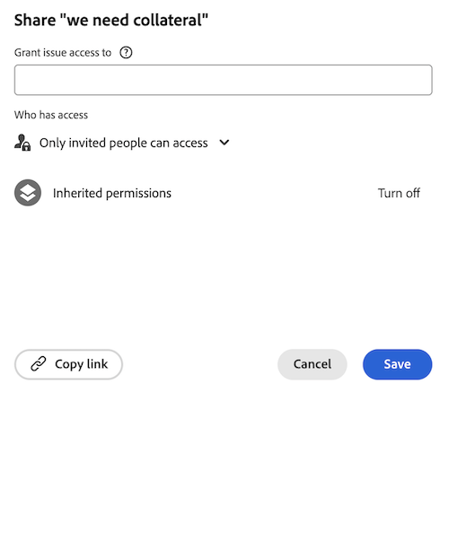

# 授予問題的存取權

身為Adobe Workfront管理員，您可以使用存取層級來定義使用者對問題的存取，如 [存取層級概觀](../../../administration-and-setup/add-users/access-levels-and-object-permissions/access-levels-overview.md).

如需使用自訂存取層級來管理使用者對Workfront中其他物件類型的存取權限的相關資訊，請參閱 [建立或修改自訂存取層級](../../../administration-and-setup/add-users/configure-and-grant-access/create-modify-access-levels.md).

## 存取需求

您必須具備下列存取權，才能執行本文中的步驟：

<table style="table-layout:auto"> 
 <col> 
 <col> 
 <tbody> 
  <tr> 
   <td role="rowheader">Adobe Workfront計畫</td> 
   <td>任何</td> 
  </tr> 
  <tr> 
   <td role="rowheader">Adobe Workfront授權</td> 
   <td>計劃</td> 
  </tr> 
  <tr> 
   <td role="rowheader">訪問級別配置</td> 
   <td> 
您必須是Workfront管理員。
 
<b>注意</b>:如果您仍無權存取，請洽詢您的Workfront管理員，他們是否在您的存取層級設定其他限制。 如需Workfront管理員如何修改您的存取層級的詳細資訊，請參閱 <a href="../../../administration-and-setup/add-users/configure-and-grant-access/create-modify-access-levels.md" class="MCXref xref" data-mc-variable-override="">建立或修改自訂存取層級</a>.
 </td> 
  </tr> 
 </tbody> 
</table>

## 使用自訂存取層級授予使用者問題的存取權

1. 開始建立或編輯存取層級，如 [建立或修改自訂存取層級](../../../administration-and-setup/add-users/configure-and-grant-access/create-modify-access-levels.md).
1. 按一下齒輪圖示  在 **檢視** 或 **編輯** 按鈕（位於「問題」右側），然後選擇要授予的功能 **微調您的設定**.

1. （可選）若要限制較高排名物件中問題的繼承權限，請按一下 **設定其他限制**，然後選取 **從不繼承項目、任務、問題等的文檔訪問**.

1. （可選）要配置您正在處理的訪問級別中其他對象和區域的訪問設定，請繼續以下文章之一列出： [設定Adobe Workfront的存取權](../../../administration-and-setup/add-users/configure-and-grant-access/configure-access.md)，例如 [授予任務的存取權](../../../administration-and-setup/add-users/configure-and-grant-access/grant-access-tasks.md) 和 [授予金融資料的存取權](../../../administration-and-setup/add-users/configure-and-grant-access/grant-access-financial.md).
1. 完成後，按一下 **儲存**.

   建立存取層級後，您可將其指派給使用者。 如需詳細資訊，請參閱 [編輯使用者的設定檔](../../../administration-and-setup/add-users/create-and-manage-users/edit-a-users-profile.md).

## 依授權類型存取問題

如需每個存取層級的使用者可針對問題執行哪些動作的相關資訊，請參閱區段 [問題](../../../administration-and-setup/add-users/access-levels-and-object-permissions/functionality-available-for-each-object-type.md#issues) 在文章中 [每種物件類型皆可使用的功能](../../../administration-and-setup/add-users/access-levels-and-object-permissions/functionality-available-for-each-object-type.md).

## 存取共用問題

作為問題的擁有者或建立者，您可以授予其他使用者權限，以與他們共用，如 [共用問題](../../../workfront-basics/grant-and-request-access-to-objects/share-an-issue.md).

<!--

If you make changes here, make them also in the "Grant access to" articles where this snippet had to be converted to text:

* reports, dashboards, and calendars

* financial data

* issue

-->

當您與其他使用者共用任何物件時，收件者對其的權利由兩項內容的組合所決定：

* 您授予物件收件者的權限
* 對象類型的收件人的訪問級別設定

此外，如果透過其存取層級允許，使用者可透過物件階層存取問題：如果使用者已擁有問題的上層專案或任務的權限，則也擁有問題的權限（請參閱上述步驟3）。 當您共用問題時，會看到擁有繼承權限的使用者清單。

