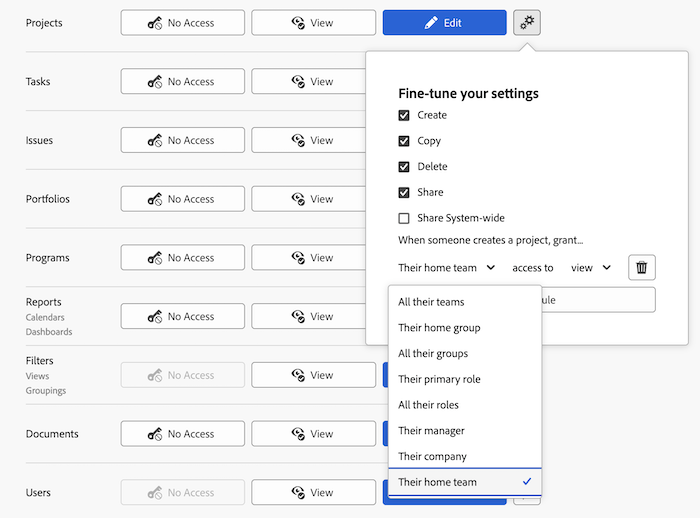

# 授予專案存取權

<!-- Audited: 12/2023 -->

身為Adobe Workfront管理員，您可以使用存取層級來定義使用者對專案的存取權，如下列文章所述：

* [存取層級概觀](../../../administration-and-setup/add-users/access-levels-and-object-permissions/access-levels-overview.md)
* [新存取層級概觀](/help/quicksilver/administration-and-setup/add-users/how-access-levels-work/access-level-overview.md)

如需使用自訂存取層級來管理使用者對Workfront中其他物件型別的存取的相關資訊，請參閱[建立或修改自訂存取層級](../../../administration-and-setup/add-users/configure-and-grant-access/create-modify-access-levels.md)。

## 存取需求

+++ 展開以檢視本文中功能的存取需求。

<table style="table-layout:auto"> 
 <col> 
 <col> 
 <tbody> 
  <tr> 
   <td role="rowheader">Adobe Workfront套件</td> 
   <td>任何</td> 
  </tr> 
    <tr> 
   <td role="rowheader">Adobe Workfront授權</td> 
   <td> 
標準

   
規劃

</td> 
  </tr> 
  <tr> 
   <td role="rowheader">存取層級設定</td> 
   <td> 
您必須是Workfront管理員。
 </td> 
  </tr> 
 </tbody> 
</table>

如需有關此表格的詳細資訊，請參閱Workfront檔案中的[存取需求](/help/quicksilver/administration-and-setup/add-users/access-levels-and-object-permissions/access-level-requirements-in-documentation.md)。

+++

## 使用自訂存取層級設定使用者對專案的存取權

1. 開始建立或編輯存取層級，如[建立或修改自訂存取層級](../../../administration-and-setup/add-users/configure-and-grant-access/create-modify-access-levels.md)中所述。
1. 按一下專案右側或&#x200B;**編輯**&#x200B;按鈕上的齒輪圖示&#x200B;**齒輪設定圖示**，然後在&#x200B;**微調您的設定**&#x200B;下選取您要授與的功能。

   

   >[!NOTE]
   >
   >* 擁有工作授權的使用者擁有有限的專案權利。 他們可以貢獻專案，但無法管理專案。
   >* 擁有「檢閱」授權的使用者擁有轉換問題專案的檢視許可權，但他們的檢視許可權有限。
   >* 如需使用者與他人共用專案時可授與的許可權相關資訊，請參閱[在Adobe Workfront中共用專案](../../../workfront-basics/grant-and-request-access-to-objects/share-a-project.md)。
   >* 當您為特定型別的物件設定存取層級設定時，該設定不會影響使用者存取排名較低的物件。 例如，您可以限制使用者刪除其存取層級的專案，但這不會限制他們刪除等級低於專案的工作。如需物件階層的詳細資訊，請參閱[瞭解Adobe Workfront中的物件](../../../workfront-basics/navigate-workfront/workfront-navigation/understand-objects.md#understanding-interdependency-and-hierarchy-of-objects)一文中的[相互依存性和物件階層](../../../workfront-basics/navigate-workfront/workfront-navigation/understand-objects.md)一節。

1. （選擇性）按一下[建立]選項右側的&#x200B;**設定共用預設值**，然後&#x200B;**新增規則**&#x200B;以新增新專案的共用規則。

   當具有此存取層級的使用者建立專案時，專案會自動與您於左側選單中選取的使用者共用。

   

   在右側的功能表中，您可指定您希望如何與這些使用者共用專案：

   

   >[!NOTE]
   >
   >如果具有此存取層級的使用者使用專案存取範本，範本會覆寫存取層級中的共用設定。 如需有關專案存取範本的資訊，請參閱[在Adobe Workfront中共用專案](../../../workfront-basics/grant-and-request-access-to-objects/share-a-project.md)。

   您可以重複此步驟，視需要為存取層級新增任意數量的專案共用規則。

1. 按一下X以關閉&#x200B;**微調您的設定**&#x200B;方塊。
1. （選擇性）若要針對您正在處理的存取層級中的其他物件與區域設定存取設定，請繼續使用[設定對Adobe Workfront的存取權](../../../administration-and-setup/add-users/configure-and-grant-access/configure-access.md)中所列的文章之一，例如[授與對工作的存取權](../../../administration-and-setup/add-users/configure-and-grant-access/grant-access-tasks.md)和[授與對財務資料的存取權](../../../administration-and-setup/add-users/configure-and-grant-access/grant-access-financial.md)。
1. 完成時，按一下&#x200B;**儲存**。

   建立存取層級後，您可以將其指派給使用者。 如需詳細資訊，請參閱[編輯使用者的設定檔](../../../administration-and-setup/add-users/create-and-manage-users/edit-a-users-profile.md)。

## 依授權型別存取報告、儀表板和行事曆

如需有關每個存取層級中的使用者可以對問題執行的資訊，請參閱文章[每個物件型別可用的功能](../../../administration-and-setup/add-users/access-levels-and-object-permissions/functionality-available-for-each-object-type.md#projects)中的[專案](../../../administration-and-setup/add-users/access-levels-and-object-permissions/functionality-available-for-each-object-type.md)小節。

## 共用專案的存取權

作為問題的擁有者或建立者，您可以授予其他使用者許可權來與其共用，如[在Adobe Workfront中共用專案](../../../workfront-basics/grant-and-request-access-to-objects/share-a-project.md)中所述。

<!--
If you make changes here, make them also in the "Grant access to" articles where this snippet had to be converted to text:
* reports, dashboards, and calendars
* financial data
* issue
-->

當您與另一個使用者共用任何物件時，收件者對該物件的權利取決於兩個專案的組合：

* 您授予收件者的物件許可權
* 收件者物件型別的存取層級設定
