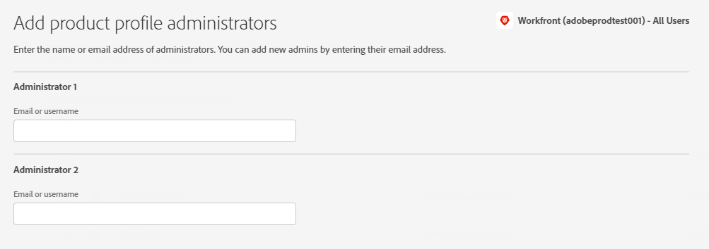

# 在Adobe Admin Console中管理使用者

<!--The highlighted information on this page refers to functionality not yet generally available. It is available only in the Preview environment for all customers. After the monthly releases to Production, the same features are also available in the Production environment for customers who enabled fast releases.    

For information about fast releases, see [Enable or disable fast releases for your organization](/help/quicksilver/administration-and-setup/set-up-workfront/configure-system-defaults/enable-fast-release-process.md). -->

>[!IMPORTANT]
>
>本文中的功能僅在貴組織的Workfront執行個體已上線至Adobe Business Platform時才能使用。
>
>如需根據貴組織是否已加入Adobe Business Platform而有所差異的程式清單，請參閱[以平台為基礎的管理差異(Adobe Workfront/Adobe Business Platform)](../../../administration-and-setup/get-started-wf-administration/actions-in-admin-console.md)。

身為Adobe管理員，您可以使用Adobe Admin Console建立Adobe Workfront系統管理員。 此主控台是管理整個組織中Adobe許可權的中央位置。 如需詳細資訊，請參閱[Admin Console概觀](https://helpx.adobe.com/tw/enterprise/using/admin-console.html)。

>[!NOTE]
>
>* 必須在Adobe Admin Console中設定&#x200B;**Workfront管理員。**&#x200B;如需相關資訊與指示，請參閱本文中的[使用Adobe Admin Console在Workfront中建立系統管理員](#create-system-administrators-in-workfront-with-the-adobe-admin-console)。
>* **如果您的組織使用單一登入(SSO)**，建議您在Adobe Admin Console中建立使用者並將其指派給Workfront。 您可以在Workfront中建立這些使用者，但根據您組織的Admin Console設定方式，將該資訊傳輸至Adobe Admin Console時可能會發生問題。
>  &#x200B;>   在Adobe Admin Console中建立使用者後，您可以在Workfront中設定使用者的資訊，例如指派角色、群組、團隊和存取層級。
>* **如果您的組織未使用單一登入(SSO)**，您可以直接在Workfront中新增非系統管理員使用者。 您可以在Adobe Admin Console中新增使用者，但若在Workfront中新增使用者，您可於建立使用者時設定其存取層級，藉此節省您的時間。

從Admin Console變更使用者的設定檔時，更新會新增到Workfront中使用者的系統活動索引標籤。 更新會顯示為「系統」所執行。 這是指Adobe Admin Console管理員，而非Workfront主要管理員。

## 存取需求

+++ 展開以檢視本文中功能的存取需求。

您必須具有下列存取權才能執行本文中的步驟：

<table style="table-layout:auto"> 
 <col> 
 </col> 
 <col> 
 </col> 
 <tbody> 
  <tr> 
   <td role="rowheader">Adobe Workfront計畫</td> 
   <td>任何</td> 
  </tr> 
  <tr> 
   <td role="rowheader">Adobe管理員許可權</td> 
   <td> 
您必須是貴組織之Adobe產品的產品設定檔管理員
 </td> 
  </tr> 
 </tbody> 
</table>

如需有關此表格的詳細資訊，請參閱Workfront檔案中的[存取需求](/help/quicksilver/administration-and-setup/add-users/access-levels-and-object-permissions/access-level-requirements-in-documentation.md)。

+++

## 先決條件

在使用適用於Workfront的Admin Console之前，您應該會收到一封邀請您加入主控台的電子郵件。

1. 如果您是初次使用Adobe，而且已收到一封電子郵件，告知您現在擁有管理貴組織的Adobe軟體和服務之許可權，請按一下電子郵件中的按鈕，以建立Adobe帳戶並開啟Admin Console。

   或

   如果您已有Adobe帳戶，請前往[Adobe Admin Console頁面](https://adminconsole.adobe.com/)。

## 有關Adobe Admin Console的其他詳細資料

* Workfront系統管理員可以從Workfront中停用Workfront使用者，但這不會在Admin Console中停用使用者。

  <!--
  
For information about deactivating a user in Workfront, see 

  -->

* 使用者&#x200B;**主群組**&#x200B;是根據建立它們的使用者來決定。 您無法在Admin Console中自訂此專案。
* Workfront系統管理員存取層級只能從Adobe Admin Console內編輯。

  <!--
  DRAFTED IN FLARE:
  How is this done?
  
  -->

* 將使用者從系統管理員的存取權變更為任何其他存取層級，必須先透過Admin Console完成。

  <!--
   This is not clear
  -->

* 若要從Workfront中的使用者移除系統管理員存取權，您必須使用Adobe Admin Console移除作為產品設定檔管理員的使用者。 這會將使用者的Workfront存取層級從系統管理員變更為請求者。

  >[!IMPORTANT]
  >
  >請勿對產品設定檔本身進行任何變更。

* Adobe Admin Console管理員可設定自動指派規則，以自動化將Adobe產品指派給組織內使用者的程式。 您的組織必須移轉至Adobe Unified Experience才能使用此功能。 如需詳細資訊與指示，請參閱Adobe檔案中的[管理自動指派規則](https://helpx.adobe.com/tw/enterprise/using/automatic-assignment-rules.html)。

  >[!NOTE]
  >
  >如果您在設定自動指派時選取受信任的組織，則可在「使用者」的「選取的目錄」或「網域」區域中找到該組織。 按一下&#x200B;**選取目錄**&#x200B;欄位旁的下拉箭頭，然後選取組織。 受信任的組織會標示「受信任」徽章。

## 存取您的Workfront生產執行個體的使用者和管理區域 {#access-the-user-and-admin-area-for-your-production-instance-of-workfront}

1. 從[Adobe Admin Console頁面](https://adminconsole.adobe.com/)，選取頂端導覽列中的&#x200B;**產品**&#x200B;索引標籤，然後選取&#x200B;**Workfront**。

   <!---->

1. 在顯示的清單中，選取頂端的連結。

   這是您的使用者所在的生產執行個體。

   <!---->

   >[!TIP]
   >
   >清單中的第二個連結（您的預覽執行個體）是複製您的即時生產環境的測試環境。 如需詳細資訊，請參閱[Adobe Workfront預覽沙箱環境](../../../administration-and-setup/set-up-workfront/workfront-testing-environments/wf-preview-sandbox-environment.md)。
   >
   >
   >您也可能在清單中看到沙箱環境的連結。 如需詳細資訊，請參閱[Adobe Workfront預覽沙箱環境](../../../administration-and-setup/set-up-workfront/workfront-testing-environments/wf-preview-sandbox-environment.md)。

1. 在顯示的清單中，選取&#x200B;**產品設定檔**&#x200B;索引標籤後，按一下Workfront產品設定檔連結的名稱。

   

   此清單包含已指派給您的Workfront生產執行個體的所有使用者。

   >[!IMPORTANT]
   >
   >請勿對產品設定檔本身進行任何變更。

1. 請繼續閱讀本文中下列其中一節：

   * [使用Adobe Admin Console在Workfront中建立使用者](#create-users-in-workfront-with-the-adobe-admin-console)
   * [使用Adobe Admin Console在Workfront中建立系統管理員](#create-system-administrators-in-workfront-with-the-adobe-admin-console)

## 使用Adobe Admin Console在Workfront中建立系統管理員 {#create-system-administrators-in-workfront-with-the-adobe-admin-console}

<!--Audited: 12/2023-->

系統管理員存取層級僅在Adobe Admin Console上授予。 您無法從Workfront中授與或移除管理員存取權。

您必須先將使用者新增到Workfront的生產執行個體，然後才能將使用者設為Workfront系統管理員。

1. 依照本文中[存取您Workfront生產執行個體的使用者和管理區域](#access-the-user-and-admin-area-for-your-production-instance-of-workfront)一節中的說明，前往Admin Console的使用者和管理區域。
1. 選取使用者清單上方的&#x200B;**管理員**&#x200B;索引標籤。
1. 選取&#x200B;**新增管理員**。
1. 在&#x200B;**新增產品設定檔管理員**&#x200B;方塊中，輸入您要新增的管理員電子郵件地址或名稱，然後選取&#x200B;**儲存**。

   

   系統管理員是在Workfront中建立。

   >[!IMPORTANT]
   >
   >請勿對產品設定檔本身進行任何變更。

## 使用Adobe Admin Console在Workfront中建立使用者 {#create-users-in-workfront-with-the-adobe-admin-console}

>[!NOTE]
>
>我們建議直接在Workfront中新增非系統管理員使用者。 您可以在Adobe Admin Console中新增使用者，但若在Workfront中新增使用者，您可於建立使用者時設定其存取層級，藉此節省您的時間。

* [直接在Adobe Admin Console的Workfront中建立使用者](#create-users-in-workfront-directly-in-the-adobe-admin-console)
* [在Workfront中建立使用者並核准他們用於Adobe Admin Console](#create-users-in-workfront-and-approve-them-for-the-adobe-admin-console)

### 直接在Adobe Admin Console的Workfront中建立使用者

1. 依照本文中[存取您Workfront生產執行個體的使用者和管理區域](#access-the-user-and-admin-area-for-your-production-instance-of-workfront)一節中的說明，前往Admin Console的使用者和管理區域。
1. 在清單上方選取&#x200B;**使用者**&#x200B;索引標籤後，選取&#x200B;**新增使用者**。
1. 在&#x200B;**將使用者新增至此產品設定檔**&#x200B;方塊中，輸入您要新增的使用者的電子郵件地址或名稱，然後選取&#x200B;**儲存**。

   視您組織的Workfront套件而定，使用者是在Workfront中建立的，具有請求者或貢獻者存取層級。

   >[!IMPORTANT]
   >
   >請勿對產品設定檔本身進行任何變更。

1. 在Workfront中，變更使用者的存取層級。

   如需Workfront管理員如何變更使用者存取層級的指示，請參閱[編輯使用者設定檔](../../../administration-and-setup/add-users/create-and-manage-users/edit-a-users-profile.md)。

1. 重複步驟3和4以新增更多使用者。

   >[!NOTE]
   >
   >Admin Console會向新Adobe使用者傳送電子郵件，邀請他們完成註冊程式。 所有使用者都必須完成註冊程式，才能存取任何Adobe應用程式。
   >
   >對於現有的Adobe使用者，使用者可能會收到也可能不會收到有關Workfront可用性的電子郵件。 這是由Adobe管理員控制的產品偏好設定。 您的Adobe管理員可能與Workfront管理員不同。

### 在Workfront中建立使用者並核准他們用於Adobe Admin Console

此工作流程可讓沒有Adobe Admin Console存取許可權的群組管理員建立使用者。

首先，群組管理員會在Workfront中建立使用者。 這會建立處於已停用和待核准狀態的使用者。

接著，Workfront管理員會核准使用者。 這會在Workfront中啟動使用者，並將他們新增至Adobe Admin Console。

#### 在Workfront中建立使用者（群組管理員）

如需在Workfront中建立使用者的指示，請參閱[新增使用者](/help/quicksilver/administration-and-setup/add-users/create-and-manage-users/add-users.md)。

#### 核准使用者(Workfront管理員)

若要核准使用者，請執行下列動作：

{{step-1-to-users}}

1. 選取使用者，然後按一下&#x200B;**更多**&#x200B;圖示。

1. 若要核准使用者，請按一下[核准]。**&#x200B;**，然後按一下[提交]。**&#x200B;**

   或

   若要拒絕使用者並從Workfront刪除使用者，請按一下[拒絕] **，然後按一下[提交]**&#x200B;**。**

   已核准的使用者會自動新增至Adobe Admin Console。

   遭拒絕的使用者會自動從Workfront中刪除。

## 在Adobe Admin Console中編輯現有使用者

您可以在Adobe Admin Console中編輯下列使用者詳細資訊：

* 與使用者相關聯的使用者群組和產品
* 管理許可權
* 國家/地區

如需有關在Adobe Admin Console中編輯單一使用者的資訊，請參閱Adobe檔案中個別管理使用者一文中的[編輯使用者詳細資料](https://helpx.adobe.com/tw/enterprise/using/manage-users-individually.html#edit-user-details)。

如需在Adobe Admin Console中大量編輯使用者的詳細資訊，請參閱
在Adobe檔案中管理多個使用者一文中的[編輯使用者詳細資料](https://helpx.adobe.com/tw/enterprise/using/bulk-upload-users.html#edit-user-details)。
<!--

&nbsp;

&nbsp;

&nbsp;

You can create Adobe Workfront users and system administrators with the <a href="https://adminconsole.adobe.com/" alt="Admin Console link">Adobe Admin Console</a>. The console is a central location for managing the Adobe entitlements across your organization. For more information, see the <a href="https://helpx.adobe.com/tw/enterprise/using/admin-console.html" alt="Admin Console Overview">Admin Console Overview</a>.

Before using the Admin Console for Workfront, you should receive a receive an email inviting you to the console. Click in the invitation to accept it and create an account. You can also use an existing account, if already available.

<h2>Create users</h2>

Create users in WF with the Adobe admin console

-->

<!--

May need to add something about oging throug WF -- check with Jonah

To create users in Workfront with the Admin Console:

<ol>
<li value="1"> 
From the <a href="https://adminconsole.adobe.com/">Admin Console page</a>, select the <b>Products</b> tab and then select the <b>Workfront</b> product tile.
 </li>
<li value="2"> 
Select the link to the Workfront instance you want to change.
 </li>
<li value="3"> 
Select the Product profile link. This shows a list of the currently-assigned users. If the list is very long, you can also search for users in the search field above the list.
 </li>
<li value="4"> 
Select the <b>Add User</b> button.
 </li>
<li value="5"> 
In the <b>Add users</b> box, enter the email address or name of the user you want to add. Select <b>Save</b>. The administrator is created in Workfront with <b>Requestor</b> access level.
 </li>
</ol>
<h2>Create system administrators</h2>

To create system administrators:

<ol>
<li value="1"> 
Make product profile assignments first. To be a Workfront System Administrator, the user must be assigned the Workfront product profile and be an admin for that product profile.
 </li>
<li value="2"> 
From the console, select the <b>Products</b> tab and then select the <b>Admins</b> tab. 
 </li>
<li value="3"> 
Select <b>Add Admin</b>.
 </li>
<li value="4"> 
In the <b>Add product profile administrators</b> box, enter the email address or name of the administrator you want to add. Select <b>Save</b>. The user is created in Workfront with <b>Requestor</b> access level.
 </li>
</ol>
<h2>Additional details for the Admin Console</h2>
<ul>
<li> 
System Administrator access level is granted only on the Admin Console. You cannot grant or remove admin access from within Workfront.
 </li>
</ul>
<ul>
<li> 
Creating and deleting users inside Workfront is only possible through the Admin Console.
 </li>
<li> 
Workfront System Administrators can deactivate Workfront users from within Workfront, but this does not deactivate the user in the Admin Console.
 </li>
<li> 
All new users are are assigned <b>Requestor</b> access level upon creation. Also, the user <b>Home Group</b> is determined based on the user who created them. This is currently not customizable from within the Admin Console.
 </li>
<li> 
The Workfront System Administrator access level can only be edited from within the Adobe Admin Console.
 </li>
<li> 
Editing a user who is a system admin to any other access level must be done through the Admin Console first.
 </li>
<li> 
To remove Workfront system admin access, remove users as Product Profile Administrators. This action changes the user access level in Workfront from a system admin to a <b>Requestor</b>.
 </li>
</ul>

-->
