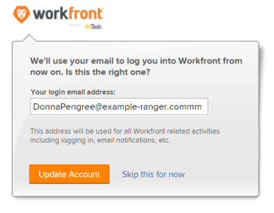

# 變更自動布建使用者的密碼

當您透過自動布建建立使用者時，Adobe Workfront會為使用者名稱指派一個GUID （全域唯一識別碼）。 GUID是隨機數字和字母的唯一字串，例如&#x200B;*5489cb430012526e1ea635e8c29f377f*。

通常，當新使用者嘗試變更其臨時密碼時，他們會輸入其電子郵件地址作為使用者名稱，並收到錯誤使用者名稱錯誤。 使用者若要變更密碼，必須輸入系統指派的使用者名稱（即GUID）。

由於GUID使用者名稱可能很難使用，建議您先將使用者的使用者名稱變更為其Workfront郵件地址，然後允許他們變更密碼。

>[!TIP]
>
>您可以透過下列方式找到使用者的GUID：
>
>* 前往使用者的設定檔，並從瀏覽器的URL複製GUID。
>
>  例如，在URL `https://acme.workfront.com/user/61941ab1000af22d7104628efa1c738b/details`中，您會複製最後兩個正斜線之間的數字與字母字串： `61941ab1000af22d7104628efa1c738b`。
>
>  如需詳細資訊，請參閱[編輯使用者的設定檔](../../../administration-and-setup/add-users/create-and-manage-users/edit-a-users-profile.md)。
>
>* 使用「使用者> GUID」欄建立使用者報表。 如需詳細資訊，請參閱[建立報告](../../../reports-and-dashboards/reports/creating-and-managing-reports/create-report.md)。
>
>* 查詢Workfront API。
>

## 存取需求

+++ 展開以檢視本文中功能的存取需求。

<table style="table-layout:auto"> 
 <col> 
 <col> 
 <tbody> 
  <tr> 
   <td>Adobe Workfront套件</td> 
   <td><p>任何</p></td> 
  </tr> 
  <tr> 
   <td>Adobe Workfront授權</td> 
   <td><p>標準</p>
       <p>規劃</p></td>
  </tr> 
  <tr> 
   <td>存取層級設定</td> 
   <td>系統管理員</td> 
  </tr> 
 </tbody> 
</table>

如需詳細資訊，請參閱Workfront檔案中的[存取需求](/help/quicksilver/administration-and-setup/add-users/access-levels-and-object-permissions/access-level-requirements-in-documentation.md)。

+++

## 變更自動布建使用者的密碼

1. 傳遞API要求以判斷使用者的GUID使用者名稱，如下列範例所示：

   https://`<domain>`.my.workfront.com/attask/api/v14.0/USER/search?fields=username&amp;ID=`<ID of User>`其中&#x200B;*`<domain>`*&#x200B;是您公司的網域，*`<ID of User>`*&#x200B;是使用者的Workfront ID。

   您會收到類似下列的回應：

   

   「使用者名稱」的傳回是使用者的GUID。

1. 使用其GUID作為使用者名稱，變更使用者的密碼。

   如需變更密碼的詳細資訊，請參閱[重設密碼](../../../workfront-basics/manage-your-account-and-profile/managing-your-workfront-account/reset-your-password.md)。

   如果您的組織使用SSO系統，只有Workfront系統管理員可以變更使用者的密碼。 如需詳細資訊，請參閱[Adobe Workfront單一登入的概觀](../../../administration-and-setup/add-users/single-sign-on/sso-in-workfront.md)

1. 使用者登入Workfront後，即可導覽至：

```
   https://<your domain>.my.workfront.com/login/convertUsername
```

1. 在&#x200B;**您的登入電子郵件地址**&#x200B;方塊中，驗證使用者的電子郵件地址是否正確，然後按一下&#x200B;**更新帳戶**。

   

   使用者的使用者名稱已變更為其Workfront電子郵件地址。

>[!TIP]
>
>若要尋找使用者的ID：
>
>1. 按一下Adobe Workfront右上角的&#x200B;**主功能表**&#x200B;圖示，然後按一下&#x200B;**使用者** 。
>
>1. 選取使用者。
>
>   使用者的設定檔頁面隨即開啟，其使用者ID會顯示在URL中。
>
