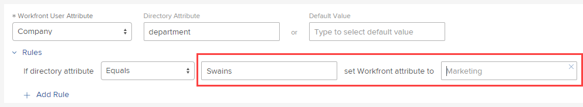

# 映射用戶屬性並自動布建新用戶

使用單一登入(SSO)，您可以將屬性從身分提供者的Active Directory傳遞給Adobe Workfront使用者。 您也可以使用自動布建選項（也稱為「準時布建」或JIT），將新使用者新增至Workfront。

>[!NOTE]
>
>如果您的組織已上線至Adobe Admin Console，則無法使用此功能。 如需詳細資訊，請洽詢您的網路或IT管理員。

## 存取需求

您必須具備下列存取權，才能執行本文中的步驟：

<table style="table-layout:auto"> 
 <col> 
 <col> 
 <tbody> 
  <tr> 
   <td role="rowheader">Adobe Workfront計畫</td> 
   <td>任何</td> 
  </tr> 
  <tr> 
   <td role="rowheader">Adobe Workfront授權</td> 
   <td>計劃</td> 
  </tr> 
  <tr> 
   <td role="rowheader">訪問級別配置</td> 
   <td> 
您必須是Workfront管理員。
 
<b>注意</b>:如果您仍無權存取，請洽詢您的Workfront管理員，他們是否在您的存取層級設定其他限制。 如需Workfront管理員如何修改您的存取層級的詳細資訊，請參閱 <a href="../../../administration-and-setup/add-users/configure-and-grant-access/create-modify-access-levels.md" class="MCXref xref">建立或修改自訂存取層級</a>.
 </td> 
  </tr> 
 </tbody> 
</table>

## 對應屬性的提示

對應屬性時，請牢記下列事項：

* 一律在「預覽」沙箱或「客戶重新整理(CR)」沙箱中測試。
* 使用管理員帳戶和非管理員帳戶進行測試，以確認您正在正確對應屬性。
* 每次使用者透過SSO登入Workfront時，屬性都會對應，而不只是在自動布建期間。

## 映射用戶屬性並自動布建新用戶

1. 按一下 **主菜單** 圖示  在Adobe Workfront的右上角，然後按一下 **設定** .

1. 按一下 **系統** > **單一登入(SSO)**.

1. 在 **類型** 下拉式清單，按一下 **SAML 2.0**.

1. 按一下 **映射用戶屬性**.

   

1. （可選）如果您希望Workfront自動從Active Directory建立新用戶，請按一下 **自動布建用戶**.

   此功能需要屬性對應。

1. 在顯示的選項列中，對應您為Workfront使用者所需的屬性。

   您可以映射地址、經理、工作角色、家庭組等屬性。

   屬性映射在1:1比率下工作。 例如，您無法設定使用者所屬的每個群組；您只能為每位使用者設定一個。

   >[!IMPORTANT]
   >
   >每個使用者都需要下列屬性：
   >      
   >* 名字
   >* 姓氏
   >* 電子郵件位址

   >      
   >我們不建議在屬性映射中映射訪問級別。 若有此設定，請務必留意設定預設值的時機，以確保不會不慎移除「管理員存取」。

   下表說明了可用於映射屬性的欄位：

   <table style="table-layout:auto"> 
    <col data-mc-conditions=""> 
    <col data-mc-conditions=""> 
    <tbody> 
     <tr> 
      <td role="rowheader">Workfront 使用者屬性</td> 
      <td>選擇要映射的屬性名稱</td> 
     </tr> 
     <tr> 
      <td role="rowheader">目錄屬性</td> 
      <td>輸入您要使用的SSO屬性標籤。/td&gt; 
     </tr> 
     <tr> 
      <td role="rowheader">預設值</td> 
      <td> 
選擇「Workfront用戶屬性」後，如果連接期間的值為NULL，則此欄位將填入系統中相應的預設值。 只有在您打算套用屬性對應規則時，才在此處輸入值（請參閱步驟7）。 預設值可作為這些規則的例外。</td> 
     </tr> 
    </tbody> 
   </table>

1. （選用）按一下 **規則** 新增規則至屬性。

   1. 在下拉式清單中，選擇您要使用的屬性修飾元。
   1. 在右側的2個欄位中，輸入目錄屬性值以及要替換它的值。

      
   您可以按一下 **新增規則** 新增更多規則至屬性。

1. （選用）若要對應更多使用者屬性，請按一下 **新增對應** 重複步驟6-7。
1. 按一下&#x200B;**儲存**。
