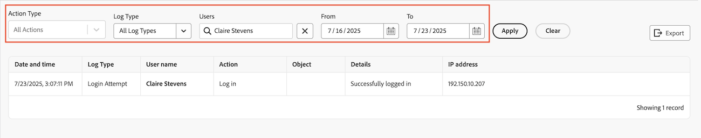

# 檢視和匯出稽核記錄

<!--
**DON'T DELETE, DRAFT OR HIDE THIS ARTICLE. IT IS LINKED TO THE PRODUCT, THROUGH THE CONTEXT SENSITIVE HELP LINKS. **
-->

您可以檢視系統中的所有稽核記錄，或符合特定篩選條件的稽核記錄。 您也可以匯出稽核記錄。

稽核記錄列出過去90天內系統中觸發的使用者變更。

如需有關所有稽核記錄型別及其產生原因的資訊，請參閱[稽核記錄](../../../administration-and-setup/add-users/create-and-manage-users/audit-logs.md)。

## 存取需求

+++ 展開以檢視本文中功能的存取需求。

您必須具有下列存取權才能執行本文中的步驟：

<table style="table-layout:auto"> 
 <col> 
 <col> 
 <tbody> 
  <tr> 
   <td role="rowheader">Adobe Workfront計畫</td> 
   <td>任何</td> 
  </tr> 
  <tr> 
  <tr> 
   <td role="rowheader">Adobe Workfront授權</td> 
   <td>
新增：標準

       
或

       
目前：計畫
</td>
  </tr> 
  </tr> 
  <tr> 
   <td role="rowheader">存取層級設定</td> 
   <td>[！UICONTROL系統管理員]</td>
  </tr> 
 </tbody> 
</table>

如需有關此表格的詳細資訊，請參閱Workfront檔案中的[存取需求](/help/quicksilver/administration-and-setup/add-users/access-levels-and-object-permissions/access-level-requirements-in-documentation.md)。

+++

## 檢視稽核記錄

{{step-1-to-setup}}

1. 在左側面板中，按一下&#x200B;**系統>稽核記錄**。
1. 在&#x200B;**記錄型別**&#x200B;下拉式功能表中，選取您要檢視的稽核記錄型別。

   依預設會選取&#x200B;**所有記錄型別**。

   如需您可以檢視的所有稽核記錄型別清單，以及它們包含的資訊，請參閱[稽核記錄](../../../administration-and-setup/add-users/create-and-manage-users/audit-logs.md)。

1. （選用）設定任何可用的篩選器。

   >[!NOTE]
   >
   >「動作型別」下拉式功能表中的選項會依選取的稽核記錄而有所不同。

   

1. 按一下&#x200B;**套用**。
1. （選擇性）按一下&#x200B;**清除篩選器**&#x200B;以重設對篩選器所做的變更。

## 匯出稽核記錄

{{step-1-to-setup}}

1. 在左側面板中，按一下&#x200B;**系統>變更追蹤>稽核記錄**。

1. 在&#x200B;**記錄型別**&#x200B;下拉式功能表中，選取稽核記錄。

   依預設會選取&#x200B;**所有記錄型別**。

1. 設定任何可用的篩選器，然後按一下&#x200B;**套用**。

   >[!IMPORTANT]
   >
   >您無法一次匯出超過50,000個記錄。 Workfront會根據您設定的篩選器匯出記錄，而不是根據頁面上顯示的記錄數量。 您可以在頁面的右下角檢視篩選的記錄總數。

1. 按一下&#x200B;**匯出**。
