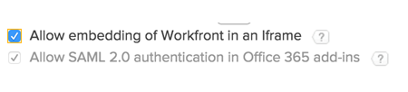

# 啟用Outlook以搭配Workfront和SAML 2.0使用

>[!IMPORTANT]
>
>[Microsoft正在停用對舊版Exchange Online權杖](https://learn.microsoft.com/en-us/office/dev/add-ins/outlook/faq-nested-app-auth-outlook-legacy-tokens)的支援，Workfront Outlook增益集目前使用這些權杖進行驗證。 Microsoft的這項變更已開始影響客戶，並將在2025年10月前持續分階段推出。
>
>* **在Microsoft完全停用這些Token後，適用於Microsoft Outlook整合的Workfront將無法繼續運作。**
>
>在這次變更中，Microsoft已決定變更代號重新啟用的方式。 在&#x200B;**2025年6月30日**&#x200B;之後，管理員將無法再自行重新啟用權杖 — 只有Microsoft支援可授予例外狀況。 **在2025年10月1日，所有租使用者的舊版代號將會關閉。 將不會授與例外。**

如果您啟用SAML 2.0驗證，並且希望使用者能夠使用他們的SAML 2.0憑證從Microsoft Outlook登入Workfront，您必須啟用SAML 2.0才能在Office增益集中進行驗證。

>[!NOTE]
>
>如果您組織的Workfront執行個體使用自訂SSO入口網站，則無法使用此選項。>
><!--
>or is enabled with Adobe IMS>
>-->
>如需詳細資訊，請洽詢您的網路或IT管理員。

## 存取需求

+++ 展開以檢視本文中功能的存取需求。

<table style="table-layout:auto"> 
 <col> 
 <col> 
 <tbody> 
  <tr> 
   <td role="rowheader">Adobe Workfront套件</td> 
   <td>
任何
</td> 
  </tr> 
  <tr> 
   <td role="rowheader">Adobe Workfront授權</td> 
   <td>
標準

規劃
</td> 
  </tr> 
  <tr> 
   <td role="rowheader">存取層級設定</td> 
   <td> 
您必須是Workfront管理員。
 
 </td> 
  </tr> 
 </tbody> 
</table>

如需詳細資訊，請參閱Workfront檔案中的[存取需求](/help/quicksilver/administration-and-setup/add-users/access-levels-and-object-permissions/access-level-requirements-in-documentation.md)。

+++

## 啟用Outlook以搭配Workfront和SAML 2.0使用

{{step-1-to-setup}}

1. 按一下&#x200B;**系統** > **偏好設定**。

1. 在&#x200B;**安全性**&#x200B;區段中，確定已啟用&#x200B;**允許Office 365增益集中的SAML 2.0驗證**。

   此選項可將Workfront內嵌在僅適用於Office 365增益集的Iframe中。 這不會開啟點選劫持漏洞，因為其中沒有可點按的內容。

   此選項預設為啟用。

   >[!NOTE]
   >
   >如果啟用選項&#x200B;**允許在iframe中內嵌Workfront**，則選項&#x200B;**允許Office 365增益集中的SAML 2.0驗證**&#x200B;會變暗並啟用。
   >
   >
   >

1. 按一下「**儲存**」。

   您在這裡儲存的變更會影響Workfront中所有使用者的體驗。
