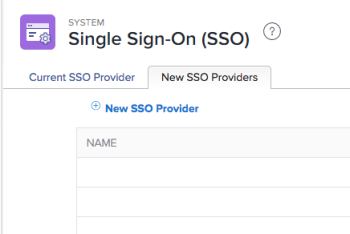

# 使用增強驗證時，更新IDP中的SAML 2.0中繼資料

<!-- enhanced authentication is no longer available for workfront customers -->

{{important-admin-console-onboard}}

身為Adobe Workfront管理員，您可以將Workfront單一登入(SSO)與任何支援安全斷言標籤語言(SAML)2.0通訊協定的身分提供者整合。

以下小節將您的Workfront帳戶升級至增強的驗證體驗（尚未開放所有組織使用）時，說明整合程式。 如需增強驗證體驗的詳細資訊，請參閱 [增強驗證概觀](../../../administration-and-setup/manage-workfront/security/get-started-enhanced-authentication.md).

如需在移轉至增強驗證體驗之前設定SAML的相關資訊，請參閱 [在您的身分提供者中更新SAML 2.0中繼資料](../../../administration-and-setup/add-users/single-sign-on/update-saml-2-metadata-ip.md).

## 存取需求

您必須具備下列存取權，才能執行本文中的步驟：

<table style="table-layout:auto"> 
 <col> 
 <col> 
 <tbody> 
  <tr> 
   <td role="rowheader">Adobe Workfront計畫</td> 
   <td>任何</td> 
  </tr> 
  <tr> 
   <td role="rowheader">Adobe Workfront授權</td> 
   <td>計劃</td> 
  </tr> 
  <tr> 
   <td role="rowheader">訪問級別配置</td> 
   <td> 
您必須是Workfront管理員。
 
<b>注意</b>:如果您仍無權存取，請洽詢您的Workfront管理員，他們是否在您的存取層級設定其他限制。 如需Workfront管理員如何修改您的存取層級的詳細資訊，請參閱 <a href="../../../administration-and-setup/add-users/configure-and-grant-access/create-modify-access-levels.md" class="MCXref xref">建立或修改自訂存取層級</a>.
 </td> 
  </tr> 
 </tbody> 
</table>

## 使用Okta作為身分提供者

Okta是支援SAML 2.0的身分提供者範例。本節說明如何使用Okta作為身分提供者。 設定支援SAML 2.0的其他身分提供者時，也需執行類似步驟。

>[!NOTE]
>
>使用者會根據其電子郵件地址進行對應。 若要使用Okta登入Workfront，您必須在您的Workfront客戶中建立一個電子郵件地址相同（不區分大小寫）的使用者。

完成下列章節，將Okta設為Workfront中的身分提供者。

* [在Okta中建立Workfront應用程式](#create-a-workfront-app-in-okta)
* [在Workfront中將您的Okta例項新增為身分提供者](#add-your-okta-instance-as-an-identity-provider-in-workfront)

### 在Okta中建立Workfront應用程式 {#create-a-workfront-app-in-okta}

1. 登入您的Okta環境。
1. 確保 **傳統UI** 在Okta介面的左上角中選取。
1. 在功能表中，按一下 **應用程式** > **應用程式**.

1. 按一下 **添加應用程式**，然後按一下 **建立新應用程式**.

1. 在 **建立新的應用程式整合對話框** 框，選擇 **SAML 2.0**，然後按一下 **建立**.

1. 指定Workfront應用程式的名稱，然後按一下 **下一個**.
1. 在顯示的「SAML設定」頁面中，找出「SAML設定」頁面所需的資訊：

   1. 若不退出顯示Okta介面的瀏覽器標籤，請開啟個別的瀏覽器標籤或視窗。
   1. 在瀏覽器中指定下列URL:

      `https://[your_customer_subdomain].my.workfront.com/auth/saml2/metadata`

   1. 在產生的XML檔案中，識別 **entityID** 和 **位置**.

      

   1. 從 **entityID** 欄位至系統剪貼簿。 請勿關閉此瀏覽器標籤。

1. 返回您在步驟6中開啟的SAML設定頁面。
1. 從 **entityID** 欄位 **對象URI（SP實體ID）** 欄位。

1. 在其他瀏覽器標籤的XML檔案中，從 **位置** 欄位。
1. 從 **位置** 欄位 **單一登入** **URL** 欄位。

1. 捲動至 **屬性陳述式（可選）** 區段。
1. 在 **名稱** 欄位，指定 **電子郵件**.

1. 在 **值** 欄位，指定 **user.email**.

1. （選用）新增任何進階值。
1. 按一下 **下一個**.
1. 選擇， **我是Okta客戶，新增內部應用程式**，然後按一下 **完成**.

### 在Workfront中將您的Okta例項新增為身分提供者 {#add-your-okta-instance-as-an-identity-provider-in-workfront}

此程式提供在Workfront中將Okta設為身分提供者的基本資訊。 如需其他對應或設定選項的詳細資訊，請參閱 [使用SAML 2.0設定Adobe Workfront](../../../administration-and-setup/add-users/single-sign-on/configure-workfront-saml-2.md).

1. 下載Okta例項的身分提供者中繼資料：

   1. 登入您的Okta環境。
   1. 確保 **傳統UI** 在Okta介面的左上角中選取。
   1. 在功能表中，按一下 **應用程式** > **應用程式**.

   1. 按一下您建立的Workfront應用程式，如一節所述 [在Okta中建立Workfront應用程式](#create-a-workfront-app-in-okta)
   1. 在 **登入** 按一下 **身分提供者中繼資料**.

      

      在新的瀏覽器索引標籤中，中繼資料會以XML開啟。

   1. 複製瀏覽器URL欄位中顯示的URL。

1. 以Workfront管理員身分登入Workfront。
1. 按一下 **主菜單** 圖示  在Adobe Workfront的右上角，然後按一下 **設定** .

1. 在左側面板中，按一下 **系統** > **單一登入(SSO)**.

1. （條件性）如果您看見兩個標籤，請按一下 **新的SSO提供程式** 標籤。

   

   >[!IMPORTANT]
   >
   >請勿刪除 **當前SSO提供程式** 索引標籤，直到帳戶更新為增強的驗證體驗，且新的SSO設定已完全運作為止。

1. 按一下 **新的SSO提供程式**.
1. 指定名稱，例如Okta IDP，然後指定說明。
1. 在 **從身分提供者中繼資料填入欄位** 區段中，將您在步驟1複製的URL貼入 **中繼資料URL** 欄位。\
   或者，您也可以按一下 **選擇檔案** 上傳.xml檔案，但建議您貼上URL。

1. 在 **映射用戶屬性** 區段中 **目錄屬性** 欄位，類型 **電子郵件**. (**電子郵件地址** 已填入 **Workfront使用者屬性** 欄位。)

1. （可選）啟用 **建立預設SSO提供程式** 將未驗證的使用者傳送至身分提供者登入畫面，而非Workfront登入畫面，以進行驗證。 建議您僅在系統中的所有使用者透過身分提供者存取Workfront時啟用此選項。
1. 選取 **啟用** 核取方塊。 執行此動作之前，請確定您系統中的使用者知道新的登入體驗，以確保他們不會失去Workfront系統的存取權。
1. 按一下 **測試連線**.\
   您應會看到訊息，告知連線成功。

1. 按一下&#x200B;**儲存**。

## 使用其他身分提供者

使用Okta以外的身分提供者時（例如Ping或Centrify），您必須將Workfront中繼資料重新上傳至身分提供者。
