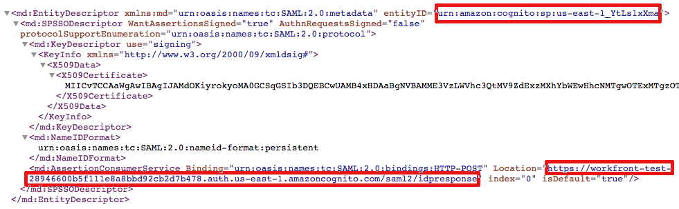

# 使用增強型驗證時更新IDP中的SAML 2.0中繼資料

<!-- enhanced authentication is no longer available for workfront customers -->

{{important-admin-console-onboard}}

身為Adobe Workfront管理員，您可以整合Workfront單一登入(SSO)與任何支援安全性宣告標籤語言(SAML) 2.0通訊協定的身分提供者。

以下小節說明當您的Workfront帳戶升級為增強驗證體驗（尚未提供給所有組織）時的整合程式。 如需有關增強型驗證體驗的詳細資訊，請參閱 [增強型驗證概述](../../../administration-and-setup/manage-workfront/security/get-started-enhanced-authentication.md).

如需有關在移轉至增強型驗證體驗之前設定SAML的資訊，請參閱 [更新身分提供者中的SAML 2.0中繼資料](../../../administration-and-setup/add-users/single-sign-on/update-saml-2-metadata-ip.md).

## 存取需求

您必須具有下列存取權才能執行本文中的步驟：

<table style="table-layout:auto"> 
 <col> 
 <col> 
 <tbody> 
  <tr> 
   <td role="rowheader">Adobe Workfront計畫</td> 
   <td>任何</td> 
  </tr> 
  <tr> 
   <td role="rowheader">Adobe Workfront授權</td> 
   <td>計劃</td> 
  </tr> 
  <tr> 
   <td role="rowheader">存取層級設定</td> 
   <td> 
您必須是Workfront管理員。
 
<b>注意</b>：如果您還是沒有存取權，請詢問Workfront管理員是否對您的存取層級設定了其他限制。 如需有關Workfront管理員如何修改您的存取層級的資訊，請參閱 <a href="../../../administration-and-setup/add-users/configure-and-grant-access/create-modify-access-levels.md" class="MCXref xref">建立或修改自訂存取層級</a>.
 </td> 
  </tr> 
 </tbody> 
</table>

## 使用Okta作為身分提供者

Okta是支援SAML 2.0的身分提供者範例。本節說明如何使用Okta作為身分提供者。 設定另一個支援SAML 2.0的身分提供者時，需要類似的步驟。

>[!NOTE]
>
>系統會根據使用者的電子郵件地址來對應使用者。 若要使用Okta登入Workfront，您必須先讓使用者使用在您的Workfront客戶中建立的相同（不區分大小寫）電子郵件地址。

請完成下列章節，在Workfront中將Okta設定為您的身分提供者。

* [在Okta中建立Workfront應用程式](#create-a-workfront-app-in-okta)
* [將您的Okta執行個體新增為Workfront中的身分提供者](#add-your-okta-instance-as-an-identity-provider-in-workfront)

### 在Okta中建立Workfront應用程式 {#create-a-workfront-app-in-okta}

1. 登入您的Okta環境。
1. 確定 **傳統UI** 在Okta介面的左上角選取。
1. 在功能表中，按一下 **應用** > **應用**.

1. 按一下 **新增應用程式**，然後按一下 **建立新的應用程式**.

1. 在 **建立新的應用程式整合對話方塊** 方塊，選取 **SAML 2.0**，然後按一下 **建立**.

1. 指定Workfront應用程式的名稱，然後按一下 **下一個**.
1. 在顯示的「SAML設定」頁面中，找到「SAML設定」頁面所需的資訊：

   1. 無需離開顯示Okta介面的瀏覽器標籤，即可開啟個別的瀏覽器標籤或視窗。
   1. 在瀏覽器中指定下列URL：

      `https://[your_customer_subdomain].my.workfront.com/auth/saml2/metadata`

   1. 在產生的XML檔案中，識別 **entityID** 和 **位置**.

      

   1. 複製下列位置的值： **entityID** 欄位至您的系統剪貼簿。 請勿關閉此瀏覽器索引標籤。

1. 回到您在步驟6開啟的「SAML設定」頁面。
1. 貼上以下位置的值： **entityID** 欄位至 **對象URI （SP實體ID）** 欄位。

1. 在其他瀏覽器標籤的XML檔案中，複製 **位置** 欄位。
1. 貼上以下位置的值： **位置** 欄位至 **單一登入** **URL** 欄位。

1. 捲動至 **屬性陳述式（選擇性）** 區段。
1. 在 **名稱** 欄位，指定 **電子郵件**.

1. 在 **值** 欄位，指定 **user.email**.

1. （選用）新增任何進階值。
1. 按一下 **下一個**.
1. 選擇， **我是新增內部應用程式的Okta客戶**，然後按一下 **完成**.

### 將您的Okta執行個體新增為Workfront中的身分提供者 {#add-your-okta-instance-as-an-identity-provider-in-workfront}

此程式提供在Workfront中將Okta設定為身分提供者時所需的基本資訊。 如需其他對應或組態選項的其他資訊，請參閱 [使用SAML 2.0設定Adobe Workfront](../../../administration-and-setup/add-users/single-sign-on/configure-workfront-saml-2.md).

1. 下載您Okta執行個體的身分提供者中繼資料：

   1. 登入您的Okta環境。
   1. 確定 **傳統UI** 在Okta介面的左上角選取。
   1. 在功能表中，按一下 **應用** > **應用**.

   1. 按一下您建立的Workfront應用程式，如區段所述， [在Okta中建立Workfront應用程式](#create-a-workfront-app-in-okta)
   1. 在 **登入** 標籤，按一下 **身分提供者中繼資料**.

      

      中繼資料會在新的瀏覽器標籤中以XML形式開啟。

   1. 複製瀏覽器URL欄位中顯示的URL。

1. 以Workfront管理員身分登入Workfront。
1. 按一下 **主要功能表** 圖示  (位於Adobe Workfront的右上角)，然後按一下 **設定** .

1. 在左側面板中，按一下 **系統** > **單一登入(SSO)**.

1. （視條件而定）如果看到兩個標籤，請按一下 **新的SSO提供者** 標籤。

   

   >[!IMPORTANT]
   >
   >請勿刪除中的現有SSO組態設定 **目前的SSO提供者** 標籤，直到您的帳戶更新為增強型驗證體驗，且新的SSO設定充分發揮作用為止。

1. 按一下 **新增SSO提供者**.
1. 指定名稱（例如Okta IDP），然後指定說明。
1. 在 **從身分提供者中繼資料填入欄位** 區段中，將您在步驟1中複製的URL貼入 **中繼資料URL** 欄位。\
   或者，您可以按一下 **選擇檔案** 上傳.xml檔案，但建議您貼上URL。

1. 在 **對應使用者屬性** 區段，在 **目錄屬性** 欄位，型別 **電子郵件**. (**電子郵件地址** 已填入 **Workfront使用者屬性** 欄位。)

1. （選用）啟用 **設為預設SSO提供者** 將未經驗證的使用者傳送至身份提供者登入畫面，而非Workfront登入畫面以進行驗證。 建議您僅在系統中的所有使用者透過身分提供者存取Workfront時，才啟用此選項。
1. 選取 **啟用** 核取方塊。 在執行此操作之前，請確保系統中的使用者知道新的登入體驗，以確保他們不會失去Workfront系統的存取權。
1. 按一下 **測試連線**.\
   您應該會看到一則訊息，告訴您連線成功。

1. 按一下「**儲存**」。

## 使用其他身分識別提供者

使用Okta以外的身分提供者（例如Ping或Centrify）時，您必須將Workfront中繼資料重新上傳至身分提供者。
