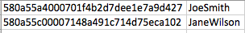

# 更新單一登入的使用者

<!-- Audited: 1/2024 -->

{{important-admin-console-onboard}}

當您的Adobe Workfront執行個體中啟用單一登入(SSO)時，您的使用者可以使用其SSO憑證登入Workfront。

如果您的現有系統已填入與SSO憑證相關聯的使用者，您可以透過將逗號分隔值(CSV)檔案匯入Workfront，將使用者的ID匯入Workfront。

如需整合Workfront與SSO系統的詳細資訊，請參閱 [Adobe Workfront單一登入概觀](../../../administration-and-setup/add-users/single-sign-on/sso-in-workfront.md).

## 存取需求

+++ 展開以檢視本文中功能的存取需求。

您必須具有下列存取權才能執行本文中的步驟：

<table style="table-layout:auto"> 
 <col> 
 <col> 
 <tbody> 
  <tr> 
   <td role="rowheader">Adobe Workfront計畫</td> 
   <td>任何</td> 
  </tr> 
  <tr> 
   <td role="rowheader">Adobe Workfront授權</td> 
   <td>
新增：標準

或

目前：計畫
</td> 
  </tr> 
  <tr> 
   <td role="rowheader">存取層級設定</td> 
   <td> 
您必須是Workfront管理員。
  </td> 
  </tr> 
 </tbody> 
</table>

如需有關此表格的詳細資訊，請參閱 [Workfront檔案中的存取需求](/help/quicksilver/administration-and-setup/add-users/access-levels-and-object-permissions/access-level-requirements-in-documentation.md).

+++

## SSO使用者名稱

根據您使用的SSO解決方案，可以將SSO環境中的使用者名稱稱為以下任一項：

* SSO 使用者名稱
* 同盟 ID
* 同盟使用者名稱

無論在您的SSO環境中呼叫了什麼使用者名稱，該欄位的值都會儲存在使用者物件的SSO使用者名稱欄位中。

為了讓您的使用者能夠使用其SSO憑證登入Workfront，除了其Workfront使用者名稱外，您必須更新其設定檔以包含其SSO使用者名稱。

身為Workfront管理員，您可以透過將使用者名稱清單匯入Workfront，大量更新Workfront使用者的SSO使用者名稱欄位。 此清單必須：

* 包含Workfront使用者ID (GUID)，以及每位使用者的對應SSO使用者名稱
* 儲存為CSV或TSV檔案。

此程式會更新Workfront中現有的SSO使用者名稱，或新增新的SSO使用者名稱（如果使用者遺失的話）。

## 準備匯入檔案 {#prepare-the-import-file}

您可以在Workfront中建立必須更新SSO使用者名稱欄位的所有使用者的報告，以開始準備匯入檔案。

1. 在Workfront中建立使用者報表。

   如需在Workfront中建立使用者報表的指示，請參閱 [建立自訂報表](../../../reports-and-dashboards/reports/creating-and-managing-reports/create-custom-report.md).

1. 在報表中選取下列欄位：

   | 欄位 | 說明 |
   |---|---|
   | 姓名 | Workfront使用者的全名。 |
   | ID | ID是Workfront的英數字元GUID。 |
   | SSO 使用者名稱 | 新增SSO使用者名稱欄位，確保匯入內容不會覆寫任何使用者名稱。 如果您的使用者尚未針對SSO更新，則所有使用者的此欄位都應空白。 |

   

1. 儲存報表。
1. 按一下 **匯出** 並匯出至Excel。
1. 開啟匯出的Excel檔案，並在「SSO使用者名稱」欄中為報告中的每個使用者新增您的SSO使用者名稱。

   >[!IMPORTANT]
   >
   >SSO使用者名稱區分大小寫。

1. 刪除Excel檔案中的所有欄，但 **ID** 和 **SSO使用者名稱** 欄。

1. 刪除欄標題，並確保報表頂端沒有空白列。

   您用來更新具有SSO使用者名稱的Workfront使用者的檔案 **必須** 只包含2欄，順序如下：

   * 第一欄必須顯示Workfront使用者ID (在Workfront中找到的使用者GUID)。
   * 第二欄必須包含SSO使用者名稱，如顯示在您的SSO系統中所示。
   * 欄不能有標題，而且名稱清單頂端不能有任何空白列。

     

1. 將報表儲存為電腦上的CSV或TSV檔案。

## 更新您的SSO使用者 {#update-your-users-for-sso}

更新SSO使用者的程式會將SSO使用者名稱欄位新增至您的Workfront使用者（如果使用者不存在），或是更新該欄位中的值（如果已經有與使用者關聯的值）。

1. 按一下 **[!UICONTROL 主要功能表]** 圖示  在Adobe Workfront的右上角，或（如果有的話）按一下 **[!UICONTROL 主要功能表]** 圖示  然後按一下「 」 **設定** .

1. 按一下 **系統** 然後選取 **更新SSO的使用者**.

1. 按一下 **選擇檔案** 以瀏覽您準備的檔案。

   如需有關如何準備此檔案的詳細資訊，請參閱 [準備匯入檔案](#prepare-the-import-file).

1. 選取儲存於電腦上的檔案，然後按一下 **開啟**.

   這會將SSO憑證插入Workfront，讓所有使用者都可使用其SSO憑證登入Workfront。

   此 **僅允許 `<SSO Configuration>` 驗證** CSV中包含的所有使用者都會啟用此設定。 這可確保使用者必須透過SSO登入。

## 根據使用者的Workfront使用者名稱驗證SSO

如需有關建立包含SSO使用者名稱資訊的使用者報告的說明，請參閱 [準備匯入檔案](#prepare-the-import-file).

1. 執行包含SSO使用者名稱資訊的使用者報告。

   請注意，系統會為每個使用者填入SSO使用者名稱欄。

1. 請確定SSO使用者名稱欄的值符合您SSO伺服器上的SSO使用者名稱。
1. 如果SSO使用者名稱欄空白，請更新使用者的SSO使用者名稱。

   

   如需更新使用者以使用SSO的說明，請參閱 [更新您的SSO使用者](#update-your-users-for-sso).
