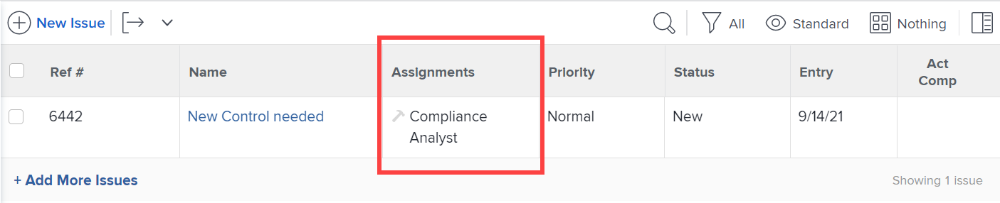

# 設定Blueprint

您可以在安裝Blueprint之前設定其詳細資訊。 專案範本和組織結構Blueprint型別通常需要設定一些偏好設定並對應一些屬性。 其他Blueprint型別可能不需要設定，您將依原樣安裝。 如需安裝的詳細資訊，請參閱[安裝Blueprint](/help/quicksilver/administration-and-setup/blueprints/blueprints-install.md)。

## 存取需求

+++ 展開以檢視本文中功能的存取需求。

<table style="table-layout:auto"> 
 <col> 
 <col> 
 <tbody> 
  <tr> 
   <td role="rowheader">Adobe Workfront套件</td> 
   <td>任何</td> 
  </tr> 
  <tr> 
   <td role="rowheader">Adobe Workfront授權</td> 
   <td>
   
標準

   
規劃
</td> 
  </tr> 
  <tr> 
   <td role="rowheader">存取層級設定</td> 
   <td>Workfront管理員 </td> 
  </tr> 
 </tbody> 
</table>

如需有關此表格的詳細資訊，請參閱Workfront檔案中的[存取需求](/help/quicksilver/administration-and-setup/add-users/access-levels-and-object-permissions/access-level-requirements-in-documentation.md)。

+++

## 設定專案範本Blueprint

1. 尋找您要使用的藍圖。
1. 按一下&#x200B;**[!UICONTROL 安裝]**，然後選擇環境：

   <table style="table-layout:auto">
        <tr>
        <td><strong>生產</strong></td>
        <td>生產環境是您的即時環境。</td>
    </tr>
    <tr>
        <td><strong>Sandbox 預覽</strong></td>
        <td>沙箱預覽是測試環境，可作為即時環境的復本，並在每個週末由Workfront重新整理。</td>
    </tr>
    <tr>
        <td><strong>Sandbox 1和2</strong></td>
        <td>自訂重新整理沙箱是獨立的測試環境，由您手動重新整理。 取得自訂重新整理沙箱需要額外付費。</td>
    </tr>
   </table>

1. 繼續下列章節：

   * [[!UICONTROL 範本偏好設定]](#template-preferences)
   * [[!UICONTROL 角色對應]](#role-mapping)
   * [[!UICONTROL 團隊對應]](#team-mapping)
   * [[!UICONTROL 公司對映]g](#company-mapping)
   * [[!UICONTROL 群組對應]](#group-mapping)

## [!UICONTROL 範本偏好設定] {#template-preferences}

選擇您要如何安裝範本。

您也可以在安裝Blueprint之前指定範本所有權。 您可以在安裝範本後變更這些欄位。 如需詳細資訊，請參閱[編輯專案範本](../../manage-work/projects/create-and-manage-templates/edit-templates.md)。

![[!UICONTROL 範本偏好設定]區段](assets/Blueprints_TemplatePreferences.png)

1. 在[!UICONTROL 範本偏好設定]區段中，指定新的範本名稱。
1. 指定下列專案：

   <table style="table-layout:auto">
    <tr>
        <td><strong>[!UICONTROL 範本所有者]<strong></td>
        <td>此人會收到範本的[!UICONTROL Manage]許可權，並將在使用範本建立專案時成為專案所有者。</td>
    </tr>
    <tr>
        <td><strong>[!UICONTROL 範本贊助者]</strong></td>
        <td>此人通常是需要瞭解專案情況的經理、執行或利害關係人。 專案贊助者未取得專案的任何額外存取權，但會新增到專案的電子郵件通知中。</td>
    </tr>
    <tr>
        <td><strong>[!UICONTROL Portfolio]</strong></td>
        <td>這是專案建立時屬於的投資組合。</td>
    </tr>
    <tr>
        <td><strong>[!UICONTROL Program]</strong></td>
        <td>這是專案建立時所屬的計畫。</td>
    </tr>
   </table>

1. 選取範本是以作用中或非作用中狀態安裝。
1. 如果偏好設定可用，請選擇您是否要使用已定義的新問題偏好設定。

   按一下&#x200B;**[!UICONTROL 檢視問題偏好設定]**&#x200B;以檢閱將與Blueprint一起安裝的特定偏好設定。 從匯入的範本建立的專案會針對[!UICONTROL 問題]區段中新增的新問題使用這些偏好設定。

   <table style="table-layout:auto"> 
    <col> 
    <col> 
    <tbody> 
     <tr> 
      <td role="rowheader"><strong>佇列主題群組</strong></td> 
      <td> 
佇列主題群組會定義問題或請求的最高類別層級。 使用者在選取提交請求的位置時，會以功能表選項的形式檢視主題群組。 一個主題群組可以包含多個佇列主題。 如需詳細資訊，請參閱<a href="../../manage-work/requests/create-and-manage-request-queues/create-topic-groups.md" class="MCXref xref">建立主題群組</a>。 
 </td> 
     </tr> 
     <tr> 
      <td role="rowheader"><strong>佇列主題</strong></td> 
      <td> 
佇列主題會與路由規則搭配使用，以指派問題或請求。 它們是使用者在輸入問題或請求時，在選取主題群組後所選取的功能表選項。 如需詳細資訊，請參閱<a href="../../manage-work/requests/create-and-manage-request-queues/create-queue-topics.md" class="MCXref xref">建立佇列主題</a>。 
 </td> 
     </tr> 
     <tr> 
      <td role="rowheader"><strong>路由規則</strong></td> 
      <td>路由規則會將問題或請求傳送給特定工作角色、使用者或團隊。 他們也可以將請求傳送至特定專案，而不是與請求佇列關聯的專案。 如需詳細資訊，請參閱<a href="../../manage-work/requests/create-and-manage-request-queues/create-routing-rules.md" class="MCXref xref">建立路由規則</a>。 </td> 
     </tr> 
    </tbody> 
   </table>

   >[!INFO]
   >
   >**範例：**&#x200B;此Blueprint中的新問題偏好設定提供四個佇列主題。 使用者在建立問題時選取以下主題之一。 （因為只有一個主題群組存在，所以會自動套用，使用者不必加以選取。） 當使用者完成並提交問題時，路由規則會決定將其指派給哪個職務角色或團隊。
   >
   >新問題的
   >

   >[!TIP]
   >
   >* 使用問題偏好設定有助於在專案上擷取新問題或請求的方式建立一致性。
   >* 設定這些偏好設定不會自動將從範本建立的專案放入請求佇列。 如需設定要求佇列的詳細資訊，請參閱[建立要求佇列](../../manage-work/requests/create-and-manage-request-queues/create-request-queue.md)。
   >* 並非所有Blueprint都包含新的問題偏好設定。

## [!UICONTROL 角色對應] {#role-mapping}

>[!NOTE]
>
>此區段可能不會出現在某些Blueprint中。

有些範本包含規定的職務角色。 當範本轉換為專案時，職位角色可協助您指派合適的人員。 您可以在安裝Blueprint之前自訂角色的對應方式。 按一下&#x200B;**[!UICONTROL 檢視角色說明]**&#x200B;以進一步瞭解Blueprint中可用的角色。

Blueprint會依角色名稱搜尋，以檢視是否有任何符合的現有角色。 搜尋區分大小寫，因此名稱必須完全相符。 如果沒有相符的現有角色，您可以讓Blueprint為您建立它們。

![[!UICONTROL 角色對應]區段](assets/Blueprints_RoleMapping.png)

1. 如果角色存在，您可以選擇下列其中一個選項：

   1. 使用不同的名稱建立新角色，然後在文字方塊中輸入名稱。
   1. 使用現有的角色，然後在選取方塊中選取角色。
   1. 不要使用對應的角色。 不建議使用此選項，因為有些任務將不會指派角色。

1. 如果角色不存在，您可以選擇下列其中一個選項：

   1. 建立新角色。 此選項會建立Blueprint建議的角色。
   1. 使用不同的名稱建立新角色，然後在文字方塊中輸入名稱。
   1. 使用現有的角色，然後在選取方塊中選取角色。
   1. 不要使用對應的角色。 不建議使用此選項，因為有些任務將不會指派角色。

>[!NOTE]
>
>安裝程式不會將角色套用至特定人員。 您應在安裝Blueprint解決方案之後驗證這些角色中的人員，並視需要指派人員。 如需詳細資訊，請參閱安裝Blueprint[後要採取的](../../administration-and-setup/blueprints/best-next-actions-after-install.md)動作。

如需[!DNL Workfront]中工作角色的詳細資訊，請參閱[建立和管理工作角色](../../administration-and-setup/set-up-workfront/organizational-setup/create-manage-job-roles.md)。

## [!UICONTROL 團隊對應] {#team-mapping}

>[!NOTE]
>
>此區段可能不會出現在某些Blueprint中。

有些範本包含規定的團隊。 團隊的任何成員都可以完成指派給團隊的工作。 您可以在安裝Blueprint之前自訂團隊的對應方式。 按一下&#x200B;**[!UICONTROL 檢視團隊說明]**&#x200B;以進一步瞭解Blueprint中可用的團隊。

Blueprint會依團隊名稱搜尋，以檢視是否有任何符合的現有團隊。 搜尋區分大小寫，因此名稱必須完全相符。 如果沒有相符的現有團隊，您可以讓Blueprint為您建立這些團隊。

![[!UICONTROL 團隊對應]區段](assets/Blueprints_TeamMapping.png)

1. 如果專案團隊存在，您可以選擇下列其中一個選項：

   1. 以不同的名稱建立新專案團隊，然後在文字方塊中輸入名稱。
   1. 使用[!UICONTROL 現有的團隊]，然後在選取方塊中選取團隊。
   1. 不要使用對應的團隊。 不建議使用此選項，因為有些任務將不會指派團隊。

1. 如果專案團隊不存在，您可以選擇下列其中一個選項：

   1. 建立新團隊。 此選項會建立Blueprint建議的團隊。
   1. 以不同的名稱建立新專案團隊，然後在文字方塊中輸入名稱。
   1. 使用[!UICONTROL 現有的團隊]，然後在選取方塊中選取團隊。
   1. 不要使用對應的團隊。 不建議使用此選項，因為有些任務將不會指派團隊。

>[!NOTE]
>
>安裝程式不會將人員加入團隊。 您應該在安裝Blueprint解決方案之後驗證團隊中的人員，並視需要指派人員。 如需詳細資訊，請參閱安裝Blueprint[後要採取的](../../administration-and-setup/blueprints/best-next-actions-after-install.md)動作。

如需[!DNL Workfront]中團隊運作方式的詳細資訊，請參閱[建立及管理團隊](../../people-teams-and-groups/create-and-manage-teams/create-and-mange-teams.md)。

## 公司對應 {#company-mapping}

>[!NOTE]
>
>此區段可能不會出現在某些Blueprint中。

部分藍圖包含規定的公司。 公司是一個組織單位，可以代表您的組織、組織內的部門或您工作的客戶。 在安裝Blueprint之前，您可以自訂公司的對應方式。 按一下&#x200B;**[!UICONTROL 檢視公司說明]**&#x200B;以進一步瞭解Blueprint中可用的公司。

藍圖會依公司名稱搜尋，以檢視是否有任何符合的現有公司。 搜尋區分大小寫，因此名稱必須完全相符。 如果沒有相符的現有公司，您可以讓Blueprint為您建立這些公司。 藍圖中的主要公司對應至您環境內的主要公司，即使這些公司沒有相同的名稱。

![[!UICONTROL 公司對應]區段](assets/Blueprints_CompanyMapping.png)

1. 如果公司存在，您可以選擇下列其中一個選項：

   1. 以不同的名稱建立新公司，然後在文字方塊中輸入名稱。
   1. 使用現有的公司，然後在選取方塊中選取公司。\

      藍圖中的主要公司對應至您環境內的主要公司，即使這些公司沒有相同的名稱。
   1. 請勿使用對應的公司。 不建議使用此選項，因為其他物件中的公司參照將是空的。

1. 如果公司不存在，您可以選擇下列其中一個選項：

   1. 建立新公司。 此選項會建立Blueprint建議的公司。
   1. 以不同的名稱建立新公司，然後在文字方塊中輸入名稱。
   1. 使用現有的公司，然後在選取方塊中選取公司。
   1. 請勿使用對應的公司。 不建議使用此選項，因為其他物件中的公司參照將是空的。

>[!NOTE]
>
>若要在安裝Blueprint之後設定公司，請參閱[安裝Blueprint之後要採取的動作](../../administration-and-setup/blueprints/best-next-actions-after-install.md)。

如需將範本與公司建立關聯的資訊，請參閱[編輯專案範本](../../manage-work/projects/create-and-manage-templates/edit-templates.md)。

如需有關公司在[!DNL Workfront]中如何運作的資訊，請參閱[建立和編輯公司](../../administration-and-setup/set-up-workfront/organizational-setup/create-and-edit-companies.md)。

## [!UICONTROL 群組對應] {#group-mapping}

>[!NOTE]
>
>此區段可能不會出現在某些Blueprint中。

某些Blueprint包含規定的群組。 群組是一組使用者，與您部門結構一致。 群組類似於Workfront中的團隊和公司，但與其不同。 您可以在安裝Blueprint之前自訂群組的對應方式。 按一下&#x200B;**[!UICONTROL 檢視群組說明]**&#x200B;以進一步瞭解Blueprint中可用的群組。

藍圖會依群組名稱搜尋，以檢視是否有任何符合的現有群組。 搜尋區分大小寫，因此名稱必須完全相符。 如果沒有相符的現有群組，您可以讓Blueprint為您建立這些群組。

![[!UICONTROL 群組對應]區段](assets/Blueprints_GroupMapping.png)

1. 如果群組存在，您可以選取&#x200B;**[!UICONTROL 重新對應群組]**，並選擇下列其中一個選項：

   1. **[!UICONTROL 使用不同的名稱建立新群組]**，然後輸入要指派給此群組的名稱。 對Blueprint定義中群組的參考將改為與此新群組相關聯。
   1. **[!UICONTROL 以現有的群組取代]**，然後在選取方塊中搜尋並選取群組。

      >[!NOTE]
      >
      >您無法重新命名現有群組。

1. 如果群組不存在，您可以：

   1. 在文字方塊中輸入建議群組名稱，即可變更該名稱。
   1. 選取&#x200B;**[!UICONTROL 重新對應群組]**&#x200B;並選擇[!UICONTROL 以現有群組取代]，然後在選取方塊中搜尋並選取群組。
   1. 選取&#x200B;**[!UICONTROL 重新對應群組]**&#x200B;並選擇&#x200B;**[!UICONTROL 插入現有群組]**，然後在選取方塊中搜尋並選取群組。 此選項會在現有群組下建立新的子群組。

>[!NOTE]
>
>若要在安裝Blueprint之後設定群組，請參閱[安裝Blueprint之後要採取的動作](../../administration-and-setup/blueprints/best-next-actions-after-install.md)。

如需在[!DNL Workfront]中使用群組的相關資訊，請參閱[群組總覽](../../administration-and-setup/manage-groups/groups-overview/groups.md)。
