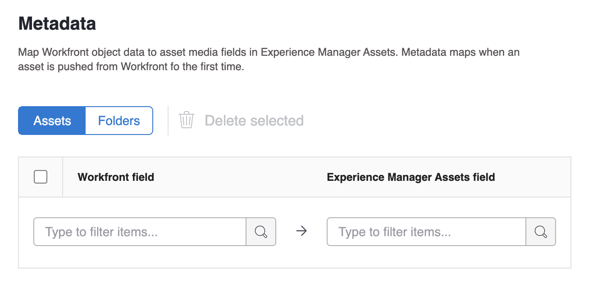
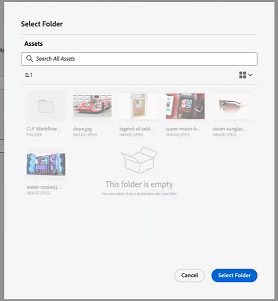

# 設定 [!UICONTROL Experience Manager Assetsas a Cloud Service] 整合

本頁強調顯示的資訊指的是尚未普遍提供的功能。 它僅適用於預覽沙箱環境。

您可以將工作與內容連結，位於 [!DNL Experience Manager Assets]&#x200B;:

* 推送資產和中繼資料 [!DNL Adobe Workfront] to [!DNL Experience Manager Assets]&#x200B;
* 連結資產來源 [!DNL Experience Manager Assets] 至 [!DNL Workfront&#x200B;]
* 加速版本設定使用案例
* 建立連結到的資料夾 [!DNL Experience Manager Assets]
* 追蹤資產和資料夾的中繼資料
* 在之間同步專案中繼資料 [!DNL Workfront] 和 [!DNL Experience Manager Assets]

您也可以跨組織ID將數個Experience Manager Assets存放庫連結至一個Workfront環境，或將數個Workfront環境連結至一個Experience Manager Assets存放庫。 針對您要設定的每個整合，請依照本文的設定指示操作。

## 存取需求

您必須具備下列條件：

<table>
  <tr>
   <td><strong>[!DNL Adobe Workfront] 計劃*</strong>
   </td>
   <td>任何
   </td>
  </tr>
  <tr>
   <td><strong>[!DNL Adobe Workfront] 許可證*</strong>
   </td>
   <td>[!UICONTROL計畫]
   </td>
  </tr>
  <tr>
   <td><strong>[!DNL Experience Manager] 授權</strong>
   </td>
   <td>[!UICONTROL Standard]
   </td>
  </tr>
  <tr>
   <td><strong>產品</strong>
   </td>
   <td>您必須 [!DNL Experience Manager Assets as a Cloud Service]，且您必須以使用者身分新增至產品。
   </td>
  </tr>
  <tr>
   <td>訪問級別配置*
   </td>
   <td>您必須是 [!DNL Workfront] 管理員。 如需 [!DNL Workfront] 管理員請參閱 <strong>授予使用者完整的管理存取權</strong>.
   </td>
  </tr>
</table>

*若要了解您擁有的計畫、授權類型或存取權，請聯絡您的Workfront管理員。

## 必要條件

開始之前，

* 您必須 [!DNL Workfront] 和 [!DNL Adobe Experience Manager Assets] 與 [!DNL Adobe Admin Consol]e.如需詳細資訊，請參閱 [平台管理差異([!DNL Adobe Workfront]/[!DNL Adobe Business Platform])](/help/quicksilver/administration-and-setup/get-started-wf-administration/actions-in-admin-console.md).

## 設定整合資訊

1. 按一下 **[!UICONTROL 主菜單]** 圖示，然後按一下 **[!UICONTROL 設定]** .
1. 選擇 **[!UICONTROL 檔案]** 在左側面板中，選取 **[!UICONTROL [!DNL Experience Manager]整合]**.
   >[!NOTE]
   >
   >此設定區域僅在 [!DNL Workfront] 環境包含在 [!DNL Adobe Admin Console].

1. 選擇 **[!UICONTROL 新增 [!DNL Experience Manager] 整合]**.
1. 在 **[!UICONTROL 名稱]** 欄位中，輸入您要讓使用者在Workfront和Experience Manager Assets中與此整合互動時看到的名稱。
1. 在 **[!UICONTROL 導覽URL]** 欄位，系統會自動填入導覽URL。 此唯讀URL可用來連結至貴組織的 [!DNL Experience Manager] 例項 [!UICONTROL 主菜單] 以快速存取。
1. 從 **[!UICONTROL [!DNL Experience Manager]資產存放庫]** 下拉式功能表。 系統會自動填入 [!DNL Experience Manager] 與您的使用者設定檔所指派之組織ID相關聯的存放庫。
   

1. 按一下 **[!UICONTROL 儲存]** 或繼續 [設定中繼資料（選用）](#set-up-metadata-optional) 一節。

   >[!NOTE]
   >
   >由於整合的複雜性，儲存初始設定後，您無法變更存放庫。

## 設定中繼資料（選用）

您可以對應 [!DNL Workfront] 對象資料，以及 [!DNL Experience Manager] 資產。

>[!IMPORTANT]
>
>您只能將中繼資料對應至一個方向：從 [!DNL Workfront] to [!DNL Experience Manager]. 連結到的文檔的元資料 [!DNL Workfront] 從 [!DNL Experience Manager] 無法轉移到 [!DNL Workfront].

### 設定中繼資料欄位

開始對應中繼資料欄位之前，您必須在Workfront和Experience Manager Assets中設定中繼資料欄位。

要配置元資料欄位：

1. 在 [!DNL Experience Manager Assets] 如 [在Adobe之間設定資產中繼資料對應 [!DNL Workfront] 和 [!DNL Experience Manager Assets]](https://experienceleague.adobe.com/docs/experience-manager-cloud-service/content/assets/integrations/configure-asset-metadata-mapping.html?lang=en).

1. 在Workfront中設定自訂表單欄位。 [!DNL Workfront] 有許多內建的自訂欄位可供您使用。 不過，您也可以建立自己的自訂欄位，如 [建立或編輯自訂表單](/help/quicksilver/administration-and-setup/customize-workfront/create-manage-custom-forms/create-or-edit-a-custom-form.md).

+++ **展開以查看支援Workfront和Experience Manager Assets欄位的詳細資訊**

**Experience Manager Assets標籤**

您可以將任何Workfront支援的欄位對應至Experience Manager Assets中的標籤。 若要這麼做，您必須確保Experience Manager Assets中的標籤值與Workfront相符。

* 標籤和Workfront欄位值在拼字和格式上必須完全相符。
* 對應至experience Manager資產標籤的Workfront欄位值必須全部為小寫，即使Experience Manager Assets中的標籤似乎有大寫字母亦然。
* Workfront欄位值不得包含空格。
* Workfront中的欄位值也必須包含Experience Manager Assets標籤的資料夾結構。
* 若要將多個單行文字欄位對應至標籤，請在中繼資料對應的Workfront端輸入以逗號分隔的標籤值清單，並 `xcm:keywords` 在Experience Manager Assets那邊。 每個欄位值都對應至個別標籤。 您可以使用計算欄位，將多個Workfront欄位合併為單一逗號分隔的文字欄位。
* 您可以輸入該欄位中以逗號分隔的可用值清單，以對應下拉式清單、選項按鈕或核取方塊欄位中的值。

>[!INFO]
>
>**範例**:若要符合此處資料夾結構中顯示的標籤，Workfront中的欄位值會是 `landscapes:trees/spruce`. 請在Workfront欄位值中記下小寫字母。
>
>如果您希望標籤在標籤樹中保持最左邊的項目，它後面必須加上冒號。 在此範例中，若要對應至景觀標籤，Workfront中的欄位值會是 `landscapes:`.
>
>

在Experience Manager Assets中建立標籤後，這些標籤會出現在中繼資料區段的「標籤」下拉式清單下。 若要將欄位連結至標籤，請選取 `xcm:keywords` 在中繼資料對應區域的「Experience Manager Assets」欄位下拉式清單中。

如需Experience Manager Assets中標籤的詳細資訊，包括如何建立和管理標籤，請參閱 [管理標籤](https://experienceleague.adobe.com/docs/experience-manager-64/administering/contentmanagement/tags.html).

**Experience Manager Assets自訂中繼資料結構欄位**

您可以將內建和自訂Workfront欄位對應至Experience Manager Assets中的自訂中繼資料結構欄位。

在Experience Manager Assets中建立的自訂中繼資料欄位，會在中繼資料設定區域的專屬區段中組織。

<!-- 
link to documentation about creating schema - waiting on response from Anuj about best article to link to
-->

**Workfront欄位**

您可以將內建和自訂Workfront欄位對應至Experience Manager Assets。 下列欄位值在大小寫和Workfront與Experience Manager Assets之間的拼字都必須相符：

* 下拉式欄位
* 多選欄位

>[!TIP]
>
> 若要檢查欄位值是否完全相符，請前往
>
> * 「設定」>「在Workfront中自訂Forms」或物件中的欄位
> * Experience Manager Assets中的「資產>中繼資料結構」

+++

### 對應資產的中繼資料

從推送資產時的中繼資料對應 [!DNL Workfront] 這是第一次。 內建或自訂欄位的檔案會在第一次將資產傳送至時，自動對應至指定的欄位 [!DNL Experience Manager Assets].

若要對應資產的中繼資料：

1. 選擇 **[!UICONTROL 資產]** 元資料表格上方。
1. 在 **[!UICONTROL [!DNL Workfront]欄位]** 欄，選擇內建或自訂Workfront欄位。

   >[!NOTE]
   >
   >您可以對應單一 [!DNL Workfront] 欄位至多個 [!UICONTROL Experience Manager Assets] 欄位。 無法映射多個 [!DNL Workfront] 欄位至單一 [!DNL Experience Manager Assets] 欄位。
   ><!--To map a Workfront field to an Experience Manager Assets tag, see -->

1. 在 [!DNL Experience Manager Assets] 欄位中，搜尋預先填入的類別，或在搜尋欄位中至少輸入兩個字母以存取其他類別。
1. 視需要重複步驟2和3。
   
1. 按一下 [!UICONTROL 儲存] 或繼續 [資料夾](#folders) 一節。

### 映射資料夾的元資料

當使用者在專案上建立連結的資料夾時，相關聯的專案、產品組合和方案資料會對應至 [!DNL Experience Manager Assets].

>[!NOTE]
>
>此整合不支援來自 [!DNL Adobe Experience Manager].

要映射資料夾的元資料：

1. 選擇 **[!UICONTROL 資料夾]** 元資料表格上方。
1. 在 **[!UICONTROL [!DNL Workfront]欄位]** 欄，選擇內建或自訂Workfront欄位。

   >[!NOTE]
   >
   >您可以將單一Workfront欄位對應至多個Experience Manager Assets欄位。 無法映射多個 [!DNL Workfront] 欄位至單一 [!DNL Experience Manager Assets] 欄位。

1. 在 **[!DNL Experience Manager Assets]** 欄位中，搜尋預先填入的類別，或在搜尋欄位中至少輸入兩個字母以存取其他類別。
1. 視需要重複步驟2和3。
   
1. 按一下 **[!UICONTROL 儲存]** 或繼續 [專案中繼資料同步](#project-metadata-sync) 一節。

### 物件中繼資料同步

安 [!DNL Experience Manager] 映射至的欄位 [!DNL Workfront] 當中的欄位更改時，產品組合、方案、項目、任務、問題和文檔欄位將自動更新 [!DNL Workfront].

>[!IMPORTANT]
>
>用戶必須在 [!DNL Experience Manager] 用於物件中的資產，以便在更新時同步中繼資料。

1. 啟用 **[!UICONTROL 同步對象元資料]** 欄位。
1. 按一下 **儲存** 或繼續 [設定工作流程（可選）](#set-up-workflows-optional) 一節。

<!--Courtney start here-->

## 設定工作流程（可選）

工作流程是連線Workfront和Adobe Experience Manager as a Cloud Service的一組動作。 身為Workfront管理員，您可以在Workfront中設定工作流程，然後將其指派至專案範本。 使用已為其分配工作流的項目模板建立項目時，將觸發工作流中定義的操作。

您在整合中設定的預設工作流值可以在「專案範本」和「專案」層級被覆寫。

### 設定建立Adobe Experience Manager連結資料夾的工作流程

1. 切換 **[!UICONTROL 建立連結的資料夾]** 開啟。
1. 選擇資料夾路徑，以指出您要將所有連結資料夾與這項整合相關聯的位置。
   
1. 啟用 **附加Portfolio和程式名** 選項，在連結資料夾名稱的結尾自動包含Portfolio和方案名稱。
1. 按一下 **儲存** 或繼續 [設定連結的資料夾（可選）](#set-up-linked-folders-optional) 一節。

<!--Courtney end here-->

## 設定連結的資料夾（可選）

您可以讓使用者建立連結至的資料夾 [!DNL Experience Manager] 在 [!DNL Workfront] 專案。 連結資料夾時，新增至資料夾的任何資產都會自動顯示在兩者中 [!DNL Workfront] 和 [!DNL Experience Manager]. 將資產新增至 [!DNL Workfront] 資產的中繼資料首次推送至 [!DNL Experience Manager Assets].

在下列步驟中，您會指出要建立連結資料夾的位置。 每個整合只能有一個位置供所有連結的資料夾使用。

要設定連結的資料夾：

1. 切換 **[!UICONTROL 啟用連結的資料夾]** 開啟。
1. 選擇資料夾路徑，以指出您要將所有連結資料夾與這項整合相關聯的位置。

   >[!NOTE]
   >
   >用戶需要在 [!DNL Adobe Experience Manager Assets] 到指定以建立連結資料夾的資料夾。

1. 按一下&#x200B;**[!UICONTROL 儲存]**。
