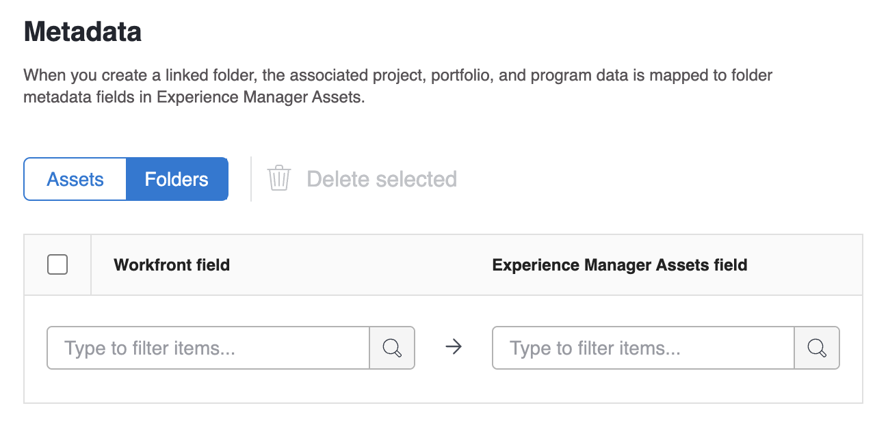

# 設定 [!UICONTROL Experience Manager Assetsas a Cloud Service] 整合

<!-- Audited: 1/2024 -->

>[!IMPORTANT]
>
>此功能僅適用於已上線的組織。 [!DNL Adobe Admin Console].

您可以在下列位置將您的工作與內容連結： [!DNL Experience Manager Assets]下&#x200B;列：

* 推送資產和中繼資料來源 [!DNL Adobe Workfront] 至 [!DNL Experience Manager Assets]&#x200B;URL
* 資產連結來源 [!DNL Experience Manager Assets] 至您的專案和任務 [!DNL Workfront&#x200B;]
* 促進版本設定使用案例
* 建立連結至的資料夾 [!DNL Experience Manager Assets]
* 追蹤資產和資料夾的中繼資料
* 同步專案中繼資料介於 [!DNL Workfront] 和 [!DNL Experience Manager Assets]

>[!NOTE]
>
>您也可以連線數個 [!DNL Experience Manager Assets] 將存放庫合併為一個 [!UICONTROL Workfront] 環境或數個 [!DNL Workfront] 環境至一 [!DNL Experience Manager Assets] 跨組織ID的存放庫。 針對您要設定的每項整合，請依照本文的設定指示操作。

## 存取需求

您必須具備下列條件：

<table>
  <tr>
   <td><strong>[!DNL Adobe Workfront] 計畫</strong>
   </td>
   <td>任何
   </td>
  </tr>
  <tr>
   <td><strong>[!DNL Adobe Workfront] 授權</strong>
   </td>
   <td>目前： [！UICONTROL計畫]  
   新增：[！UICONTROL Standard]
   </td>
  </tr>
  <tr>
   <td><strong>[!DNL Experience Manager] 授權</strong>
   </td>
   <td>[！UICONTROL標準]
   </td>
  </tr>
  <tr>
   <td><strong>產品</strong>
   </td>
   <td>您必須擁有 [!DNL Experience Manager Assets as a Cloud Service]，而且您必須以使用者的身分新增至產品中。
   </td>
  </tr>
  <tr>
   <td>存取層級設定*
   </td>
   <td>您必須是 [!DNL Workfront] 管理員。
   </td>
  </tr>
</table>

如需有關此表格的詳細資訊，請參閱 [Workfront檔案中的存取需求](/help/quicksilver/administration-and-setup/add-users/access-levels-and-object-permissions/access-level-requirements-in-documentation.md).

## 先決條件

開始之前，

* 您必須擁有 [!DNL Workfront] 和 [!DNL Adobe Experience Manager Assets] 與中的組織ID相關聯 [!DNL Adobe Admin Console]. 如需詳細資訊，請參閱 [平台式管理差異([!DNL Adobe Workfront]/[!DNL Adobe Business Platform])](/help/quicksilver/administration-and-setup/get-started-wf-administration/actions-in-admin-console.md).

## 設定整合資訊

{{step-1-to-setup}}

1. 選取 **[!UICONTROL 檔案]** 在左側面板中，然後選取 **[!UICONTROL [!DNL Experience Manager]整合]**.

   >[!NOTE]
   >
   >此設定區域僅在 [!DNL Workfront] 環境包含在下 [!DNL Adobe Admin Console].

1. 選取 **[!UICONTROL 新增 [!DNL Experience Manager] 整合]**.
1. 在 **[!UICONTROL 名稱]** 欄位中，輸入您希望使用者在Workfront和Experience Manager Assets中與此整合互動時看到的名稱。
1. 在 **[!UICONTROL 導覽URL]** 欄位時，系統會自動填入導覽URL。 此唯讀URL用於連結至貴組織的 [!DNL Experience Manager] 例項來自 [!UICONTROL 主要功能表] 以快速存取。
1. 從中選擇存放庫 **[!UICONTROL [!DNL Experience Manager]資產存放庫]** 下拉式功能表。 系統會自動填入 [!DNL Experience Manager] 與您的使用者設定檔指派到的組織ID相關聯的存放庫。
   

1. 按一下 **[!UICONTROL 儲存]** 或移至 [設定中繼資料（選用）](#set-up-metadata-optional) 一節。

   >[!NOTE]
   >
   >由於整合的複雜性，您在儲存初始設定後無法變更存放庫。

## 設定中繼資料（選用）

您可以對應 [!DNL Workfront] 物件資料至中的資產媒體欄位 [!DNL Experience Manager] 資產。

>[!IMPORTANT]
>
>您只能在一個方向對應中繼資料：從 [!DNL Workfront] 至 [!DNL Experience Manager]. 連結至的檔案中繼資料 [!DNL Workfront] 從 [!DNL Experience Manager] 無法轉移到 [!DNL Workfront].

### 設定中繼資料欄位

開始對應中繼資料欄位之前，您必須先在Workfront和Experience Manager Assets中設定中繼資料欄位。

若要設定中繼資料欄位：

1. 在中設定中繼資料結構 [!DNL Experience Manager Assets] 如中所述 [設定Adobe之間的資產中繼資料對應 [!DNL Workfront] 和 [!DNL Experience Manager Assets]](https://experienceleague.adobe.com/docs/experience-manager-cloud-service/content/assets/integrations/configure-asset-metadata-mapping.html?lang=en).

1. 在Workfront中設定自訂表單欄位。 [!DNL Workfront] 有許多內建的自訂欄位可供您使用。 不過，您也可以建立自己的自訂欄位，如中所述 [建立或編輯自訂表單](/help/quicksilver/administration-and-setup/customize-workfront/create-manage-custom-forms/create-or-edit-a-custom-form.md).

+++ **展開以檢視有關支援的Workfront和Experience Manager Assets欄位的詳細資訊**

**Experience Manager Assets標籤**

您可以將任何Workfront支援的欄位對應到Experience Manager Assets中的標籤。 若要這麼做，您必須確保Experience Manager Assets中的標籤值符合Workfront。

* 標籤和Workfront欄位值在拼字和格式上必須是完全相符的。
* 對應至Workfront assets標籤的Experience Manager欄位值必須全部小寫，即使Experience Manager Assets中的標籤似乎包含大寫字母。
* Workfront欄位值不得包含空格。
* Workfront中的欄位值也必須包含Experience Manager Assets標籤的資料夾結構。
* 若要將多個單行文字欄位對應到標籤，請在中繼資料對應的Workfront端輸入標籤值清單（以逗號分隔），然後 `xcm:keywords` 在Experience Manager Assets端。 每個欄位值對應至個別標籤。 您可以使用計算欄位，將多個Workfront欄位合併為單一逗號分隔文字欄位。
* 您可以透過在下拉式清單、單選按鈕或核取方塊欄位中輸入逗號分隔的可用值清單，來對應該欄位的值。

>[!INFO]
>
>**範例**：若要與這裡資料夾結構中顯示的標籤相符，Workfront中的欄位值將是 `landscapes:trees/spruce`. 請注意Workfront欄位值中的小寫字母。
>
>如果您希望標籤成為標籤樹中最左邊的專案，它後面必須跟一個冒號。 在此範例中，若要對應至景觀標籤，Workfront中的欄位值將是 `landscapes:`.
>
>

在Experience Manager Assets中建立標籤後，標籤會顯示在中繼資料區段的「標籤」下拉式清單下。 若要將欄位連結至標籤，請選取 `xcm:keywords` 在中繼資料對應區域的Experience Manager Assets欄位下拉式清單中。

如需Experience Manager Assets標籤的詳細資訊，包括如何建立和管理標籤，請參閱 [管理標籤](https://experienceleague.adobe.com/docs/experience-manager-64/administering/contentmanagement/tags.html).

**Experience Manager Assets自訂中繼資料結構欄位**

您可以將內建和自訂Workfront欄位對應到Experience Manager Assets中的自訂中繼資料結構欄位。

在Experience Manager Assets中建立的自訂中繼資料欄位，會整理在中繼資料設定區域的各自區段中。

<!-- 
link to documentation about creating schema - waiting on response from Anuj about best article to link to
-->

**Workfront欄位**

您可以將內建和自訂Workfront欄位對應至Experience Manager Assets。 Workfront和Experience Manager Assets之間的下列欄位值大小寫和拼字必須相符：

* 下拉式欄位
* 多選欄位

>[!TIP]
>
> 若要檢查欄位值是否完全相符，請前往
>
> * Workfront中的「設定>自訂Forms」或物件中的欄位
> * Experience Manager Assets中的「資產>中繼資料結構」

+++

### 對應資產的中繼資料

中繼資料對映何時從推送資產 [!DNL Workfront] 這是第一次。 含有內建或自訂欄位的檔案，在第一次將資產傳送至時，會自動對應至指定的欄位 [!DNL Experience Manager Assets].

若要對應資產的中繼資料：

<!--
1. Select **[!UICONTROL Assets]** above the metadata table.
-->
1. 在 **[!UICONTROL [!DNL Workfront]欄位]** 欄中，選擇內建或自訂Workfront欄位。

   >[!NOTE]
   >
   >您可以對應單一 [!DNL Workfront] 欄位至多個 [!UICONTROL Experience Manager Assets] 欄位。 您無法對應多個 [!DNL Workfront] 欄位至單一 [!DNL Experience Manager Assets] 欄位。
   ><!--To map a Workfront field to an Experience Manager Assets tag, see -->

1. 在 [!DNL Experience Manager Assets] 欄位，在預先填入的類別中搜尋，或在搜尋欄位中輸入至少兩個字母以存取其他類別。
1. 視需要重複步驟2和3。
   
1. 按一下 [!UICONTROL 儲存] 或移至 [設定工作流程](#set-up-workflows-optional) 一節。

<!--

### Map metadata for folders

When users create a linked folder on a project, the associated project, portfolio, and program data is mapped to folder metadata fields in [!DNL Experience Manager Assets].

>[!NOTE]
>
>This integration does not support custom metadata from [!DNL Adobe Experience Manager].

To map metadata for folders: 

1. Select **[!UICONTROL Folders]** above the metadata table.
1. In the **[!UICONTROL [!DNL Workfront] field]** column, choose a built-in or custom Workfront field.

    >[!NOTE]
    >
    >You can map a single Workfront field to multiple Experience Manager Assets fields. You can't map multiple [!DNL Workfront] fields to a single [!DNL Experience Manager Assets] field.

1. In the **[!DNL Experience Manager Assets]** field, search through the pre-populated categories or enter at least two letters in the search field to access additional categories.
1. Repeat steps 2 and 3 as needed.

1. Click **[!UICONTROL Save]** or move on to the [Project metadata sync](#project-metadata-sync) section in this article.

### Object metadata sync

An [!DNL Experience Manager] fields that is mapped to [!DNL Workfront] portfolio, program, project, task, issue, and document fields update automatically when the field is changed in [!DNL Workfront].

When this option is enabled, any asset that has been pushed to Adobe Experience manager includes a card on the Document Details page that displays a real-time view of the document's Adobe Experience Manager metadata.

>[!IMPORTANT]
>
>Users must have write access in [!DNL Experience Manager] for assets living in the object in order for the metadata to sync when it's updated.

1. Enable the **[!UICONTROL Sync object metadata]** field.
1. Click **Save** or move on to the [Set up workflows (Optional)](#set-up-workflows-optional) section in this article.-->

## 設定工作流程（選用）

工作流程是一組將Workfront連線至Adobe Experience Manager as a Cloud Service的動作。 身為Workfront管理員，您可以在Workfront中設定工作流程，然後將它們指派給專案範本。 使用指派了工作流程的專案範本建立專案時，會觸發工作流程中定義的動作。

已啟用並設定整個Adobe Experience Manager的工作流程。 這些工作流程隨後可套用至專案範本，並在範本或專案層級進行調整或自訂。

Adobe Experience Manager整合提供下列工作流程：

* [建立Adobe Experience Manager連結資料夾](#create-adobe-experience-manager-linked-folders)
* [發佈傳送至Adobe Experience Manager Assets的資產](#publish-assets-that-are-sent-to-adobe-experience-manager-assets)

### 建立Adobe Experience Manager連結資料夾

1. 切換 **[!UICONTROL 建立連結的資料夾]** 開啟。
1. 輸入您正在建立的連結資料夾名稱。
1. （視條件而定）啟用 **預設資料夾樹狀結構** 選項，如果您希望此連結資料夾為使用使用此整合之範本所建立專案的預設資料夾。 您可以選取一或多個預設資料夾。
1. 選擇資料夾路徑，以指出您要將所有連結的資料夾與此整合相關聯的位置。
1. （視條件而定）若要將資料夾樹狀結構（巢狀資料夾）新增至此整合，請執行下列動作：

   1. 按一下 **新增資料夾** 圖示 .
   1. 在 **名稱型別** 欄位中，選取您要如何命名資料夾：

      * **名稱**：輸入資料夾的名稱。
      * **物件資料**：選取資料夾名稱的來源，如專案名稱。

      >[!NOTE]
      >
      >* 資料夾名稱必須少於100個字元。
      >* 下列字元將會從資料夾名稱中移除：
      >
      >   `/`， `:`， `[`， `]`， `|`， `*`

   1. 若要將巢狀資料夾新增至資料夾樹狀結構，請按一下您要在其中建立巢狀資料夾的資料夾旁邊的三個點功能表，然後選取 **新增資料夾**. 依照上一步驟中的說明填寫欄位。
   1. 若要將資料夾連結至Workfront，請選取資料夾並按一下 **建立連結的資料夾**   圖示 .
   1. （可選）若要編輯資料夾，請選取資料夾並按一下 **編輯資料夾** 圖示 .
   1. （可選）若要刪除資料夾，請選取資料夾並按一下 **刪除資料夾** 圖示 .
1. （視條件而定）若要新增另一個資料夾樹狀結構，請按一下 **+新增資料夾樹狀結構** 並依照步驟5中的步驟操作。

1. 按一下 **[!UICONTROL 儲存]**，或繼續前往 [發佈傳送至Adobe Experience Manager Assets的資產](#publish-assets-that-are-sent-to-adobe-experience-manager-assets) 一節。

>[!NOTE]
>
>* 此整合最多只會建立100個資料夾，無論已建立多少資料夾樹狀結構。 例如，與4個資料夾樹狀結構的整合最多可建立100個資料夾，而不是400個資料夾。
>* 資料夾樹狀結構中的第一個資料夾會自動標示為連結至Workfront。 如果您不想要連結此資料夾，可以取消其連結。
>* 如果未提供資料夾樹狀結構，則根資料夾會成為連結的資料夾。

### 發佈傳送至Adobe Experience Manager Assets的資產

1. 開啟 **[!UICONTROL 自動發佈資產]**.
1. 勾選您要發佈傳送至Adobe Experience Manager資產之資產的位置旁的方塊。 您可以啟用任一或兩個選項。
1. （視條件而定）如果您已啟用Brand Portal選項，請選取您要發佈資產的Brand Portal 。
1. 按一下 **[!UICONTROL 儲存]** 或移至 [設定連結的資料夾（選擇性）](#set-up-linked-folders-optional) 一節。

## 設定連結的資料夾（選擇性）

您可以允許使用者建立連結至的資料夾 [!DNL Experience Manager] 當在 [!DNL Workfront] 專案。 連結資料夾時，新增至資料夾的任何資產都會自動顯示在兩者中 [!DNL Workfront] 和 [!DNL Experience Manager]. 將資產新增至中的連結資料夾時 [!DNL Workfront] 資產的中繼資料首次推送至 [!DNL Experience Manager Assets].

在下列步驟中，您會指示您要在哪個位置建立連結資料夾。 每個整合只能有一個位置用於所有連結的資料夾。

若要設定連結的資料夾：

1. 切換 **[!UICONTROL 啟用連結的資料夾]** 開啟。
1. 選擇資料夾路徑，以指出您要將所有連結的資料夾與此整合相關聯的位置。

   >[!NOTE]
   >
   >使用者需要寫入許可權 [!DNL Adobe Experience Manager Assets] 至指定用來建立連結資料夾的資料夾。

1. 按一下「**[!UICONTROL 儲存]**」。
