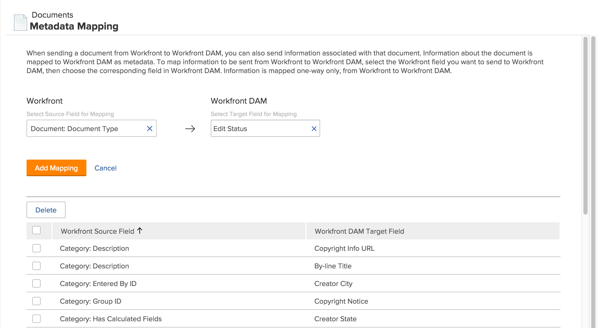

# 設定中繼資料對應

中繼資料是與檔案相關聯的描述性資訊。 您可以設定[!DNL Adobe Workfront]以包含中繼資料以及傳送至[!DNL Workfront]應用程式的檔案。

## 存取權要求

+++ 展開以檢視這篇文章中所述功能的存取權要求。

<table>
  <tr>
   <td>Adobe Workfront 封裝
   </td>
   <td> 
Prime或Ultimate

    
Workflow Ultimate

   </td>
  </tr>
  <tr>
   <td>Adobe Workfront 授權
   </td>
   <td>
標準

   
規劃

   </td>
  </tr>
   <tr>
   <td>存取層級設定
   </td>
   <td>您必須是[!DNL Workfront]管理員。
   </td>
  </tr>
</table>

如需詳細資訊，請參閱Workfront檔案中的[存取需求](/help/quicksilver/administration-and-setup/add-users/access-levels-and-object-permissions/access-level-requirements-in-documentation.md)。

+++

## 關於[!DNL Workfront]中繼資料

[!DNL Workfront]中檔案的中繼資料可包含相關專案名稱、任務說明或規劃完成日期等資訊。 作為[!DNL Workfront]管理員，您可以將[!DNL Workfront]設定為包含中繼資料，以及從[!DNL Workfront]傳送至下列[!DNL Workfront]應用程式的檔案：

* [!DNL Workfront DAM]

您必須先指定或對應想要包含的中繼資料，才能隨檔案傳送中繼資料。 您可以對應[!DNL Workfront]中使用的任何欄位。 設定中繼資料對應後，所有上傳至[!DNL Workfront]應用程式的檔案都將包含對應的中繼資料。

當使用者將檔案從[!DNL Workfront]傳送到[!DNL Workfront]應用程式時，對應的中繼資料會隨檔案傳輸。 當[!DNL Workfront]應用程式中的檔案版本連結到[!DNL Workfront]時，在[!DNL Workfront]中對檔案中繼資料所做的變更不會反映在[!DNL Workfront]應用程式中的檔案中繼資料中。 如果[!DNL Workfront]中的對應欄位已變更，您必須將含有更新後中繼資料的新版檔案傳送到[!DNL Workfront]應用程式。

>[!NOTE]
>
>您只能在一個方向對應中繼資料：從[!DNL Workfront]到[!DNL Workfront DAM]。 從[!DNL Workfront DAM]連結至[!DNL Workfront]的檔案中繼資料無法傳輸至Workfront。

您可以將相同的[!DNL Workfront]欄位對應到[!DNL Workfront DAM]中的各種中繼資料欄位，但您無法在其中任一應用程式中使用中繼資料欄位來對應多個[!DNL Workfront]中繼資料欄位。

若要設定多個[!DNL Workfront]欄位以匯出至[!DNL Workfront]應用程式中的一個中繼資料欄位，請先在[!DNL Workfront]中建立計算自訂欄位，以顯示物件的所有個別自訂欄位。 然後，將計算的[!DNL Workfront]欄位對應到[!DNL Workfront]應用程式中的中繼資料欄位。 如需有關計算自訂欄位的詳細資訊，請參閱[將計算欄位新增至表單](/help/quicksilver/administration-and-setup/customize-workfront/create-manage-custom-forms/form-designer/design-a-form/add-a-calculated-field.md)。

您必須先在[!DNL Workfront]中啟用應用程式，才能對應中繼資料對應程式的欄位。 如需詳細資訊，請參閱[設定檔案整合](../../administration-and-setup/configure-integrations/configure-document-integrations.md)。

## 設定[!DNL Workfront]以傳送中繼資料

{{step-1-to-setup}}

1. 在左側面板中，按一下&#x200B;**[!UICONTROL 檔案]** > **[!UICONTROL 中繼資料對應]**。

   

1. 在&#x200B;**[!UICONTROL 選取對應的Source欄位]**&#x200B;方塊中，開始輸入您要對應至[!DNL Workfront DAM]的Workfront欄位名稱，然後在清單中看到該欄位時選取它。
1. 在&#x200B;**[!UICONTROL 選取對應目標欄位]**&#x200B;方塊中，選取要以所選[!DNL Workfront]欄位中的資訊填入的欄位。

1. 按一下&#x200B;**[!UICONTROL 新增對應]**。

   對應欄位會顯示在頁面底部所列的對應欄位中。

1. 重複步驟5和6，直到您新增所有所需的[!DNL Workfront]欄位及其對應的[!DNL Workfront DAM]欄位為止。

## 刪除對應的欄位

1. 以系統管理員身分登入[!DNL Workfront]。

{{step-1-to-setup}}

1. 在左側面板中，按一下&#x200B;**[!UICONTROL 檔案]** > **[!UICONTROL 中繼資料對應]**。

1. 在對映欄位清單中，選取要從中繼資料對應中移除的欄位。
1. 按一下&#x200B;**[!UICONTROL 刪除]**。

   指定的欄位不再對應。 現在，當使用者將檔案從[!DNL Workfront]傳送到[!DNL Workfront DAM]時，已刪除欄位中包含的中繼資料未隨檔案一起傳輸。

   在您刪除對應欄位之前傳送的檔案會保留隨之傳送的原始中繼資料，包括已刪除欄位的中繼資料。
