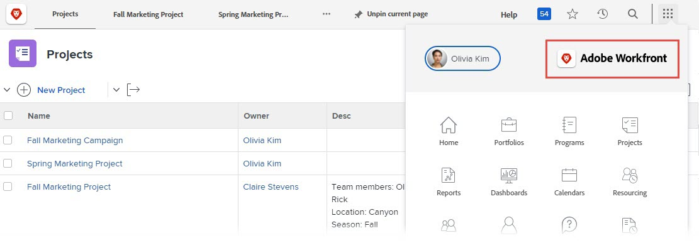

# 為您的 Adobe Workfront 執行個體建立品牌

<!--
**DON'T DELETE, DRAFT OR HIDE THIS ARTICLE. IT IS LINKED TO THE PRODUCT, THROUGH THE CONTEXT SENSITIVE HELP LINKS. **
-->

>[!IMPORTANT]
>
>此頁面上說明的程式僅適用於尚未上線到[!DNL Adobe Experience Cloud]的組織。
>
> 如果您的組織已上線到[!DNL Adobe Experience Cloud]，則無法使用品牌化。

身為Workfront管理員，您可在下列位置使用Logos為Workfront命名：

* 登入畫面

  

* 頂端巡覽區域

  

* 主要功能表

  

您也可以變更登入畫面的背景影像和顏色：

>[!NOTE]
>
>* 如果您組織的Workfront執行個體使用自訂SSO入口網站，則無法變更登入背景影像和顏色。 如需詳細資訊，請洽詢您的網路或IT管理員。
><!--
>or is enabled with Adobe IMS  >
>  >
>-->
>
>* Workfront管理員或群組管理員也可以使用版面配置範本，為特定群組和使用者包裝Workfront。 版面配置範本中的品牌化會覆寫本文中說明的系統層級品牌化。 如需版面配置範本中的品牌化指示，請參閱[使用版面配置範本的品牌Adobe Workfront](../../../administration-and-setup/customize-workfront/use-layout-templates/brand-wf-using-a-layout-template.md)。

## 存取需求

+++ 展開以檢視本文中功能的存取需求。

您必須具有下列存取權才能執行本文中的步驟：

<table style="table-layout:auto"> 
 <col> 
 <col> 
 <tbody> 
  <tr> 
   <td role="rowheader">Adobe Workfront計畫</td> 
   <td>任何</td> 
  </tr> 
  <tr> 
   <td role="rowheader">Adobe Workfront授權</td> 
   <td>計劃</td> 
  </tr> 
  <tr> 
   <td role="rowheader">存取層級設定</td> 
   <td> 
您必須是Workfront管理員。
 
<b>注意</b>：如果您還是沒有存取權，請詢問您的Workfront管理員是否對您的存取層級設定了其他限制。 如需Workfront管理員如何修改存取層級的詳細資訊，請參閱<a href="../../../administration-and-setup/add-users/configure-and-grant-access/create-modify-access-levels.md" class="MCXref xref">建立或修改自訂存取層級</a>。
 </td> 
  </tr> 
 </tbody> 
</table>

+++

## 為登入畫面建立品牌

{{step-1-to-setup}}

1. 按一下&#x200B;**系統** > **品牌**。

1. 進行下列任何變更，以使用您的品牌影像自訂Workfront。

   <table style="table-layout:auto"> 
    <col> 
    <col> 
    <tbody> 
     <tr> 
      <td role="rowheader"> 
品牌首頁圖示 （顯示在頂端導覽區域的最左側）
 </td> 
      <td> 
在<strong>上層導覽區域</strong>區段的<strong>首頁圖示</strong>下，按一下方塊中的任何位置，然後尋找並選取您的標誌影像。 或將影像拖曳至方塊。
 
若要裁切影像，請使用捲動控制項，並將影像拖曳至您想要在指定空間內的位置。
 
建議使用120 x 120影像。 其格式可為下列任一格式：GIF、JPG、PNG、SVG。
 
此圖示也會顯示在使用者匯出為PDF檔案的報告、清單、控制面板以及傳遞的報告中。
 </td> 
     </tr> 
     <tr> 
      <td role="rowheader"> 
標籤主要功能表標誌 （顯示在主要功能表的右上角）
 </td> 
      <td> 
在<strong>頂端導覽區域</strong>區段的<strong>主功能表標誌</strong>下，按一下方塊中的任何位置，然後尋找並選取您的標誌影像。 或將影像拖曳至方塊。
 
若要裁切影像，請使用捲動控制項，並將影像拖曳至您想要在指定空間內的位置。
 
建議使用300 x 120畫素的影像。 其格式可為下列任一格式：GIF、JPG、PNG、SVG。
 </td> 
     </tr> 
     <tr> 
      <td role="rowheader">品牌登入畫面標誌 （顯示在使用者輸入登入認證的方塊左上方）</td> 
      <td> 
在<strong>登入畫面</strong>下，按一下方塊中的任何位置，然後尋找並選取您的標誌影像。 若要裁切影像，請使用捲動控制項，並將影像拖曳至您想要在指定空間內的位置。
 
建議使用300 x 120畫素的影像。 其格式可為下列任一格式：GIF、JPG、PNG、SVG。
 </td> 
     </tr> 
     <tr> 
      <td role="rowheader">標籤登入畫面背景色彩 （顯示在使用者輸入登入認證的方塊後面）</td> 
      <td> 
在<strong>登入畫面</strong>下，設定<strong>背景色彩</strong>。 
 
您可以使用RGB或十六進位色彩代碼。
 
只有在登入熒幕背景大於登入熒幕背景影像時（請參閱此表格中的下一列），或是影像中有任何透明度時，才會顯示背景顏色。
 </td> 
     </tr> 
     <tr> 
      <td role="rowheader">標籤登入畫面背景影像 （顯示在使用者輸入其登入認證的方塊後面）</td> 
      <td> 
       <ol style="list-style-type: lower-alpha;"> 
        <li value="1"> 
 在<strong>登入畫面</strong>區域的<strong>背景影像</strong>下方，按一下方塊，然後尋找並選取您的JPG或PNG影像或影像（最多20個）。 
 
多個背景影像會以隨機順序顯示，每次使用者重新整理其登入頁面時都會變更。 建議影像不要大於2 MB。
 </li> 
        <li value="2"> 
將游標停留在您已上傳的每個背景影像上，按一下「設定」（齒輪）圖示，然後使用下列任何選項來指定您希望影像在登入畫面背景中出現的位置與方式：
 
         <ul> 
          <li> 
<strong>填滿熒幕</strong>：將影像調整至登入熒幕背景，可能會放大影像。 使用高解析度影像（最大2 MB）以獲得最佳效果。
 
使用此選項時，無法自訂的Workfront橫幅會遮蔽部分影像。
 </li> 
          <li> 
<strong>圖磚</strong>：將影像以原始大小並排顯示於登入畫面背景區域。 這對於建立陣列非常有用。 選取藍色對齊選項，從背景區域的左上角、中上角或右上角開始並排顯示。
 </li> 
          <li> 
<strong>位置</strong>：使用其中一個藍色對齊選項（登入畫面背景區域的左上角、中上角或右上角），將影像置於您選擇位置的原始大小。
 
背景顏色會填滿登入畫面背景區域的其餘部分。 如需背景顏色的詳細資訊，請參閱此表格的前一列。
 </li> 
         </ul> </li> 
       </ol> </td> 
     </tr> 
     <tr> 
      <td role="rowheader">重設為預設品牌</td> 
      <td> 
重設為預設品牌會刪除您上傳的所有像片與影像。
 
按一下熒幕右下角的<strong>「將所有商標重設為Workfront預設值</strong>」，然後按一下<strong>是</strong>。
 </td> 
     </tr> 
    </tbody> 
   </table>

   >[!NOTE]
   >
   >如果您組織的Workfront執行個體使用自訂SSO入口網站，則無法使用此選項。
   ><!--   >
   >or is enabled with Adobe IMS   >
   >   >
   >-->
   >
   >如需詳細資訊，請洽詢您的網路或IT管理員。

1. 按一下「**儲存**」。
