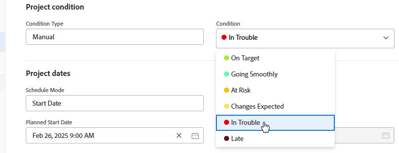

# 變更條件的顯示順序

您可以變更條件在專案、任務和問題中的顯示順序：

* 當使用者編輯專案時

  編輯專案時

* 當使用者變更任務或問題的條件時

  中的狀況

  >[!NOTE]
  >
  >在預設的「條件」檢視中，**條件**&#x200B;欄位是無法內嵌編輯的欄位型別。 當您單獨將&#x200B;**條件**&#x200B;欄位新增到檢視時，它是可編輯的。 如需內嵌編輯的詳細資訊，請參閱[在Adobe Workfront中內嵌編輯清單的專案](/help/quicksilver/workfront-basics/navigate-workfront/use-lists/inline-edit-objects.md)。

## 存取需求

+++ 展開以檢視本文中功能的存取需求。

<table style="table-layout:auto"> 
 <col> 
 <col> 
 <tbody> 
  <tr> 
   <td>Adobe Workfront套件</td> 
   <td>
任何
</td> 
  </tr> 
  <tr> 
   <td>Adobe Workfront授權</td> 
   <td>
標準

       
規劃
</td>
  </tr> 
  <tr> 
   <td>存取層級設定</td> 
   <td>系統管理員</td> 
  </tr> 
 </tbody> 
</table>

如需詳細資訊，請參閱Workfront檔案中的[存取需求](/help/quicksilver/administration-and-setup/add-users/access-levels-and-object-permissions/access-level-requirements-in-documentation.md)。

+++

## 變更條件的顯示順序

{{step-1-to-setup}}

1. 按一下&#x200B;**專案偏好設定** > **條件**。

1. 選取&#x200B;**專案**、**任務**&#x200B;或&#x200B;**問題**&#x200B;索引標籤。

1. 拖曳條件以變更其順序。

   新訂單會自動儲存。

如需自訂條件的詳細資訊，請參閱[自訂條件](../../../administration-and-setup/customize-workfront/create-manage-custom-conditions/custom-conditions.md)。
