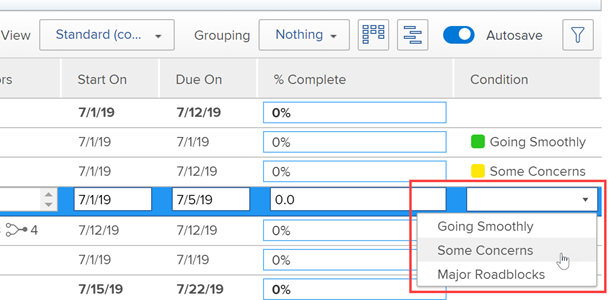

# 建立或編輯自訂條件

身為Adobe Workfront管理員，您可以針對專案、工作和問題建立或編輯自訂條件，以符合您組織的需求。

## 存取需求

您必須具備下列存取權，才能執行本文中的步驟：

<table style="table-layout:auto"> 
 <col> 
 <col> 
 <tbody> 
  <tr> 
   <td>Adobe Workfront計畫</td> 
   <td>任何</td> 
  </tr> 
  <tr> 
   <td>Adobe Workfront授權</td> 
   <td>計劃</td> 
  </tr> 
  <tr> 
   <td>訪問級別配置</td> 
   <td> 
您必須是Workfront管理員。
 
<b>注意</b>:如果您仍無權存取，請洽詢您的Workfront管理員，他們是否在您的存取層級設定其他限制。 如需Workfront管理員如何修改您的存取層級的詳細資訊，請參閱 <a href="../../../administration-and-setup/add-users/configure-and-grant-access/create-modify-access-levels.md" class="MCXref xref">建立或修改自訂存取層級</a>.
 </td> 
  </tr> 
 </tbody> 
</table>

## 建立或編輯自訂條件

1. 按一下 **主菜單** 圖示  在Adobe Workfront的右上角，然後按一下 **設定** .

1. 按一下 **專案偏好設定** > **條件**.

1. 按一下物件類型的標籤(**專案**, **任務**，或 **問題**)來建立關聯。

1. 若要建立新條件，請按一下 **新增條件**.

   或

   若要編輯現有條件，請將滑鼠指標暫留在您要編輯的條件上，然後按一下 **編輯** 表徵圖。

   

1. 使用下列選項設定自訂條件：

   <table style="table-layout:auto"> 
    <col> 
    <col> 
    <tbody> 
     <tr> 
      <td>狀況名稱</td> 
      <td>（必要）為條件輸入描述性名稱。</td> 
     </tr> 
     <tr> 
      <td>說明</td> 
      <td>（選用）為將使用此條件的人輸入條件用途的說明。</td> 
     </tr> 
     <tr> 
      <td>顏色</td> 
      <td>（選用）按一下顏色圖示，然後選擇條件在專案、工作或問題中顯示時所要的顏色。 您也可以輸入十六進位數。</td> 
     </tr> 
     <tr> 
      <td>視為 </td> 
      <td>
（僅適用於專案）按一下下拉式清單中最能說明新條件之功能的選項。 例如，對於名為「追蹤良好」的條件，您可以按一下「目標」。 這會決定預設條件的運作方式。 您建立的每個條件都必須等於下拉式功能表中的其中一個選項。

      
如需預設條件的相關資訊，請參閱 <a href="../../../administration-and-setup/customize-workfront/create-manage-custom-conditions/set-custom-condition-default-projects.md" class="MCXref xref">將自訂條件設為專案的預設值</a> 和 <a href="../../../administration-and-setup/customize-workfront/create-manage-custom-conditions/set-custom-condition-default-tasks-issues.md" class="MCXref xref">將自訂條件設為工作和問題的預設值</a>.

      
建立條件後，無法修改此選項。
</td> 
     </tr> 
     <tr> 
      <td>密鑰</td> 
      <td>
（必要）針對專案條件，輸入使用者能辨識的英數字元縮寫。 對於任務或問題條件，鍵入01到99的兩位數數字代碼。 

      
此金鑰（用於API中，且可用於報表用途）對每個物件必須是唯一的。

      
儲存條件後，您無法變更條件的索引鍵。 
</td> 
     </tr> 
     <tr> 
      <td>隱藏狀態</td> 
      <td>
（選用）此選項適用於您不再希望使用者使用，但因歷史原因而想保留的自訂條件。 

      
如果隱藏已用於工作項目的自定義條件，則在隱藏該條件後，該條件將繼續出現在這些工作項上。 
</td> 
     </tr> 
    </tbody> 
   </table>

   >[!TIP]
   >
   >您可以在所有三種物件類型中標準化條件術語和顏色。 若要這麼做，請將條件名稱和色彩十六進位程式碼從一個索引標籤（專案、工作、問題）複製到其他兩個索引標籤上的對應條件。

1. （可選）拖曳  任何條件重新排序清單。

   這會變更條件在專案、工作和問題中的顯示順序：

   * 使用者編輯專案時

      

   * 當用戶在「更新」頁簽上更改任務或問題的條件時：

      

   * 當用戶在清單視圖中更改任務或問題的條件時：

      

1. 按一下&#x200B;**儲存**。

您可以將自訂條件設為專案或工作和問題的預設條件。 如需詳細資訊，請參閱 [將自訂條件設為專案的預設值](../../../administration-and-setup/customize-workfront/create-manage-custom-conditions/set-custom-condition-default-projects.md) 和 [將自訂條件設為工作和問題的預設值](../../../administration-and-setup/customize-workfront/create-manage-custom-conditions/set-custom-condition-default-tasks-issues.md).

如需自訂條件的詳細資訊，請參閱 [自訂條件](../../../administration-and-setup/customize-workfront/create-manage-custom-conditions/custom-conditions.md).
