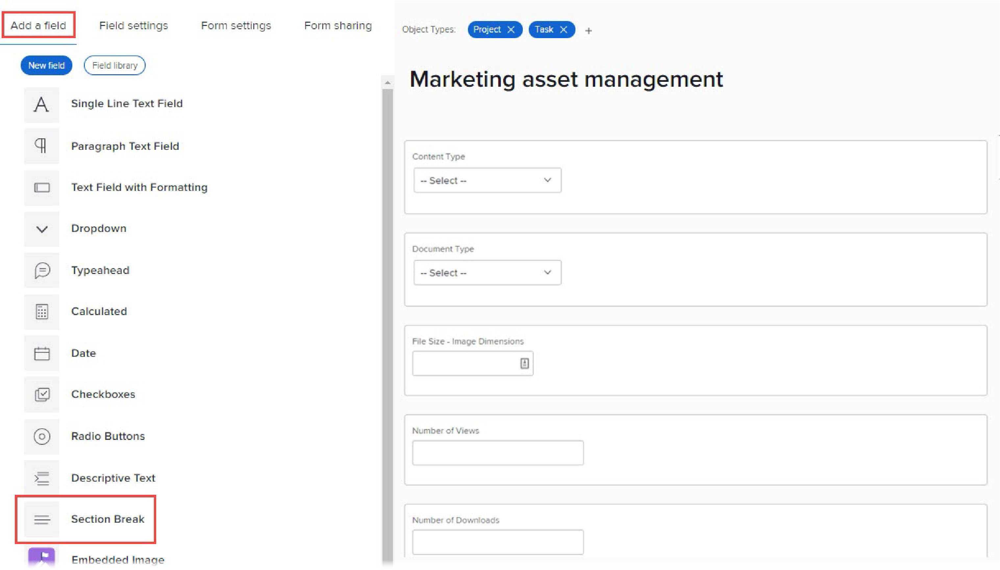

# 使用舊版表單產生器，將區段分頁新增至自訂表單

您可以將自訂表單中的自訂欄位和Widget分組為具有標題的區段。 這對於向將填寫表單的使用者呈現有條理的體驗非常有用。 此外，如果您需要限制特定使用者對特定自訂欄位和Widget的存取權，您可以將它們放在區段中，然後僅將區段的存取權授予這些使用者。

例如，如果您需要追蹤只有系統管理員才能檢視或編輯的敏感資訊，您可以使用「僅管理員」權限建立分區符號，並將敏感欄位放在該區段中。

您為區段選取的存取設定會直接系結至使用者在自訂表單附加位置的Workfront物件上的權限。 您可以根據使用者是否有檢視、貢獻或管理該物件的存取權，來隱藏或顯示區段。 或者，您可以將區段設為「僅管理員」，讓只有具有系統管理員存取權限的使用者才能存取。

有關對象權限的資訊，請參見 [對象共用權限概述](../../../workfront-basics/grant-and-request-access-to-objects/sharing-permissions-on-objects-overview.md).

如需自訂表單中自訂欄位和小工具的相關資訊，請參閱 [新增自訂欄位至自訂表單](../../../administration-and-setup/customize-workfront/create-manage-custom-forms/add-a-custom-field-to-a-custom-form.md) 和 [在自訂表單中新增或編輯資產介面工具集](../../../administration-and-setup/customize-workfront/create-manage-custom-forms/add-widget-or-edit-its-properties-in-a-custom-form.md).

<!--
>[!TIP]
>
>Section breaks that you add to custom forms are saved in your system for re-use. For information about listing them, see [List and edit custom forms and widgets added to custom forms](../../../administration-and-setup/customize-workfront/create-manage-custom-forms/list-edit-share-custom-forms-and-custom-fields.md).
-->

## 存取需求

您必須具備下列條件才能執行本文所述步驟：

<table style="table-layout:auto"> 
 <col> 
 <col> 
 <tbody> 
  <tr data-mc-conditions=""> 
   <td role="rowheader"> 
Adobe Workfront計畫*
 </td> 
   <td>任何</td> 
  </tr> 
  <tr> 
   <td role="rowheader">Adobe Workfront授權*</td> 
   <td>計劃</td> 
  </tr> 
  <tr data-mc-conditions=""> 
   <td role="rowheader">訪問級別配置*</td> 
   <td> 
管理對自訂表單的存取
 
如需Workfront管理員如何授予此存取權的詳細資訊，請參閱 <a href="../../../administration-and-setup/add-users/configure-and-grant-access/grant-users-admin-access-certain-areas.md" class="MCXref xref">授予用戶對特定區域的管理訪問權限</a>.
 </td> 
  </tr>  
 </tbody> 
</table>

&#42;若要了解您擁有的計畫、授權類型或存取層級設定，請聯絡您的Workfront管理員。

## 為自訂表單中的區段建立和設定存取權

1. 開始建立或編輯自訂表單，如 [建立或編輯自訂表單](../../../administration-and-setup/customize-workfront/create-manage-custom-forms/create-or-edit-a-custom-form.md).
1. 將自訂欄位和小工具新增至表單，如 [新增自訂欄位至自訂表單](../../../administration-and-setup/customize-workfront/create-manage-custom-forms/add-a-custom-field-to-a-custom-form.md) 和 [在自訂表單中新增或編輯資產介面工具集](../../../administration-and-setup/customize-workfront/create-manage-custom-forms/add-widget-or-edit-its-properties-in-a-custom-form.md).

1. 在建立或編輯自訂表單時，請在 **新增欄位** 按一下 **區段分隔**.

   

1. 在 **欄位設定** ，請為區段設定您想要的選項：

   <table style="table-layout:auto"> 
    <col> 
    </col> 
    <col> 
    </col> 
    <tbody> 
     <tr> 
      <td role="rowheader">標籤</td> 
      <td> 
（必要）輸入要在區段上方顯示的描述性標籤。 您隨時都可以變更標籤。
 
<b>重要</b>:請避免在此標籤中使用特殊字元。 報表中無法正確顯示。
 </td> 
     </tr> 
     <tr> 
      <td role="rowheader">說明</td> 
      <td>如果您想要向使用者說明區段的用途，請輸入文字。 這會顯示在自訂表單上區段的標籤下方。</td> 
     </tr> 
     <tr> 
      <td role="rowheader">新增邏輯</td> 
      <td>使用顯示邏輯根據使用者在填寫表單時在多選項自訂欄位中所做的選取，指定是否應在表單上顯示區段。 如需詳細資訊，請參閱 <a href="../../../administration-and-setup/customize-workfront/create-manage-custom-forms/display-or-skip-logic-custom-form.md" class="MCXref xref">新增顯示邏輯並略過邏輯至自訂表單</a>.</td> 
     </tr> 
     <tr> 
      <td role="rowheader"> 
授予存取權
 </td> 
      <td> 
 選取使用者對自訂表單附加所在物件所需的權限，以檢視此區段並編輯其欄位值。 
       
下列權限可在 <b>具有物件存取權的使用者可檢視欄位值</b>:
 
         <ul>  
          <li>
<b>有限編輯</b>:（只有對象是項目、任務、問題或用戶時才可用）:
 
          
如果物件是專案、任務或問題，可讓使用者貢獻物件。

          
允許用戶編輯配置檔案或擁有對象的配置檔案權限（如果對象是用戶）。
</li> 
          <li><b>編輯</b>:管理物件的權限 </li> 
          <li><b>僅限管理員</b>:系統管理員訪問級別</li> 
         </ul> </li> 
        
下列權限可在 <b>對對象具有此訪問權限的用戶可以編輯欄位值</b>: 
 
         <ul> 
          <li> 
<b>有限編輯</b>:（只有對象是項目、任務、問題或用戶時才可用）:
 
           
如果物件是專案、任務或問題，此權限可讓使用者貢獻該物件

          
如果對象是用戶，則此權限允許用戶編輯配置檔案或擁有該對象的配置檔案權限。
 
          <li><b>編輯</b>:管理物件的權限 </li> 
          <li><b>僅限管理員</b>:系統管理員訪問級別</li> 
         </ul> </li> 
       </ul> 
       
有關對象權限的資訊，請參見 <a href="../../../workfront-basics/grant-and-request-access-to-objects/sharing-permissions-on-objects-overview.md" class="MCXref xref">對象共用權限概述</a>.
 
       
<b>附註</b>:  
       <ul> 
       <li> 
沒有您在此處指定權限的使用者看不到區段中的自訂欄位和Widget。 
 
如果在報表中顯示欄位值，或在文字模式報表中的計算欄位中使用這些值，也會是正確的。
 </li> 
       <li> 
將多個對象類型與表單關聯可以更改這些步驟中可用的查看和編輯權限。 如需詳細資訊，請參閱 <a href="#how-multiple-object-types-can-affect-section-break-permissions-in-a-custom-form" class="MCXref xref">多種對象類型如何影響自定義表單中的分節符權限</a> 這篇文章。
 </li> 
        </ul> 
 </td> 
     </tr> 
    </tbody> 
   </table>

1. 將至少一個自訂欄位或介面工具集拖曳或新增至新區段。

   儲存區段之前，此為必要項目。

1. 按一下 **完成**.

   >[!TIP]
   >
   >您可以按一下 **套用** 在您建立自訂表單時隨時儲存變更並保持表單開啟。

1. 如果您想以其他方式繼續建立自訂表單，請繼續閱讀下列其中一篇文章：

   * [新增自訂欄位至自訂表單](../../../administration-and-setup/customize-workfront/create-manage-custom-forms/add-a-custom-field-to-a-custom-form.md#add2)
   * [在自訂表單中新增或編輯資產介面工具集](../../../administration-and-setup/customize-workfront/create-manage-custom-forms/add-widget-or-edit-its-properties-in-a-custom-form.md)
   * [將計算資料新增至自訂表單](../../../administration-and-setup/customize-workfront/create-manage-custom-forms/add-calculated-data-to-custom-form.md)
   * [在自訂表單中放置自訂欄位和小工具](../../../administration-and-setup/customize-workfront/create-manage-custom-forms/position-fields-in-a-custom-form.md)
   * [新增顯示邏輯並略過邏輯至自訂表單](../../../administration-and-setup/customize-workfront/create-manage-custom-forms/display-or-skip-logic-custom-form.md)
   * [預覽並完成自訂表單](../../../administration-and-setup/customize-workfront/create-manage-custom-forms/preview-and-complete-a-custom-form.md)

<!--
DRAFTED IN FLARE:
<h2>Configure access for fields without section breaks</h2>

************This section might get added later. Team decided not to implement.

In a custom form, you can also control users' access to custom fields
and image widgets that are not placed inside a defined section.

<ol>
<li value="1">Begin creating or editing a custom form, as described in <a href="../../../administration-and-setup/customize-workfront/create-manage-custom-forms/create-or-edit-a-custom-form.md" class="MCXref xref">Create or edit a custom form</a>.</li>
<li value="2">Add custom fields

and widgets

to the form, as described in <a href="../../../administration-and-setup/customize-workfront/create-manage-custom-forms/add-a-custom-field-to-a-custom-form.md" class="MCXref xref">Add a custom field to a custom form</a>.</li>
<li value="3"> 
While still creating or editing the custom form, open the <b>Form settings</b> tab.
 
SHOW THIS 
 </li>
<li value="4"> 
Under <b>Grant access</b>, configure the permissions that users need on an object where the custom form is attached, in order to view and edit values in fields not placed under a section break. 
 
If you need information about permissions on objects, see <a href="../../../workfront-basics/grant-and-request-access-to-objects/sharing-permissions-on-objects-overview.md" class="MCXref xref">Overview of sharing permissions on objects</a>.
 <note type="note">
<ul>
<li> 
Users without the permissions you specify here can't see the values of the fields
and image widgets that are not placed in a defined section in the custom form. This is also true if you display the values in reports or use them in calculated fields in text mode reporting.
 </li>
<li> 
Associating multiple object types with your form can change the viewing and editing permissions that are available in these steps. For more information, see <a href="#how-multiple-object-types-can-affect-section-break-permissions-in-a-custom-form" class="MCXref xref">How multiple object types can affect section break permissions in a custom form</a> in this article.
 </li>
</ul>
</note>
<table style="table-layout:auto">
<col>
<col>
<tbody>
<tr>
<td role="rowheader"><b>Users with this access to the object can view field values</b> </td>
<td>
<ul>  
<li> 
<b>Limited Edit</b>: (Available only if the object is a project, task, issue, or user):

<ul>
<li> 
Contribute permission to the object if it's a project, task, or issue
 </li>
<li> 
Edit the profile or own the profile permission to the object if it's a user (profile)
 </li>
</ul> </li>
<li><b>Edit</b>: Manage permissions to the object </li>
<li><b>Admin only</b>: System Administrator access level</li>
</ul> </td>
</tr>
<tr>
<td role="rowheader">Users with this access to the object can edit field values</td>
<td>
<ul>
<li> 
<b>Limited Edit</b>: (Available only if the object is a project, task, issue, or user):

<ul>
<li> 
Contribute permission to the object if it's a project, task, or issue
 </li>
<li> 
Edit the profile or own the profile permission to the object if it's a user (profile)
 </li>
</ul> </li>
<li><b>Edit</b>: Manage permissions to the object </li>
<li><b>Admin only</b>: System Administrator access level</li>
</ul> </td>
</tr>
</tbody>
</table> </li>
<li value="5"> 
Click Done.
 <note type="tip">
You can click
<strong>Apply</strong> at any point while you are creating a custom form to save your changes and keep the form open.
</note> </li>
<li value="6"> 
If you want to continue building your custom form in other ways, continue on to one of the following articles:

<ul>
<li><a href="../../../administration-and-setup/customize-workfront/create-manage-custom-forms/add-a-custom-field-to-a-custom-form.md#add2" class="MCXref xref">Add a custom field to a custom form</a> </li>
<li><a href="../../../administration-and-setup/customize-workfront/create-manage-custom-forms/add-widget-or-edit-its-properties-in-a-custom-form.md" class="MCXref xref">Add or edit an asset widget in a custom form</a> </li>
<li><a href="../../../administration-and-setup/customize-workfront/create-manage-custom-forms/add-calculated-data-to-custom-form.md" class="MCXref xref">Add calculated data to a custom form</a> </li>
<li><a href="../../../administration-and-setup/customize-workfront/create-manage-custom-forms/position-fields-in-a-custom-form.md" class="MCXref xref">Position custom fields and widgets in a custom form</a> </li>
<li><a href="../../../administration-and-setup/customize-workfront/create-manage-custom-forms/display-or-skip-logic-custom-form.md" class="MCXref xref">Add display logic and skip logic to a custom form</a> </li>
<li><a href="../../../administration-and-setup/customize-workfront/create-manage-custom-forms/preview-and-complete-a-custom-form.md" class="MCXref xref">Preview and complete a custom form</a> </li>
</ul> </li>
</ol>

-->

## 多種對象類型如何影響分節符權限 {#how-multiple-object-types-can-affect-section-break-permissions-in-a-custom-form}

自訂表單區段分段的「有限編輯」權限僅適用於「專案」、「任務」、「問題」和「使用者」物件類型。

在配置了「有限編輯」權限的帶分區符的自定義表單中，如果向表單中添加其他對象類型(Portfolio、程式、文檔、公司、帳單記錄、小版本、費用或組)，將提示您切換到「編輯」權限，該權限與該對象類型和表單上的現有對象類型都相容。

>[!INFO]
>
>**範例：** 在與「項目」對象類型關聯的自定義窗體中，分區符將配置為「有限編輯」權限。
>
>將Portfolio對象類型添加到窗體中，這表示窗體中的分區分隔符不再提供「有限編輯」權限選項。
>
>螢幕上的消息提示您切換到「編輯」權限，該權限是與「有限編輯」最相似的選項，並與「項目」對象類型和「Portfolio」對象類型相容。
