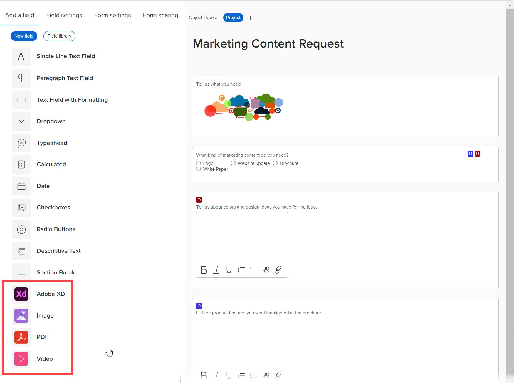

# 在自訂表單中新增或編輯影像或其他資產介面工具集

您可以以自訂表單新增或編輯下列任何資產小工具的屬性：

* 影像
* 視訊
* PDF檔案
* Adobe XD檔案

當您需要包含品牌影像、教學影片或您所設計應用程式的互動式原型等視覺內容時，這個功能就十分實用。

將包含介面工具集的自訂表單附加至物件時，使用該物件的使用者可在下列區域看到該物件：

* 對象的「詳細資訊」區域（例如，對於項目，為「項目詳細資訊」區域）
* 物件的「編輯」方塊(如果具有新的Adobe Workfront體驗外觀)（例如「編輯專案」和「編輯工作」方塊）

目前，使用者無法在下列區域中看到介面工具集：&#x200B;

* 清單與報表
* 首頁和摘要
* 物件的「編輯」方塊(如果沒有新的Adobe Workfront體驗外觀和風格)（例如「編輯費用」方塊）
* Workfront行動應用程式

## 存取需求

您必須具備下列條件才能執行本文所述步驟：

<table style="table-layout:auto"> 
 <col> 
 <col> 
 <tbody> 
  <tr data-mc-conditions=""> 
   <td role="rowheader"> 
Adobe Workfront計畫*
 </td> 
   <td>任何</td> 
  </tr> 
  <tr> 
   <td role="rowheader">Adobe Workfront授權*</td> 
   <td>計劃</td> 
  </tr> 
  <tr data-mc-conditions=""> 
   <td role="rowheader">訪問級別配置*</td> 
   <td> 
管理對自訂表單的存取
 
如需Workfront管理員如何授予此存取權的詳細資訊，請參閱 <a href="../../../administration-and-setup/add-users/configure-and-grant-access/grant-users-admin-access-certain-areas.md" class="MCXref xref">授予用戶對特定區域的管理訪問權限</a>.
 </td> 
  </tr>  
 </tbody> 
</table>

&#42;若要了解您擁有的計畫、授權類型或存取層級設定，請聯絡您的Workfront管理員。

## 在自訂表單中新增或編輯資產介面工具集

1. 開始使用自訂表單，如 [建立或編輯自訂表單](../../../administration-and-setup/customize-workfront/create-manage-custom-forms/create-or-edit-a-custom-form.md).
1. 使用 **新增欄位** 頁簽開啟，執行下列任一操作：

   * 如果要添加新介面工具集，請選擇 **影像**, **PDF**，或 **影片** 要在表單底部添加，或將其拖動到您希望的表單上。

      

   * 如果要新增已新增至其他自訂表單的介面工具集，請按一下 **欄位程式庫**，然後在顯示的清單中按一下介面工具集的名稱。 如需詳細資訊，請參閱 [在自訂表單中重複使用自訂欄位或介面工具集](../../../administration-and-setup/customize-workfront/create-manage-custom-forms/reuse-an-existing-field.md).

   * 如果您正在編輯已添加到自定義表單的介面工具集，請選擇它。

1. 為介面工具集鍵入或編輯以下任何屬性：

   <table style="table-layout:auto"> 
    <col> 
    <col> 
    <tbody> 
     <tr> 
      <td role="rowheader">標籤</td> 
      <td> 
（必要）輸入要在介面工具集上方顯示的描述性標籤。 您隨時都可以變更標籤。
 
<b>重要</b>:請避免在此標籤中使用特殊字元。 報表中無法正確顯示。
 </td> 
     </tr> 
     <tr> 
      <td role="rowheader">名稱</td> 
      <td> 
（必要）此名稱是系統識別介面工具集的方式。
 
當您第一次設定介面工具集並輸入標籤時，「名稱」欄位會自動填入以符合標籤。 但「標籤」和「名稱」欄位未同步，因此您可以自由地更改用戶看到的標籤，而不必更改系統看到的名稱。
 
<b>重要</b>:雖然可以這麼做，但建議您不要在您或其他使用者開始使用Widget中的自訂表單後變更此名稱。 如果您這麼做，系統將不再識別介面工具集，現在可能會在Workfront的其他區域參照該介面工具集。 
 
在貴組織的Workfront例項中，每個介面工具集名稱必須是唯一的。 這樣，您就可以重複使用已針對其他自訂表單建立的表單。 
 </td> 
     </tr> 
     <tr> 
      <td role="rowheader">URL</td> 
      <td> 
（必要）輸入或貼上Widget的URL，該URL儲存在網際網路上。
 
      
如果您新增視訊介面工具集，目前可在URL方塊中新增下列內容，以完成新增：
 
      <ul> 
      <li> 
YouTube或Vimeo連結
 </li> 
      <li> 
Google驅動器視頻連結
 </li> 
      <li> 
連結至MP4和MOV擴充功能的影片
 </li> 
      <li> 
連結至已上傳至Workfront執行個體中「檔案」區域的影片。 如需指示，請參閱 <a href="#add-a-video-widget-to-a-custom-form-from-the-documents-area" class="MCXref xref">從「文檔」區域將視頻介面工具集添加到自定義表單中</a> 這篇文章。
 </li> 
      </ul> 
       </td> 
     </tr> 
     <tr> 
      <td role="rowheader">指示</td> 
      <td> 
輸入有關介面工具集的任何其他資訊。 當使用者填寫自訂表單時，可將滑鼠移至問號圖示上方，檢視包含您在此輸入之資訊的工具提示。
 </td> 
     </tr> 
     <tr> 
      <td role="rowheader">大小</td> 
      <td>視需要變更介面工具集的顯示大小。</td> 
     </tr> 
    </tbody> 
   </table>

1. 按一下 **套用**.
1. 如果您想以其他方式繼續建立自訂表單，請繼續閱讀下列其中一篇文章：

   * [在自訂表單中放置自訂欄位和小工具](../../../administration-and-setup/customize-workfront/create-manage-custom-forms/position-fields-in-a-custom-form.md)
   * [新增自訂欄位至自訂表單](../../../administration-and-setup/customize-workfront/create-manage-custom-forms/add-a-custom-field-to-a-custom-form.md)
   * [在自訂表單中重複使用自訂欄位或介面工具集](../../../administration-and-setup/customize-workfront/create-manage-custom-forms/reuse-an-existing-field.md)
   * [將計算資料新增至自訂表單](../../../administration-and-setup/customize-workfront/create-manage-custom-forms/add-calculated-data-to-custom-form.md)
   * [在自訂表單中重複使用現有的計算自訂欄位](../../../administration-and-setup/customize-workfront/create-manage-custom-forms/use-existing-calc-field-new-custom-form.md)
   * [新增顯示邏輯並略過邏輯至自訂表單](../../../administration-and-setup/customize-workfront/create-manage-custom-forms/display-or-skip-logic-custom-form.md)
   * [預覽並完成自訂表單](../../../administration-and-setup/customize-workfront/create-manage-custom-forms/preview-and-complete-a-custom-form.md)

## 新增XD檔案至自訂表單

1. 開始使用自訂表單，如 [建立或編輯自訂表單](../../../administration-and-setup/customize-workfront/create-manage-custom-forms/create-or-edit-a-custom-form.md).
1. 使用 **新增欄位** 頁簽開啟，選擇 **Adobe XD**.
1. 為介面工具集鍵入或編輯以下任何屬性：

   <table style="table-layout:auto"> 
    <col> 
    <col> 
    <tbody> 
     <tr> 
      <td role="rowheader">標籤</td> 
      <td> 
（必要）輸入要在介面工具集上方顯示的描述性標籤。 您隨時都可以變更標籤。
 
<b>重要</b>:請避免在此標籤中使用特殊字元。 報表中無法正確顯示。
 </td> 
     </tr> 
     <tr> 
      <td role="rowheader">名稱</td> 
      <td> 
（必要）此名稱是系統識別介面工具集的方式。
 
當您第一次設定介面工具集並輸入標籤時，「名稱」欄位會自動填入以符合標籤。 但「標籤」和「名稱」欄位未同步，因此您可以自由地更改用戶看到的標籤，而不必更改系統看到的名稱。
 
<b>重要</b>:雖然可以這麼做，但建議您不要在您或其他使用者開始使用Widget中的自訂表單後變更此名稱。 如果您這麼做，系統將不再識別介面工具集，現在可能會在Workfront的其他區域參照該介面工具集。 
 
在貴組織的Workfront例項中，每個介面工具集名稱必須是唯一的。 這樣，您就可以重複使用已針對其他自訂表單建立的表單。 
 </td> 
     </tr> 
     <tr> 
      <td role="rowheader">URL</td> 
      <td> 
（必要）輸入或貼上有效的XD原型連結。
 
      
注意：Adobe XD中「共用」標籤上的「連結存取」設定必須設為「具有連結的任何人」。 否則，使用者將無法檢視原型。 
   </td> 
     </tr> 
     <tr> 
      <td role="rowheader">指示</td> 
      <td> 
（選用）輸入關於介面工具集的任何其他資訊。 當使用者填寫自訂表單時，可將滑鼠移至問號圖示上方，檢視包含您在此輸入之資訊的工具提示。
 </td> 
     </tr> 
     <tr> 
      <td role="rowheader">大小</td> 
      <td>（可選）視需要變更介面工具集的顯示大小。</td> 
     </tr> 
    </tbody> 
   </table>

1. 如果您想以其他方式繼續建立自訂表單，請繼續閱讀下列其中一篇文章：

   * [在自訂表單中放置自訂欄位和小工具](../../../administration-and-setup/customize-workfront/create-manage-custom-forms/position-fields-in-a-custom-form.md)
   * [新增自訂欄位至自訂表單](../../../administration-and-setup/customize-workfront/create-manage-custom-forms/add-a-custom-field-to-a-custom-form.md)
   * [在自訂表單中重複使用自訂欄位或介面工具集](../../../administration-and-setup/customize-workfront/create-manage-custom-forms/reuse-an-existing-field.md)
   * [將計算資料新增至自訂表單](../../../administration-and-setup/customize-workfront/create-manage-custom-forms/add-calculated-data-to-custom-form.md)
   * [在自訂表單中重複使用現有的計算自訂欄位](../../../administration-and-setup/customize-workfront/create-manage-custom-forms/use-existing-calc-field-new-custom-form.md)
   * [新增顯示邏輯並略過邏輯至自訂表單](../../../administration-and-setup/customize-workfront/create-manage-custom-forms/display-or-skip-logic-custom-form.md)
   * [預覽並完成自訂表單](../../../administration-and-setup/customize-workfront/create-manage-custom-forms/preview-and-complete-a-custom-form.md)

## 從「文檔」區域將視頻介面工具集添加到自定義表單中 {#add-a-video-widget-to-a-custom-form-from-the-documents-area}

>[!IMPORTANT]
>
>以這種方式將視訊新增至自訂表單時，當使用者存取物件上的表單時，只有為自訂表單設定的權限才會套用至視訊，而非在「檔案」區域為視訊設定的權限。

1. 前往「檔案」區域中的影片，並產生校樣，如 [為網站或其他網路內容建立互動式校樣](../../../review-and-approve-work/proofing/creating-proofs-within-workfront/generate-interactive-proof-for-website-or-other-web-content.md).
1. 開啟校樣。
1. 以滑鼠右鍵按一下視訊的任一位置，然後選取 **複製視訊地址**.
1. 在您新增視訊介面工具集的自訂表單中，將複製的位址貼入 **URL** 框。
