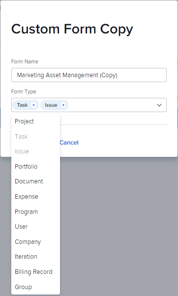

# 複製自訂表單以建立新表單

您可以根據現有表單建立新的自訂表單。

## 存取需求

您必須具備下列條件才能執行本文所述步驟：

<table style="table-layout:auto"> 
 <col> 
 <col> 
 <tbody> 
  <tr data-mc-conditions=""> 
   <td role="rowheader"> 
Adobe Workfront計畫*
 </td> 
   <td>任何</td> 
  </tr> 
  <tr> 
   <td role="rowheader">Adobe Workfront授權*</td> 
   <td>計劃</td> 
  </tr> 
  <tr data-mc-conditions=""> 
   <td role="rowheader">訪問級別配置*</td> 
   <td> 
管理對自訂表單的存取
 
如需Workfront管理員如何授予此存取權的詳細資訊，請參閱 <a href="../../../administration-and-setup/add-users/configure-and-grant-access/grant-users-admin-access-certain-areas.md" class="MCXref xref">授予用戶對特定區域的管理訪問權限</a>.
 </td> 
  </tr> 
 </tbody> 
</table>

&#42;若要了解您擁有的計畫、授權類型或存取層級設定，請聯絡您的Workfront管理員。

## 複製自訂表單以建立新表單

1. 按一下 **主菜單** 圖示  在Adobe Workfront的右上角，然後按一下 **設定** .

1. 按一下 **自訂Forms。**
1. 選取您要作為新自訂表單基礎的自訂表單，然後按一下 **複製**.
1. 在 **自訂表單副本** 框中，鍵入以下資訊：

   <table style="table-layout:auto"> 
    <col> 
    <col> 
    <tbody> 
     <tr> 
      <td role="rowheader">表格名稱</td> 
      <td>鍵入複製表單的名稱。</td> 
     </tr> 
     <tr> 
      <td role="rowheader"> 
表單類型 
 </td> 
      <td> 
在 <b>表單類型</b> 框中，選擇希望自定義表單使用的對象類型，然後按一下要刪除的任何類型旁邊的X。 已與表單關聯的類型在清單中被禁用。
 
      

 
      
表單必須至少與一個對象類型關聯。
 
      </td> 
     </tr> 
    </tbody> 
   </table>

1. 按一下 **複製表單**.

   在原始表單中，如果計算欄位引用與添加到新表單的對象類型不相容的欄位，則會出現一條消息提示您更改這些欄位中的計算。

   同樣，如果原始表單上斷節的訪問選項與添加到新表單中的對象類型不相容，則消息會提示您調整該選項。

1. 選取您剛複製的表單，然後按一下 **編輯**.
1. 對表單進行任何變更，如下列文章所述：

   * [複製自訂表單以建立新表單](#Add2)
   * [將計算資料新增至自訂表單](../../../administration-and-setup/customize-workfront/create-manage-custom-forms/add-calculated-data-to-custom-form.md)
   * [在自訂表單中放置自訂欄位和小工具](../../../administration-and-setup/customize-workfront/create-manage-custom-forms/position-fields-in-a-custom-form.md)
   * [在自訂表單中新增或編輯資產介面工具集](../../../administration-and-setup/customize-workfront/create-manage-custom-forms/add-widget-or-edit-its-properties-in-a-custom-form.md)
   * [在自訂表單中重複使用現有的計算自訂欄位](../../../administration-and-setup/customize-workfront/create-manage-custom-forms/use-existing-calc-field-new-custom-form.md)
   * [新增顯示邏輯並略過邏輯至自訂表單](../../../administration-and-setup/customize-workfront/create-manage-custom-forms/display-or-skip-logic-custom-form.md)
   * [預覽並完成自訂表單](../../../administration-and-setup/customize-workfront/create-manage-custom-forms/preview-and-complete-a-custom-form.md)

1. （選用）按一下 **儲存並關閉**，將表單附加至您要使用該表單的物件，如 [將自訂表單新增至物件](../../../workfront-basics/work-with-custom-forms/add-a-custom-form-to-an-object.md).
