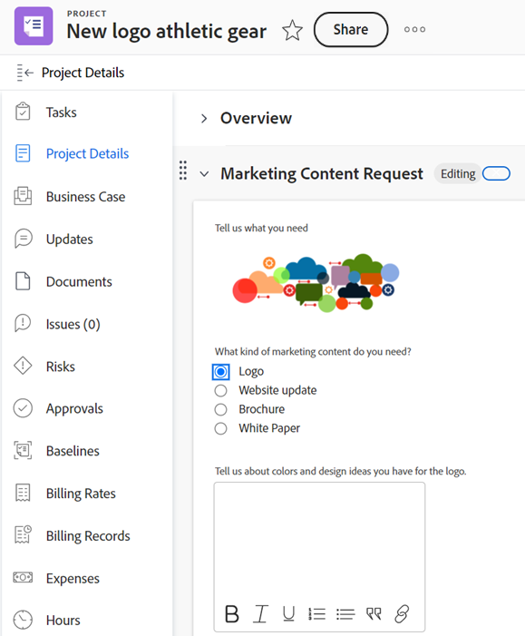

# 自訂表單概述

<!--Audited: 12/2023-->

{{form-designer-default}}

您可以建置使用者可附加至Adobe Workfront物件的自訂表單。 處理物件的使用者可以填寫自訂表格，以提供物件的相關資訊。

例如，您可以附加名為「行銷內容研究」的自訂表單以附加至專案，讓專案上的使用者可以請求專案的行銷內容：

## 如何建立自訂表格

有兩個選項可在[!DNL Workfront]中建立自訂表格。 您可以使用舊版自訂表單產生器或新的表單設計工具：

* [舊版自訂表單產生器](/help/quicksilver/administration-and-setup/customize-workfront/create-manage-custom-forms/use-the-custom-form-builder.md)
* [表單設計工具](/help/quicksilver/administration-and-setup/customize-workfront/create-manage-custom-forms/form-designer/form-designer-toc.md)

## 自訂欄位和小工具

Workfront為每種物件型別提供許多內建欄位。

在自訂表單中，您可以建立其他欄位，提示使用者輸入其工作流程特有的資訊。 這些自訂欄位是自訂表單的建置組塊。

您可以在Workfront中將下列型別的自訂欄位新增至自訂表單：

* 表單設計工具中的單行文字欄位或單行文字
* 表單設計工具中的段落文字欄位或段落文字
* 在表單設計工具中有格式化的文字欄位或有格式化的文字
* 下拉
* 外部查詢 — 僅適用於表單設計工具
* 自動提示
* 已計算
* 表單設計工具中的日期或日期欄位
* 核取方塊
* 單選按鈕
* 描述文字
* 分節符號
* Adobe XD
* 影像
* PDF
* 影片

## 使用者可附加自訂表單的物件

當您建置自訂表單時，可以將其設定為使用多個物件型別。

使用者可以將自訂表單附加到下列物件型別：

* 專案（包括業務案例）
* 任務
* 問題（包括請求佇列）
* 公司
* 文件
* 使用者
* 方案
* 專案組合
* 費用
* 群組
* 反覆項目
* 計費記錄

如需將自訂表單附加至物件的詳細資訊，請參閱[將自訂表單新增至物件](../../../workfront-basics/work-with-custom-forms/add-a-custom-form-to-an-object.md)。

如需有關轉換物件時自訂表單所發生情況的資訊，請參閱[轉換物件時傳輸自訂表單資料](/help/quicksilver/administration-and-setup/customize-workfront/create-manage-custom-forms/transfer-custom-form-data-larger-item.md)。

