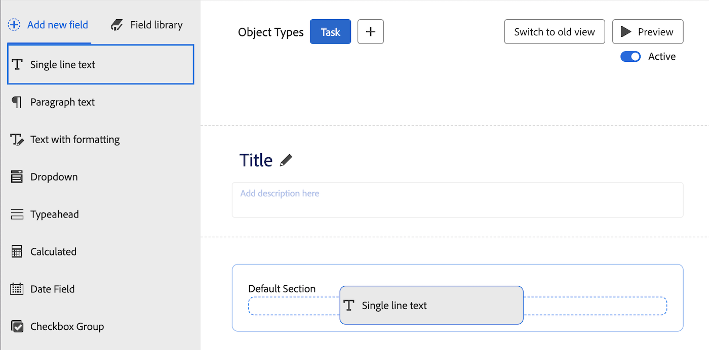

# 使用表單設計工具新增計算欄位

您可以將自訂表單附加至物件時，新增使用現有資料產生新資料的計算自訂欄位。

計算自訂欄位可包含：

* 單一內建欄位的簡單參考。

  >[!INFO]
  >
  > **範例：** 若要計算專案與任務產生的收入，您可以建立包含內建欄位「實際收入」的計算自訂欄位。 當有人將自訂表單附加到專案或任務時，專案或任務的收入會顯示在欄位中。

* 參考一或多個欄位的運算式。 這些可以是自訂欄位、其他計算自訂欄位和內建欄位。

  >[!INFO]
  >
  >**範例：** 若要計算專案與任務產生的利潤，您可以建立名為「利潤」的計算自訂欄位，其中包含從收入中減去成本的數學運算式。
  >
  >若要這麼做，您可以使用數學運算式SUB （減）搭配內建的Workfront欄位「實際成本」和「實際收入」。
  >
  >在下列步驟中，您可以看到如何執行此範例。

## 存取需求

您必須具備下列專案才能執行本文所述的步驟：

<table style="table-layout:auto"> 
 <col> 
 <col> 
 <tbody> 
  <tr data-mc-conditions=""> 
   <td role="rowheader"> 
Adobe Workfront計畫*
 </td> 
   <td>任何</td> 
  </tr> 
  <tr> 
   <td role="rowheader">Adobe Workfront授權*</td> 
   <td>計劃</td> 
  </tr> 
  <tr data-mc-conditions=""> 
   <td role="rowheader">存取層級設定*</td> 
   <td> 
管理自訂表單的存取權
 
如需Workfront管理員如何授予此存取許可權的詳細資訊，請參閱 <a href="/help/quicksilver/administration-and-setup/add-users/configure-and-grant-access/grant-users-admin-access-certain-areas.md" class="MCXref xref">授予使用者管理特定區域的存取權</a>.
 </td> 
  </tr>  
 </tbody> 
</table>

&#42;若要瞭解您擁有的計畫、授權型別或存取層級設定，請聯絡Workfront管理員。

## 在自訂表單中重複使用現有的計算自訂欄位

您可以在屬於不同物件的自訂表單上使用相同的計算自訂欄位。 例如，您可以使用您在任務自訂表單上為專案自訂表單建立的利潤計算欄位。

使用現有的計算自訂欄位時，計算未轉移到新表單。 您必須在新自訂表單的相同欄位上再次新增計算。

您也可以在新表單上為相同欄位進行不同的計算。 保持計算自訂欄位的名稱相同，可確保命名慣例中的連貫性和一致性。

>[!IMPORTANT]
>
>變更計算運算式可能會導致物件上的欄位值過時。 為確保您一律檢視這些欄位中的最新計算，請執行下列任一項作業：
>
>* 在儲存您已在附加自訂表單中編輯資料的物件後，按一下「更多」圖示  在物件首頁面上，然後重新計算自訂運算式。
>* 選取大量編輯物件時重新計算自訂運算式選項。
>* 在自訂表單上編輯計算的自訂欄位時，選取「更新先前的計算」選項。

若要重複使用現有的計算自訂欄位：

1. 按一下 **主要功能表** 圖示  (位於Adobe Workfront的右上角)，然後按一下 **設定** .

1. 按一下 **自訂Forms** 在左側面板中。

   <!-- >[!TIP]
    >
    >In the view that appears, you can review all custom forms and custom fields that have been created for your organization. You can also see who created each form and the fields that are associated with it. -->

1. 按一下 **新增自訂表格。**
1. 選取您要附加自訂表單的物件型別，然後按一下 **繼續**.

1. 在熒幕的左上角，按一下 **欄位程式庫**.

   

1. 使用搜尋方塊或展開 **已計算** 區段以找出所需的計算欄位，然後拖曳您想要該欄位在自訂表單中出現的位置。

1. （可選）重複上一步驟以新增任何其他欄位。

   >[!NOTE]
   >
   >您最多可以在單一自訂表單中新增500個欄位和Widget。 不過，根據表單的複雜性，當表單上存在超過100個時，可能會發生效能降低。
   >
   >
   >複雜表單的範例包括含有階層式引數的表單、計算的自訂資料欄位，以及單一欄位中的多個值選項。

1. 若要儲存變更，請按一下 **套用** 並移至另一個區段，以繼續建立您的表單。

   或

   按一下 **儲存並關閉**.

## 新增計算欄位

>[!IMPORTANT]
>
>在建立新的計算自訂欄位之前，請識別要包含的現有欄位，以確定Workfront中存在計算所需的資料。

1. 按一下 **主要功能表** 圖示  (位於Adobe Workfront的右上角)，然後按一下 **設定** .

1. 按一下 **自訂Forms** 在左側面板中。

   <!-- >[!TIP]
    >
    >In the view that appears, you can review all custom forms and custom fields that have been created for your organization. You can also see who created each form and the fields that are associated with it. -->

1. 按一下 **新增自訂表格。**
1. 選取您要附加自訂表單的物件型別，然後按一下 **繼續**.

1. 在畫面左側，尋找 **已計算** 並將其拖曳至畫布上的區段。

   

1. 在畫面的右側，設定您新增之自訂欄位型別的可用選項：

   <table style="table-layout:auto"> 
    <col> 
    </col> 
    <col> 
    </col> 
    <tbody> 
     <tr> 
      <td role="rowheader">標籤</td> 
      <td>輸入欄位的標籤。 這是使用者使用自訂表單時會看到的內容。 欄位 <b>名稱</b>，會自動填入，並由Workfront在報表中參照。</td> 
     </tr> 
     <tr> 
      <td role="rowheader" id="instructions">指示</td> 
      <td> 依預設，您為欄位建立的公式會儲存在此處。 您可以新增文字，以提供有關欄位及其公式的其他資訊。 此功能有兩個優點： 
       <ul> 
      <li>
提醒您公式是什麼及其運作方式。 如果您打算在多個表單上使用此計算自訂欄位，這會特別實用。
 </li> 
      <li> 
當使用者將游標停留在欄位上時，即可看到工具提示。 您可以在此處新增任何您希望他們在工具提示中看到的文字。
 
如果您不希望他們在工具提示中看到公式（這可能會導致他們困惑），您可以隱藏它。</li> 
       </ul> </td> 
     </tr> 
     <tr> 
      <td role="rowheader">格式</td> 
      <td> 
您希望儲存並顯示欄位結果的格式。
 
如果該欄位將用於數學計算，請一律使用 <strong>數字</strong> 或 <strong>貨幣</strong> 格式。 當您選取「數字」或「貨幣」時，系統會自動截斷以0開頭的數字。
 
      
<b>重要</b>：在選擇格式之前，請考慮新欄位的正確格式。 儲存自訂表單後無法編輯格式欄位。 選擇錯誤的格式可能會影響未來的計算，以及報告和清單分組中的彙總值。

      
<strong>注意：</strong> 使用貨幣格式的計算欄位不應包含引號。 （例如，使用800.00而非「800.00」。） 使用引號可能會由於貨幣型別的語言格式細微差別而造成非預期的後果。
</td>
     </tr> 
    </tbody> 
   </table>

1. 在 **計算** 方塊，開始建立您的計算：
   1. 按一下 **最大化** 以開啟計算編輯器並建置您的計算。

計算通常以運算式開始，後面接著括弧，其中包含當自訂表單附加至物件時要參考的欄位。

      每個欄位都必須以大括弧括住。 當您開始輸入欄位名稱時，系統會提供建議，您可以選取一個來將其插入計算。

+++ **展開以檢視計算自訂欄位中所需的語法**

      每個欄位都必須使用以下說明的語法，並在每個欄位名稱兩側加上大括弧。 當您開始輸入欄位名稱時，系統會提供建議，您可以選取一個來將其插入計算。 如果您在計算中輸入的資料不正確，警告訊息會警告您。 除非編輯計算以包含有效欄位和有效的計算運算式，否則無法儲存表單。

      >[!NOTE]
      >
      >目前，只有在您開始輸入要在自訂表單將附加到的物件上參考的欄位名稱時，系統才會提出建議。 不建議使用父物件中的欄位。

      **以大括弧括住欄位名稱**

      * 如果您希望計算參照內建欄位，欄位名稱必須用大括弧括住。

        例如： `{actualRevenue}`

        欄位名稱會區分大小寫，且在計算中必須如期顯示於Workfront系統中。

        導覽至 [Workfront API總管](https://developer.adobe.com/workfront/api-explorer/) 以識別可在計算中使用的欄位名稱。

      * 如果您希望計算參照自訂欄位，欄位名稱必須用大括弧括住，並在前面加上 `DE:` 括弧內。

        例如： `{DE:Profit}`

        系統列出您在輸入時可以選擇的所有自訂欄位 `DE:`.

         * 如果您希望計算作業參考欄位，而此欄位將從 *父級* 物件當自訂表單附加到物件時，您必須在欄位名稱前面加上父物件的物件型別，同樣位於大括弧中。

        例如，如果自訂表單設定為與任務搭配使用，而您希望欄位在表單附加到任務時計算父級物件的實際收入，則您需要指示 `Project` 做為欄位的物件型別：

        `{project}.{actualRevenue}`

        或者，如果是自訂欄位：

        `{project}.{DE:profit}`

        **使用句點分隔專案**

        當您在計算的自訂欄位中參考相關物件時，必須使用句點分隔物件名稱和屬性。

        例如，在任務型別自訂表單中，若要在計算的自訂欄位中顯示Portfolio擁有者的名稱，您可以輸入下列內容：

        `{project}.{porfolio}.{owner}`

        這會決定下列專案：從自訂表單（任務）的物件中，您可以存取與任務（專案）相關的下一個物件。 從那裡，您可以存取專案的下一個相關物件（投資組合），然後參照為投資組合物件（所有者）定義的欄位

        **參照自訂欄位的名稱語法**

        當您在計算的自訂欄位中參考另一個自訂欄位時，您需要輸入顯示在Workfront使用者介面中的欄位名稱。

        例如，若要參照在標示為Executive supporter的自訂欄位中選取的選項，您可以輸入以下內容：

        `{DE:Executive sponsor}`

        >[!NOTE]
        >
        >預先輸入欄位的語法與其他型別的欄位語法有些不同，因為您需要新增 `:name` 在結尾處。
        >
        >例如，若要參照在名為「高階主管支援人」的自訂預先輸入欄位中選取的選項，您可以輸入：
        >
        >`{DE:Executive sponsor:name}`

        **多物件自訂表單中的已計算自訂欄位**

        在多物件自訂表單中，選取的物件型別必須與表單的計算自訂欄位中參考的至少一個欄位相容。 與物件不相容的欄位會在表單上顯示N/A。

        為確保計算欄位顯示所有物件型別的正確結果，您必須使用 `$$OBJCODE` 以定義每個物件型別的計算。

        >[!INFO]
        >
        >**範例：**
        >
        >在設定為處理專案、任務和問題的自訂表單中，您可以使用以下公式來顯示物件型別：
        >
        >`IF($$OBJCODE="PROJ","This is a project",IF($$OBJCODE="TASK","This is a task","This is an issue"))`
        >
        >在專案上，欄位將顯示「這是專案」，在任務上將顯示「這是任務」，並且在問題上將顯示「這是問題」。

        >[!INFO]
        >
        >**範例：** 雖然專案中沒有「指派至：名稱」欄位，但有一個內建的「擁有者」欄位（除非有人手動變更此欄位，否則會自動填入建立專案者的名稱）。
        >
        >因此，在您的自訂負責欄位中，您可以使用 `$$OBJCODE` 如下所示，當自訂表單附加到專案時，這是參考「所有者」欄位，而當表單附加到任務時，這是參考「指派給：名稱」欄位：
        >
        >`IF($$OBJCODE="PROJ",{owner}.{name},{assignedTo}.{name})`

        如需變數的詳細資訊，例如 `$$OBJCODE,` 另請參閱 [萬用字元篩選器變數概觀](/help/quicksilver/reports-and-dashboards/reports/reporting-elements/understand-wildcard-filter-variables.md).

        **自動更新計算的自訂欄位**

        當發生下列情況時，會自動重新計算物件上的已計算自訂欄位：

         * 物件上的某些專案會變更，例如每日時間表計算。
         * 有人編輯物件上計算自訂欄位參考的另一個欄位。
         * 計算的運算式是空的，而欄位包含一個值 — 這會將值設定為null。

           >[!NOTE]
           >
           >
在附加到物件的自訂表單中，計算自訂欄位中的日期和時間陳述式會由世界協調時間(UTC)計算和儲存，而不是由針對您的組織執行個體和您的使用者設定檔設定的時區設定計算和儲存。 自訂表單中的計算是根據每位使用者的個別時區產生。

+++

   1. 按一下大型文字方塊，然後按一下 **運算式** 和 **欄位** 這些引數可用於將其新增至您的計算。

      您也可以開始在大型文字方塊中輸入運算式或欄位，然後在顯示時選取該運算式或欄位。 每個專案在欄位中顯示為「F」，在運算式中顯示為「E」。

      如果您鍵入左括弧，則會自動新增右括弧。

+++ **展開以檢視實用秘訣**
      >[!TIP]
      >
      >您可以執行下列任一項作業，以取得計算的協助：
      > 
      >* 將滑鼠指標暫留在計算中的運算式上可檢視說明、示範其使用方式的範例，以及文章中其他資訊的「瞭解更多」連結 [計算資料運算式的概觀](/help/quicksilver/reports-and-dashboards/reports/calc-cstm-data-reports/calculated-data-expressions.md).
      >  
      >* 使用顏色編碼來識別您新增的元件。 運算式會以藍色顯示，而欄位則會以綠色顯示。
      >  
      >* 立即尋找以粉紅色反白顯示的計算錯誤。 您可以將滑鼠停留在醒目提示的錯誤上，以顯示其原因的簡短說明。
      >  
      >* 在計算下方的區域中，預覽現有Workfront物件的結果。
      ><!--or by providing test values (NOT READY YET; CHANGE THIS SCREENSHOT WHEN IT IS)-->
      >  
      >* 使用左邊顯示的行號在長計算中參考運算式。

+++
   1. 按一下 **最小化** 當您完成計算自訂欄位的計算時。

   1. （可選）使用下列任一選項來進一步設定您的計算自訂欄位：

      <table style="table-layout:auto">
   <col> 
    <col> 
    <tbody> 
     <tr> 
      <td role="rowheader">新增邏輯</td> 
      <td>您可以新增顯示邏輯，以根據使用者在填寫表單時於前置的多重選擇欄位（下拉式清單、核取方塊或選項按鈕）中進行的至少一個選擇，決定是否要顯示計算欄位。 <!-- For more information, see <a href="Need to add link for new article when it's written" class="MCXref xref">Add display logic and skip logic to a custom form</a>.--> 
唯有在表單的計算自訂欄位前面至少有一個核取方塊、選項按鈕或下拉欄位時，才能使用此選項。 
 
略過邏輯不適用於已計算的自訂欄位。
 </td> 
     </tr> 
     <tr> 
      <td role="rowheader">更新先前的計算</td> 
      <td>當您編輯現有的計算自訂欄位時，可以選取此選項，以在儲存自訂表單時觸發計算中的更新。 當您儲存自訂表單時，只會發生一次。 執行此操作後，選項會回到其停用狀態。</td> 
     </tr> 
     <tr> 
      <td role="rowheader">在指示中顯示公式</td> 
      <td>如果您希望填寫自訂表單的使用者將游標停留在欄位上時檢視欄位公式，請將此選項保持啟用。 如需詳細資訊，請參閱以下資訊 <a href="#instructions" class="MCXref xref">指示</a> 此表格的舊版。</td> 
     </tr> 
    </tbody> 
   </table>

1. 若要儲存變更，請按一下 **套用** 並移至另一個區段，以繼續建立您的表單。

   或

   按一下 **儲存並關閉**.
