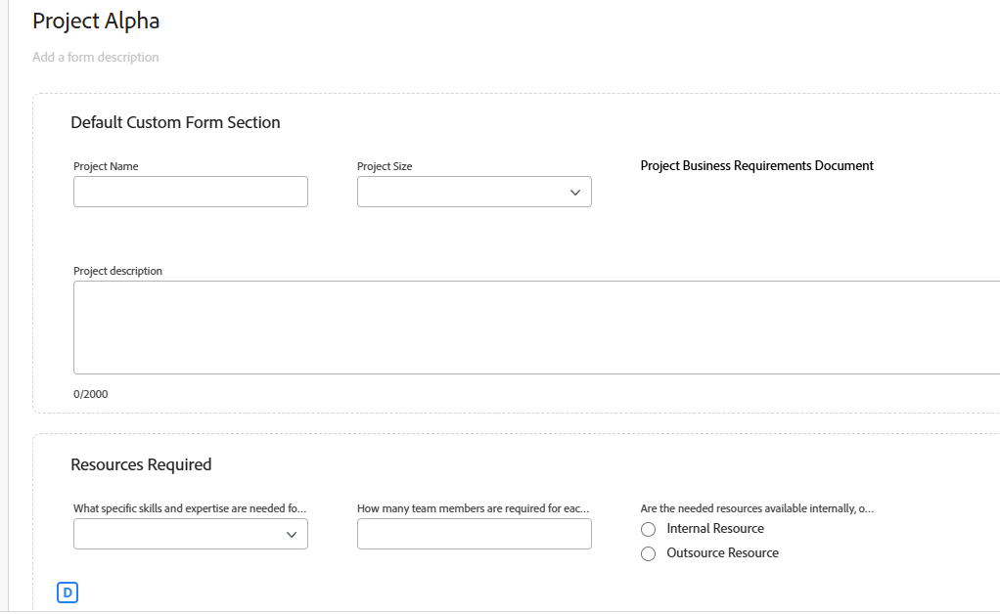
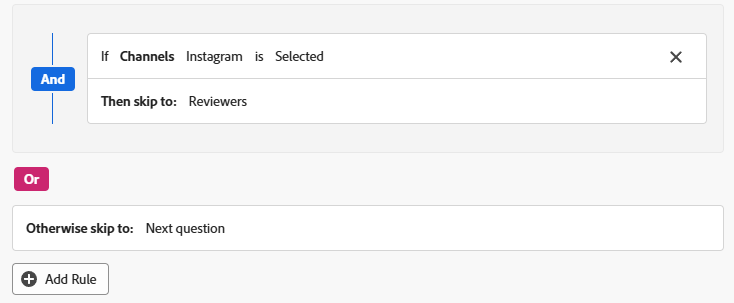

# 新增邏輯規則至自訂表單和欄位

邏輯規則可讓您進一步自訂表單上的欄位。

例如，您可以根據使用者在填寫時所做的選擇，顯示或略過自訂表單中的欄位或區段。

>[!NOTE]
>
>邏輯僅適用於一個表單，且不能以來自不同表單的選擇為基礎。

## 存取需求

+++ 展開以檢視本文中功能的存取需求。

您必須具有下列存取權才能執行本文中的步驟：

<table style="table-layout:auto"> 
 <col> 
 <col> 
 <tbody> 
  <tr data-mc-conditions=""> 
   <td role="rowheader">Adobe Workfront計畫 </td> 
   <td>任何</td> 
  </tr> 
  <tr> 
   <td role="rowheader">Adobe Workfront授權</td> 
   <td>
   <p>新增：標準</p>
   <p>或</p>
   <p>目前：計畫</p></td> 
  </tr> 
  <tr data-mc-conditions=""> 
   <td role="rowheader">存取層級設定</td> 
   <td>管理自訂表單的存取權 </td> 
  </tr>  
 </tbody> 
</table>

如需有關此表格的詳細資訊，請參閱Workfront檔案中的[存取需求](/help/quicksilver/administration-and-setup/add-users/access-levels-and-object-permissions/access-level-requirements-in-documentation.md)。

+++

## 顯示和略過邏輯圖示

自訂表單顯示圖示以指示顯示或略過邏輯何時套用至特定欄位。 表單設計工具中欄位上的圖示表示邏輯已套用至欄位。

| 圖示 | 表單設計工具中欄位的位置 | 定義 |
|--- |--- |--- |
|  | 左下方 | 欄位是顯示邏輯的目標欄位。 如果在表單上做了特定選擇，則會顯示此欄位。 |
|  | 右下方 | 欄位會定義顯示邏輯。 此欄位中的特定選取範圍或值會顯示目標欄位。 |
| 目標欄位的略過邏輯 | 左下方 | 欄位是略過邏輯的目標欄位。 如果對表單進行了特定選擇，則表單會前進到此欄位，並且之間的欄位會隱藏。 |
|  | 右下方 | 此欄位會定義略過邏輯。 此欄位上的特定選取範圍或值會略過其他欄位，並直接移至目標欄位。 |


選取已套用邏輯的欄位，以在欄位設定中顯示現有的邏輯規則。


## 使用顯示邏輯和略過邏輯的考量事項

* 若要在自訂欄位、Widget或分割槽符號上新增顯示邏輯，表單上必須至少有一個多選欄位（選項按鈕、下拉清單或核取方塊）位於該欄位之前。
如需自訂表單中自訂欄位和Widget的相關資訊，請參閱[建立自訂表單](/help/quicksilver/administration-and-setup/customize-workfront/create-manage-custom-forms/form-designer/design-a-form/design-a-form.md)。
* 您無法將跳過邏輯新增至Widget或分割槽符號。 您只能將其新增至多選欄位（選項按鈕、下拉式清單或核取方塊）。
* 您無法套用顯示或略過邏輯來顯示或隱藏多選項欄位的選擇。 例如，您無法根據其他欄位的顯示或略過邏輯，限制顯示下拉式清單、核取方塊群組或選項按鈕欄位的選項。
* 如果自訂欄位符合以下所有條件，則您可以將顯示邏輯和略過邏輯新增到自訂欄位：

   * 它是一個多選欄位（單選按鈕、下拉清單或覈取方塊）
   * 它前面有複選欄位
   * 後面接著另一個自訂欄位

* 複製具有顯示邏輯或跳過邏輯的表單時，邏輯會複製到新的自訂表單。
* 大量編輯物件時，所有自訂欄位都會顯示在「編輯物件」方塊中，包括略過或隱藏的欄位。
* 為自訂表單建立顯示邏輯規則時，請記住下列事項：

   * 預設情況下，顯示邏輯陳述式中未包含的自訂欄位會顯示在自訂表單上。
   * 您可以建立多欄位顯示邏輯陳述式。
   * 如果分割槽符號下的所有欄位都套用了顯示邏輯，並且它們都因該邏輯而隱藏，則整個分割槽將在自訂表單上隱藏。

## 新增顯示邏輯至自訂表單

顯示邏輯定義當使用者在多重選擇欄位中選擇特定值時，要在表單上顯示的自訂欄位。 此邏輯會新增至目標欄位，並僅在選取值時顯示。

<!--
>[!NOTE]
>
><span class="preview">This procedure describes the basic mode for display logic. Advanced display logic is also available. For more information, see [Add advanced display logic to a custom form](#add-advanced-display-logic-to-a-custom-form), in this article.</span>
-->

{{step-1-to-setup}}

1. 按一下&#x200B;**自訂Forms**。
1. 建立新的自訂表單或開啟現有的表單。 如需詳細資訊，請參閱[建立自訂表格](/help/quicksilver/administration-and-setup/customize-workfront/create-manage-custom-forms/form-designer/design-a-form/design-a-form.md)。
1. 視需要新增欄位至表單。 至少一個多選欄位（單選按鈕、下拉清單或核取方塊）必須放在將顯示的目標欄位之前。
1. 選取目標欄位並按一下&#x200B;**新增邏輯**。
1. 選取邏輯產生器上的&#x200B;**顯示**&#x200B;標籤。
1. 按一下&#x200B;**新增顯示規則**。

   

1. 請依照下列步驟，在產生器中建立邏輯陳述式。

   1. 第一個選項是選擇定義欄位。 此欄位具有顯示目標的選取值。 它必須是多選欄位。
   1. 第二個選項是選擇選取值。 只有已為該欄位定義的值才可使用。
   1. 第三個選項是&#x200B;**已選取**&#x200B;或&#x200B;**未選取**。 選擇&#x200B;**已選取**&#x200B;表示選取值時，會顯示目標欄位。 選擇&#x200B;**未選取**&#x200B;表示在定義欄位中選取任何其他值時，會顯示目標欄位。
   1. 若要將&#x200B;**And**&#x200B;規則新增至邏輯陳述式，請按一下您剛建立之規則下方的[新增規則]。 **&#x200B;**&#x200B;依照相同的提示來建置規則。 必須符合所有的And規則，目標欄位才會顯示。

      

   1. 若要將&#x200B;**Or**&#x200B;規則新增至邏輯陳述式，請按一下邏輯產生器底部附近的&#x200B;**新增規則**。 然後，按一下Or區域中的&#x200B;**新增規則**，並依照相同的提示來建置規則。 當滿足一個Or規則時，將顯示目標欄位。

1. 當您完成建置邏輯陳述式時，請按一下&#x200B;**套用**。

   顯示邏輯圖示會新增至表單設計工具的目標欄位和定義欄位。

<!--
<div class="preview">

## Add advanced display logic to a custom form

The advanced display logic for custom form fields allows you to build complex logic using formulas. You can apply this logic to the following field types: drop-down, radio button, checkbox, typeahead, single line text, paragraph text, date field, text with formatting, and calculated fields.

### Examples

You can use advanced display logic to control the visibility of custom form sections based on user roles and the visibility of a field based on another field's status.

No logic is applied to the default section on the form, so it is always visible to all users.

Using the following condition, the Resources Required section is only displayed when a user with the job role of Resource Manager views the form.

```IF($$USER.{roleID}="123abc", true)```

Note that ```123abc``` represents the role ID of the Resource Manager.



The same condition with a different role ID is applied to the Project Financial KPIs section to define that  only the Financial Advisor role can view the section.

Using the following condition, the Sold KPI field only becomes visible when the project is complete. This logic is applied directly to the field instead of to a form section. There is no need to specify which role can view the field, because that is already defined in the section that the field is in.

```IF({status}="CPL", true)```


### Define advanced display logic

{{step-1-to-setup}}

1. Click **Custom Forms**.
1. Create a new custom form or open an existing form. See [Create a custom form](/help/quicksilver/administration-and-setup/customize-workfront/create-manage-custom-forms/form-designer/design-a-form/design-a-form.md) for details.
1. Add fields to the form as needed.
1. Select the field to apply logic to, and click **Add Logic**.
1. Select the **Display** tab on the logic builder.
1. Turn on **Advanced mode**.
   
   This option might be turned on automatically, for fields that do not support the simple mode of display logic.

   

1. Build the display condition in the editor.

   For more information about calculations and expressions, see [Add calculated fields to a form](/help/quicksilver/administration-and-setup/customize-workfront/create-manage-custom-forms/form-designer/design-a-form/add-a-calculated-field.md) and [Overview of calculated data expressions](/help/quicksilver/reports-and-dashboards/reports/calc-cstm-data-reports/calculated-data-expressions.md).

1. Click **Apply**.
   
   The logic is applied to the field and the display logic icon is added in the form designer.

</div>
-->

## 將跳過邏輯新增至自訂表單

跳過邏輯定義自訂表單欄位，當使用者在多重選擇欄位中選擇特定值時，將跳過這些欄位。 略過的欄位會隱藏在表單上。 邏輯會套用至進行選取的定義欄位，而非跳過的欄位。

{{step-1-to-setup}}

1. 按一下&#x200B;**自訂Forms**。
1. 建立新的自訂表單或開啟現有的表單。 如需詳細資訊，請參閱[建立自訂表格](/help/quicksilver/administration-and-setup/customize-workfront/create-manage-custom-forms/form-designer/design-a-form/design-a-form.md)。
1. 視需要新增欄位至表單。 略過邏輯的定義欄位必須是多選欄位（選項按鈕、下拉式清單或核取方塊）。
1. 選取定義欄位，然後按一下畫面左下方的&#x200B;**新增邏輯**。
1. 選取邏輯產生器上的&#x200B;**略過**&#x200B;索引標籤。
1. 按一下&#x200B;**新增略過規則**。

   

1. 請依照下列步驟，在產生器中建立邏輯陳述式。

   1. 定義欄位會顯示在產生器中。 這是您選取要套用略過邏輯的欄位。
   1. 第一個選項是選擇選取值。 只有已為該欄位定義的值才可使用。
   1. 第二個選項是&#x200B;**已選取**&#x200B;或&#x200B;**未選取**。 選擇&#x200B;**已選取**&#x200B;表示選取值時，會顯示目標欄位，並略過兩者之間的欄位。 選擇&#x200B;**未選取**&#x200B;表示在定義欄位中選取任何其他值時，會顯示目標欄位，並略過兩者之間的欄位。
   1. 第三個選項是目標欄位，或跳至的位置。 選取欄位名稱或&#x200B;**表單**&#x200B;結尾。 您可能需要先按一下「空白」這個字，才能選取選項。

      

   1. 若要將&#x200B;**Or**&#x200B;規則新增至邏輯陳述式，請按一下邏輯產生器底部附近的&#x200B;**新增規則**。 然後，在相同的提示下選取選項以建置規則。 當符合一個&#x200B;**或**&#x200B;規則時，會顯示目標欄位。

1. 當您完成建置邏輯陳述式時，請按一下&#x200B;**套用**。

   略過邏輯圖示會新增至表單設計工具中的目標欄位和定義欄位。

## 新增驗證邏輯至自訂表單

驗證邏輯是使用公式建立的，您可以讓邏輯變得簡單或複雜。 驗證可以基於其他欄位的值或物件的狀態，並且您可以在驗證失敗時提供錯誤訊息。

如果套用了邏輯的欄位在使用者填寫自訂表單時符合定義的驗證條件，則該欄位會醒目提示並顯示錯誤訊息。

您可以將驗證邏輯套用至下列欄位型別：單行文字、段落、單選下拉式清單、多選下拉式清單、外部查閱、預先輸入、日期、核取方塊群組，以及選項按鈕。

### 範例

當使用者輸入觸發訊息的值時，「預算」欄位會在欄位下方顯示訊息。 例如，如果輸入的值為負數，則會顯示第一條訊息。 如果使用者在輸入預算值之前嘗試將專案狀態變更為目前，則會顯示第二則訊息。

```
IF({DE:Budget Field} < 0,
     "Budget cannot be negative",
     IF({DE:Budget Field} == 0 && {status} == "CUR", "Budget must be specified before moving to Current status")
)
```

另一個簡單範例是電話號碼欄位必須包含特定的有效位數。

根據其他欄位進行驗證的另一個範例是會議室大小（小、中或大）的欄位，以及會議出席者人數的個別欄位。 每個房間大小的人數會寫入驗證公式中。 如果使用者輸入的出席者數目對於所選會議室而言太多，則會顯示錯誤訊息。

### 定義驗證邏輯

{{step-1-to-setup}}

1. 按一下&#x200B;**自訂Forms**。
1. 建立新的自訂表單或開啟現有的表單。 如需詳細資訊，請參閱[建立自訂表格](/help/quicksilver/administration-and-setup/customize-workfront/create-manage-custom-forms/form-designer/design-a-form/design-a-form.md)。
1. 視需要新增欄位至表單。
1. 選取要套用邏輯的欄位，然後按一下&#x200B;**新增邏輯**。
1. 選取邏輯產生器上的&#x200B;**驗證**&#x200B;標籤。

   

1. 在編輯器中建立驗證條件，包括不符合驗證時顯示的錯誤訊息。

   如需有關計算和運算式的詳細資訊，請參閱[新增計算欄位至表單](/help/quicksilver/administration-and-setup/customize-workfront/create-manage-custom-forms/form-designer/design-a-form/add-a-calculated-field.md)和[計算資料運算式概觀](/help/quicksilver/reports-and-dashboards/reports/calc-cstm-data-reports/calculated-data-expressions.md)。

1. 按一下&#x200B;**套用**。

   此邏輯會套用至表單設計器中的欄位。

<!--
<div class="preview">

## Add formatting logic to a custom form

Formatting logic highlights a field value when it meets the defined conditions. The applied formatting will work on multiple fields at once.

You can apply formatting logic to the following field types: single line text, paragraph, single-select dropdown, multi-select dropdown, external lookup, typeahead, calculated, date, checkbox group, and radio buttons.

Formatting applied to custom forms is separate from formatting applied to lists and reports. For information on report formatting, see [Use conditional formatting in views](/help/quicksilver/reports-and-dashboards/reports/reporting-elements/use-conditional-formatting-views.md).

### Example

Using the following condition, the Budget field appears red when the user enters a value of 1000 or more. The field appears yellow when the user enters a value of 500 or more.

To add a hover-over definition of the formatting, use the Instructions field in the custom form. For example, a message on the Budget field could say "Please enter a budget within a reasonable range. Values over 500 are a warning notice, and above 1000 is considered too high."

```
IF(
     {DE:Budget Field} >=1000,
     FORMAT($$NEGATIVE),
     IF({DE:Budget Field} >= 500, FORMAT($$NOTICE))
)
```

### Define formatting logic

{{step-1-to-setup}}

1. Click **Custom Forms**.
1. Create a new custom form or open an existing form. See [Create a custom form](/help/quicksilver/administration-and-setup/customize-workfront/create-manage-custom-forms/form-designer/design-a-form/design-a-form.md) for details.
1. Add fields to the form as needed.
1. Select the field to apply logic to, and click **Add Logic**.
1. Select the **Formatting** tab on the logic builder.

   

1. Build the formatting condition in the editor.

   You can add up to five formatting rules per field.

   The field highlighting color options are:

   * `$$POSITIVE (green)`
   * `$$INFORMATIVE (blue)`
   * `$$NEGATIVE (red)`
   * `$$NOTICE (orange)`
   
   The text formatting options are:
   
   * `$$BOLD`
   * `$$ITALIC`
   * `$$UNDERLINE`

   Only one color option may be used per function, along with up to three additional text formatting options. If no color option is specified, the system's default color is applied.

   For more information about calculations and expressions, see [Add calculated fields to a form](/help/quicksilver/administration-and-setup/customize-workfront/create-manage-custom-forms/form-designer/design-a-form/add-a-calculated-field.md) and [Overview of calculated data expressions](/help/quicksilver/reports-and-dashboards/reports/calc-cstm-data-reports/calculated-data-expressions.md).

1. Click **Apply**.
   
   The logic is applied to the field in the form designer.

</div>
-->
