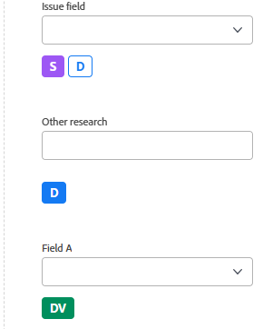

# 新增邏輯規則至自訂表單和欄位

邏輯規則可讓您進一步自訂表單上的欄位。

例如，您可以根據使用者在填寫時所做的選擇，顯示或略過自訂表單中的欄位或區段。

>[!NOTE]
>
>邏輯僅適用於一個表單，且不能以來自不同表單的選擇為基礎。

## 存取權要求

+++ 展開以檢視這篇文章中所述功能的存取權要求。

<table style="table-layout:auto"> 
 <col> 
 <col> 
 <tbody> 
  <tr> 
   <td>Adobe Workfront 封裝</td> 
   <td> <p>若要套用進階顯示、預設值、條件式格式或可編輯性邏輯：工作流程Prime或更高版本</p>
         <p>若要套用所有其他邏輯型別：任何Workfront或Workflow套件</p> </td> 
  </tr> 
  <tr> 
   <td>Adobe Workfront授權</td> 
   <td><p>標準</p>
       <p>規劃</p></td>
  </tr> 
  <tr> 
   <td>存取層級設定</td> 
   <td> <p>管理自訂表單的存取權</p> </td> 
  </tr>  
 </tbody> 
</table>

如需詳細資訊，請參閱Workfront檔案中的[存取需求](/help/quicksilver/administration-and-setup/add-users/access-levels-and-object-permissions/access-level-requirements-in-documentation.md)。

+++

## 邏輯指標圖示

自訂表單會顯示圖示來指示邏輯何時套用至欄位。

按一下表單設計工具標題中的[顯示邏輯&#x200B;**]，可顯示或隱藏不同欄位邏輯型別的圖示。**

| 圖示 | 定義 |
| --- | --- |
|  | 欄位是套用顯示邏輯的目標欄位。 如果在表單上做了特定選擇，則會顯示此欄位。 |
|  | 此欄位是顯示邏輯的參考欄位。 此欄位中的特定選取範圍或值會顯示目標欄位。 |
| 目標欄位的略過邏輯 | 欄位是套用略過邏輯的目標欄位。 此欄位上的特定選取範圍或值會略過其他欄位，並直接移至參考欄位。 |
| 參考欄位的略過邏輯圖示 | 此欄位是略過邏輯的參考欄位。 如果在目標欄位上做了特定選擇，則表單會前進到此欄位，並且之間的欄位會隱藏。 |
| 目標欄位的驗證邏輯 | 欄位是套用驗證邏輯的目標欄位。 參考欄位上的特定選取範圍或值會決定驗證是否失敗。 驗證邏輯的目標欄位和參考欄位可以相同。 |
| 參考欄位的驗證邏輯 | 欄位是驗證邏輯的參考欄位。 此欄位上的特定選取範圍或值會決定目標欄位上的驗證是否失敗。 驗證邏輯的目標欄位和參考欄位可以相同。 |
|  | 欄位是套用預設值邏輯的目標欄位。 參考欄位上的特定選取範圍或值會決定預設值。 預設值邏輯的目標欄位和參考欄位可以相同。 |
|  | 欄位是預設值邏輯的參考欄位。 此欄位上的特定選取範圍或值會決定目標欄位的預設值。 預設值邏輯的目標欄位和參考欄位可以相同。 |
|  | 欄位是套用格式邏輯的目標欄位。 參考欄位上的特定選取範圍或值會決定格式。 目標欄位和參考欄位在格式邏輯上可以相同。 |
|  | 欄位是格式邏輯的參考欄位。 此欄位上的特定選取範圍或值會決定目標欄位的格式。 目標欄位和參考欄位在格式邏輯上可以相同。 |
| 目標欄位的可編輯性邏輯 | 欄位是套用可編輯性邏輯的目標欄位。 當滿足定義的條件時，該欄位可以編輯或唯讀。 可編輯性邏輯的目標欄位和參考欄位可以相同。 |
| 參考欄位的可編輯性邏輯 | 此欄位是可編輯性邏輯的參考欄位。 當此欄位符合定義的條件時，邏輯會套用至目標欄位。 可編輯性邏輯的目標欄位和參考欄位可以相同。 |



若僅針對顯示和略過邏輯，請選取欄位以在欄位設定中顯示現有的邏輯規則。


## 使用顯示邏輯和略過邏輯的考量事項

* 若要在自訂欄位、Widget或分割槽符號上新增顯示邏輯，表單上必須至少有一個多選欄位（選項按鈕、下拉清單或核取方塊）位於該欄位之前。
如需自訂表單中自訂欄位和Widget的相關資訊，請參閱[建立自訂表單](/help/quicksilver/administration-and-setup/customize-workfront/create-manage-custom-forms/form-designer/design-a-form/design-a-form.md)。
* 您無法將跳過邏輯新增至Widget或分割槽符號。 您只能將其新增至多選欄位（選項按鈕、下拉式清單或核取方塊）。
* 您無法套用顯示或略過邏輯來顯示或隱藏多選項欄位的選擇。 例如，您無法根據其他欄位的顯示或略過邏輯，限制顯示下拉式清單、核取方塊群組或選項按鈕欄位的選項。
* 如果自訂欄位符合以下所有條件，則您可以將顯示邏輯和略過邏輯新增到自訂欄位：

   * 它是一個多選欄位（單選按鈕、下拉清單或覈取方塊）
   * 它前面有複選欄位
   * 後面接著另一個自訂欄位

* 複製具有顯示邏輯或跳過邏輯的表單時，邏輯會複製到新的自訂表單。
* 大量編輯物件時，所有自訂欄位都會顯示在「編輯物件」方塊中，包括略過或隱藏的欄位。
* 為自訂表單建立顯示邏輯規則時，請記住下列事項：

   * 預設情況下，顯示邏輯陳述式中未包含的自訂欄位會顯示在自訂表單上。
   * 您可以建立多欄位顯示邏輯陳述式。
   * 如果分割槽符號下的所有欄位都套用了顯示邏輯，並且它們都因該邏輯而隱藏，則整個分割槽將在自訂表單上隱藏。

## 新增顯示邏輯至自訂表單

顯示邏輯定義當使用者在多重選擇欄位中選擇特定值時，要在表單上顯示的自訂欄位。 此邏輯會新增至目標欄位，並僅在選取值時顯示。

>[!NOTE]
>
>此程式說明顯示邏輯的基本模式。 進階顯示邏輯也可使用。 如需詳細資訊，請參閱本文中的[新增進階顯示邏輯至自訂表單](#add-advanced-display-logic-to-a-custom-form)。

{{step-1-to-setup}}

1. 按一下&#x200B;**自訂Forms**。
1. 建立新的自訂表單或開啟現有的表單。 如需詳細資訊，請參閱[建立自訂表格](/help/quicksilver/administration-and-setup/customize-workfront/create-manage-custom-forms/form-designer/design-a-form/design-a-form.md)。
1. 視需要新增欄位至表單。 至少一個多選欄位（單選按鈕、下拉清單或核取方塊）必須放在將顯示的目標欄位之前。
1. 選取目標欄位並按一下&#x200B;**新增邏輯**。
1. 選取邏輯產生器上的&#x200B;**顯示**&#x200B;標籤。
1. 按一下&#x200B;**新增顯示規則**。

   

1. 請依照下列步驟，在產生器中建立邏輯陳述式。

   1. 第一個選項是選擇定義欄位。 此欄位具有顯示目標的選取值。 它必須是多選欄位。
   1. 第二個選項是選擇選取值。 只有已為該欄位定義的值才可使用。
   1. 第三個選項是&#x200B;**已選取**&#x200B;或&#x200B;**未選取**。 選擇&#x200B;**已選取**&#x200B;表示選取值時，會顯示目標欄位。 選擇&#x200B;**未選取**&#x200B;表示在定義欄位中選取任何其他值時，會顯示目標欄位。
   1. 若要將&#x200B;**And**&#x200B;規則新增至邏輯陳述式，請按一下您剛建立之規則下方的[新增規則]。 **&#x200B;**&#x200B;依照相同的提示來建置規則。 必須符合所有的And規則，目標欄位才會顯示。

      

   1. 若要將&#x200B;**Or**&#x200B;規則新增至邏輯陳述式，請按一下邏輯產生器底部附近的&#x200B;**新增規則**。 然後，按一下Or區域中的&#x200B;**新增規則**，並依照相同的提示來建置規則。 當滿足一個Or規則時，將顯示目標欄位。

1. 當您完成建置邏輯陳述式時，請按一下&#x200B;**套用**。

   系統會套用邏輯，並將邏輯圖示新增至表單設計工具的目標欄位和參考欄位。

## 新增進階顯示邏輯至自訂表單

自訂表單欄位的進階顯示邏輯可讓您使用公式來建立複雜的邏輯。 您可以將此邏輯套用至下列欄位型別：單行文字、段落、含格式的文字、單選下拉式清單、多選下拉式清單、外部查閱、多選外部查閱、原生欄位參考、預先輸入、計算、日期、核取方塊群組，以及選項按鈕。

>[!NOTE]
>
>此程式說明顯示邏輯的進階模式。 也提供基本顯示邏輯。 如需詳細資訊，請參閱本文中的[新增顯示邏輯至自訂表單](#add-display-logic-to-a-custom-form)。

### 範例

您可以使用進階顯示邏輯，根據使用者角色控制自訂表單區段的可見度，以及根據其他欄位狀態控制欄位的可見度。

表單上的預設區段不會套用任何邏輯，因此所有使用者一律可以看到它。

使用下列條件時，只有當具有Resource Manager工作角色的使用者檢視表單時，才會顯示「需要資源」區段。

```IF($$USER.{roleID}="123abc", true)```

請注意，```123abc```代表資源管理員的角色ID。

針對角色顯示的表單區段

具有不同角色ID的相同條件會套用至「專案財務KPI」區段，以定義只有「財務建議程式」角色才能檢視區段。

使用下列條件時，「售出的KPI」欄位只有在專案完成時才會顯示。 此邏輯會直接套用至欄位，而非表單區段。 不需要指定哪個角色可以檢視欄位，因為欄位所在的區段中已定義該角色。

```IF({status}="CPL", true)```


### 定義進階顯示邏輯

{{step-1-to-setup}}

1. 按一下&#x200B;**自訂Forms**。
1. 建立新的自訂表單或開啟現有的表單。 如需詳細資訊，請參閱[建立自訂表格](/help/quicksilver/administration-and-setup/customize-workfront/create-manage-custom-forms/form-designer/design-a-form/design-a-form.md)。
1. 視需要新增欄位至表單。
1. 選取要套用邏輯的欄位，然後按一下&#x200B;**新增邏輯**。
1. 選取邏輯產生器上的&#x200B;**顯示**&#x200B;標籤。
1. 開啟&#x200B;**進階模式**。

   此選項可針對不支援簡單顯示邏輯模式的欄位型別自動開啟。

   顯示邏輯的

1. 在編輯器中建立顯示條件。

   如需有關計算和運算式的詳細資訊，請參閱[新增計算欄位至表單](/help/quicksilver/administration-and-setup/customize-workfront/create-manage-custom-forms/form-designer/design-a-form/add-a-calculated-field.md)和[計算資料運算式概觀](/help/quicksilver/reports-and-dashboards/reports/calc-cstm-data-reports/calculated-data-expressions.md)。

1. 按一下「**套用**」。

   系統會套用邏輯，並將邏輯圖示新增至表單設計工具的目標欄位和參考欄位。

   >[!NOTE]
   >
   >表單設計工具預覽模式不支援進階顯示邏輯。

## 將跳過邏輯新增至自訂表單

跳過邏輯定義自訂表單欄位，當使用者在多重選擇欄位中選擇特定值時，將跳過這些欄位。 略過的欄位會隱藏在表單上。 邏輯會套用至進行選取的定義欄位，而非跳過的欄位。

{{step-1-to-setup}}

1. 按一下&#x200B;**自訂Forms**。
1. 建立新的自訂表單或開啟現有的表單。 如需詳細資訊，請參閱[建立自訂表格](/help/quicksilver/administration-and-setup/customize-workfront/create-manage-custom-forms/form-designer/design-a-form/design-a-form.md)。
1. 視需要新增欄位至表單。 略過邏輯的定義欄位必須是多選欄位（選項按鈕、下拉式清單或核取方塊）。
1. 選取定義欄位，然後按一下畫面左下方的&#x200B;**新增邏輯**。
1. 選取邏輯產生器上的&#x200B;**略過**&#x200B;索引標籤。
1. 按一下&#x200B;**新增略過規則**。

   

1. 請依照下列步驟，在產生器中建立邏輯陳述式。

   1. 定義欄位會顯示在產生器中。 這是您選取要套用略過邏輯的欄位。
   1. 第一個選項是選擇選取值。 只有已為該欄位定義的值才可使用。
   1. 第二個選項是&#x200B;**已選取**&#x200B;或&#x200B;**未選取**。 選擇&#x200B;**已選取**&#x200B;表示選取值時，會顯示目標欄位，並略過兩者之間的欄位。 選擇&#x200B;**未選取**&#x200B;表示在定義欄位中選取任何其他值時，會顯示目標欄位，並略過兩者之間的欄位。
   1. 第三個選項是目標欄位，或跳至的位置。 選取欄位名稱或&#x200B;**表單**&#x200B;結尾。 您可能需要先按一下「空白」這個字，才能選取選項。

      

   1. 若要將&#x200B;**Or**&#x200B;規則新增至邏輯陳述式，請按一下邏輯產生器底部附近的&#x200B;**新增規則**。 然後，在相同的提示下選取選項以建置規則。 當符合一個&#x200B;**或**&#x200B;規則時，會顯示目標欄位。

1. 當您完成建置邏輯陳述式時，請按一下&#x200B;**套用**。

   系統會套用邏輯，並將邏輯圖示新增至表單設計工具的目標欄位和參考欄位。

## 新增預設值邏輯至自訂表單

預設值邏輯可讓您使用公式來設定自訂表單欄位的預設值。 當滿足定義的條件時，會顯示預設值。 預設值可以是參考物件內其他欄位的靜態值或動態值。 雖然預設值可參考其他欄位，但不會隨著表單上的其他欄位變更而變更。

您可以將進階預設值邏輯套用至下列欄位型別：單行文字、段落、單選下拉式清單、多選下拉式清單、外部查閱、多選外部查閱。 原生欄位參考、預先輸入、核取方塊群組和選項按鈕。

>[!TIP]
>
>當自訂表單附加至物件時，預設值僅會套用至自訂欄位一次。 如果預設值公式相依於另一個欄位的值，則在附加自訂表單時，另一個欄位中的值必須已存在。

>[!NOTE]
>
>表單設計器中的標準預設值邏輯仍然存在。 如果兩個型別都套用至相同欄位，則進階邏輯優先。 如需有關標準預設值邏輯的資訊，請參閱[建立自訂表單](/help/quicksilver/administration-and-setup/customize-workfront/create-manage-custom-forms/form-designer/design-a-form/design-a-form.md)中的[新增選項按鈕、核取方塊群組和下拉清單](/help/quicksilver/administration-and-setup/customize-workfront/create-manage-custom-forms/form-designer/design-a-form/design-a-form.md#add-radio-buttons-checkbox-groups-and-drop-downs)。

### 範例

使用下列公式，當專案狀態為「計畫管理系統」時，套用邏輯的多重選取下拉式欄位會從專案摘要提取其預設值。

```
IF({status} = 'PLN', ARRAY({description}, ','))
```

當自訂表單附加至專案且專案狀態為「計畫」時，則會使用專案說明欄位值作為多選欄位中的預設值。 由於是多選欄位，當值符合說明時，可以提取多個值。 如果說明值不符合任何多重選取值選項，則多重選取欄位將不會有預設值，使用者可以從下拉式清單中選取值。

### 定義預設值邏輯

1. 按一下&#x200B;**自訂Forms**。
1. 建立新的自訂表單或開啟現有的表單。 如需詳細資訊，請參閱[建立自訂表格](/help/quicksilver/administration-and-setup/customize-workfront/create-manage-custom-forms/form-designer/design-a-form/design-a-form.md)。
1. 視需要新增欄位至表單。
1. 選取要套用邏輯的欄位，然後按一下&#x200B;**新增邏輯**。
1. 選取邏輯產生器上的&#x200B;**預設值**&#x200B;標籤。

   

1. 在編輯器中建立預設值條件。

   如需有關計算和運算式的詳細資訊，請參閱[新增計算欄位至表單](/help/quicksilver/administration-and-setup/customize-workfront/create-manage-custom-forms/form-designer/design-a-form/add-a-calculated-field.md)和[計算資料運算式概觀](/help/quicksilver/reports-and-dashboards/reports/calc-cstm-data-reports/calculated-data-expressions.md)。

1. 按一下「**套用**」。

   系統會套用邏輯，並將邏輯圖示新增至表單設計工具的目標欄位和參考欄位。

   >[!NOTE]
   >
   >表單設計工具預覽模式不支援預設值邏輯。

## 新增驗證邏輯至自訂表單

驗證邏輯是使用公式建立的，您可以讓邏輯變得簡單或複雜。 驗證可以基於其他欄位的值或物件的狀態，並且您可以在驗證失敗時提供錯誤訊息。

如果套用了邏輯的欄位在使用者填寫自訂表單時符合定義的驗證條件，則該欄位會醒目提示並顯示錯誤訊息。

您可以將驗證邏輯套用至下列欄位型別：單行文字、段落、單選下拉式清單、多選下拉式清單、外部查閱、多選外部查閱、預先輸入、日期、核取方塊群組，以及選項按鈕。

### 範例

當使用者輸入觸發訊息的值時，「預算」欄位會在欄位下方顯示訊息。 例如，如果輸入的值為負數，則會顯示第一條訊息。 如果使用者在輸入預算值之前嘗試將專案狀態變更為目前，則會顯示第二則訊息。

```
IF({DE:Budget Field} < 0,
     "Budget cannot be negative",
     IF({DE:Budget Field} == 0 && {status} == "CUR", "Budget must be specified before moving to Current status")
)
```

另一個簡單範例是電話號碼欄位必須包含特定的有效位數。

根據其他欄位進行驗證的另一個範例是會議室大小（小、中或大）的欄位，以及會議出席者人數的個別欄位。 每個房間大小的人數會寫入驗證公式中。 如果使用者輸入的出席者數目對於所選會議室而言太多，則會顯示錯誤訊息。

如需其他驗證邏輯範例，請參閱[自訂表單中的進階邏輯範例](/help/quicksilver/administration-and-setup/customize-workfront/create-manage-custom-forms/form-designer/design-a-form/advanced-logic-examples.md)。

### 定義驗證邏輯

{{step-1-to-setup}}

1. 按一下&#x200B;**自訂Forms**。
1. 建立新的自訂表單或開啟現有的表單。 如需詳細資訊，請參閱[建立自訂表格](/help/quicksilver/administration-and-setup/customize-workfront/create-manage-custom-forms/form-designer/design-a-form/design-a-form.md)。
1. 視需要新增欄位至表單。
1. 選取要套用邏輯的欄位，然後按一下&#x200B;**新增邏輯**。
1. 選取邏輯產生器上的&#x200B;**驗證**&#x200B;標籤。

   

1. 在編輯器中建立驗證條件，包括不符合驗證時顯示的錯誤訊息。

   如需有關計算和運算式的詳細資訊，請參閱[新增計算欄位至表單](/help/quicksilver/administration-and-setup/customize-workfront/create-manage-custom-forms/form-designer/design-a-form/add-a-calculated-field.md)和[計算資料運算式概觀](/help/quicksilver/reports-and-dashboards/reports/calc-cstm-data-reports/calculated-data-expressions.md)。

1. 按一下「**套用**」。

   系統會套用邏輯，並將邏輯圖示新增至表單設計工具的目標欄位和參考欄位。

   >[!NOTE]
   >
   >表單設計工具預覽模式不支援驗證邏輯。

## 新增格式邏輯至自訂表單

格式化邏輯會在欄位值符合定義的條件時反白標示欄位值。 套用的格式一次可在多個欄位上運作。

您可以將格式邏輯套用至下列欄位型別：單行文字、段落、單選下拉式清單、多選下拉式清單、外部查閱、多選外部查閱、預先輸入、計算、日期、核取方塊群組，以及選項按鈕。

套用至自訂表單的格式與套用至清單和報表的格式不同。 如需報表格式化的資訊，請參閱[在檢視中使用條件式格式](/help/quicksilver/reports-and-dashboards/reports/reporting-elements/use-conditional-formatting-views.md)。

### 範例

若使用以下條件，當使用者輸入1000或以上的值時，「預算」欄位會顯示為紅色。 當使用者輸入500或更多值時，欄位會顯示為黃色。

若要新增格式的暫留定義，請使用自訂表單中的「指示」欄位。 例如，「預算」欄位上的訊息可能會顯示「請輸入合理範圍內的預算。 超過500的值是警告通知，超過1000則被視為太高。」

```
IF(
     {DE:Budget Field} >=1000,
     FORMAT($$NEGATIVE),
     IF({DE:Budget Field} >= 500, FORMAT($$NOTICE))
)
```

### 定義格式邏輯

{{step-1-to-setup}}

1. 按一下&#x200B;**自訂Forms**。
1. 建立新的自訂表單或開啟現有的表單。 如需詳細資訊，請參閱[建立自訂表格](/help/quicksilver/administration-and-setup/customize-workfront/create-manage-custom-forms/form-designer/design-a-form/design-a-form.md)。
1. 視需要新增欄位至表單。
1. 選取要套用邏輯的欄位，然後按一下&#x200B;**新增邏輯**。
1. 選取邏輯產生器上的&#x200B;**格式化**&#x200B;索引標籤。

   

1. 在編輯器中建立格式條件。

   每個欄位最多可以新增5個格式規則。

   醒目提示色彩選項的欄位包括：

   * `$$POSITIVE (green)`
   * `$$INFORMATIVE (blue)`
   * `$$NEGATIVE (red)`
   * `$$NOTICE (orange)`

   文字格式設定選項為：

   * `$$BOLD`
   * `$$ITALIC`
   * `$$UNDERLINE`

   每個函式只能使用一個顏色選項，以及最多三個額外的文字格式選項。 如果未指定顏色選項，則會套用系統的預設顏色。

   如需有關計算和運算式的詳細資訊，請參閱[新增計算欄位至表單](/help/quicksilver/administration-and-setup/customize-workfront/create-manage-custom-forms/form-designer/design-a-form/add-a-calculated-field.md)和[計算資料運算式概觀](/help/quicksilver/reports-and-dashboards/reports/calc-cstm-data-reports/calculated-data-expressions.md)。

1. 按一下「**套用**」。

   系統會套用邏輯，並將邏輯圖示新增至表單設計工具的目標欄位和參考欄位。

   >[!NOTE]
   >
   >表單設計工具預覽模式不支援格式邏輯。

## 新增可編輯性邏輯至自訂表單

可編輯性邏輯會決定是否可編輯自訂表單欄位，或是唯讀欄位。 此邏輯是使用公式建立的，當欄位符合定義的條件時，可將其設定為可編輯或唯讀。

您可以將可編輯性邏輯套用至下列欄位型別：單行文字、段落、含格式的文字、單選下拉式清單、多選下拉式清單、外部查閱、多選外部查閱、預先輸入、日期、核取方塊群組，以及選項按鈕。

### 範例

使用下列公式時，只有在名稱為Radio的另一個欄位已選取啟用選擇時，才可編輯已套用邏輯的欄位。

```
IF({DE:Radio} = "Enabled", true)
```

使用下列公式，「說明」欄位只有在空白時才能編輯。 輸入值之後，它就會變成唯讀。

```
IF(ISBLANK({DE:Description}), true)
```

使用下列公式，只有在具有Resource Manager工作角色的使用者檢視表單時，才可編輯已套用邏輯的欄位。

```
IF($$USER.{role}.{name}="Resource Manager", true)
```

### 定義可編輯性邏輯

{{step-1-to-setup}}

1. 按一下&#x200B;**自訂Forms**。
1. 建立新的自訂表單或開啟現有的表單。 如需詳細資訊，請參閱[建立自訂表格](/help/quicksilver/administration-and-setup/customize-workfront/create-manage-custom-forms/form-designer/design-a-form/design-a-form.md)。
1. 視需要新增欄位至表單。
1. 選取要套用邏輯的欄位，然後按一下&#x200B;**新增邏輯**。
1. 選取邏輯產生器上的&#x200B;**可編輯性**&#x200B;標籤。

   

1. 在編輯器中建立可編輯性條件。

   如需有關計算和運算式的詳細資訊，請參閱[新增計算欄位至表單](/help/quicksilver/administration-and-setup/customize-workfront/create-manage-custom-forms/form-designer/design-a-form/add-a-calculated-field.md)和[計算資料運算式概觀](/help/quicksilver/reports-and-dashboards/reports/calc-cstm-data-reports/calculated-data-expressions.md)。

1. 按一下「**套用**」。

   系統會套用邏輯，並將邏輯圖示新增至表單設計工具的目標欄位和參考欄位。

   >[!NOTE]
   >
   >表單設計工具預覽模式不支援可編輯性邏輯。
