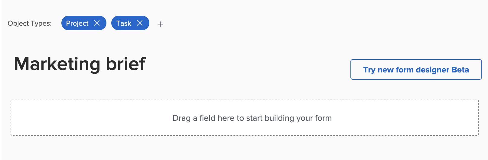

# 表單設計工具概觀

您可以使用新的表單設計工具來設計使用者可附加至Workfront物件的自訂表單。 處理物件的使用者可填寫自訂表單，以提供物件的相關資訊。

新的表單設計工具有新的畫布樣式工作區，允許您同時檢視欄位、畫布和欄位設定。 它也可讓您在設計表單時拖放區段內的欄位。

<!-- add screenshot when field settings empty state is ready -->

## 如何訪問新的表單設計器

新表單設計工具和舊表單產生器頂端都有新按鈕。 您可以使用此按鈕，在舊版產生器與新設計工具之間切換。

## 表單設計工具提供的新功能

有了新的表單設計工具，我們便能

* **複製欄位**:您現在可以直接從畫布按一下欄位上的復製圖示，複製現有欄位。

* **更改描述性文本的大小**:您現在可以為「描述性」文字欄位指派小、中或大小。 您也可以在相同列上搭配其他欄位使用。

* **使用預設區段**:如果表單建立者未在表單頂端新增區段，畫布中現在會顯示「預設」區段，讓使用者可以調整未指派自訂區段之欄位的權限。

   >[!NOTE]
   >
   >表單附加至物件後，預設區段在物件內不會顯示。

## 功能即將推出

下列項目目前無法在表單設計工具中使用，但即將新增：

* 調整描述性文字的大小

* 顯示/略過邏輯

* 篩選預先輸入欄位

>[!IMPORTANT]
>
>使用新的表單設計工具時，邏輯和預先輸入篩選器的現有設定不受影響。

## 從表單設計工具中移除的功能

我們已從表單設計工具內移除下列功能：

* 表單設定、表單共用、欄位共用標籤

   * 表單設定現在可在畫布頂端使用

   * 表單共用首頁簽和欄位共用子標籤
   >[!NOTE]
   >
   >您可以從「設定>自訂Forms > Forms」或「欄位」標籤控制表單和欄位共用。

* 追蹤更新摘要中的欄位變更
   >[!NOTE]
   >
   >您可以在「設定>介面>更新摘要」中找到
