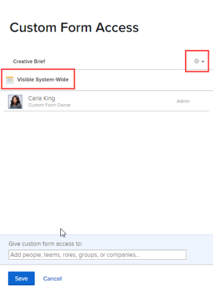

# 共用自訂表單

您可以配置自定義表單的訪問權限，以控制誰（人員、角色、組、團隊、公司）可以查看、共用和編輯它。

## 存取需求

您必須具備下列條件才能執行本文所述步驟：

<table style="table-layout:auto"> 
 <col> 
 <col> 
 <tbody> 
  <tr data-mc-conditions=""> 
   <td role="rowheader"> 
Adobe Workfront計畫*
 </td> 
   <td>任何</td> 
  </tr> 
  <tr> 
   <td role="rowheader">Adobe Workfront授權*</td> 
   <td>計劃</td> 
  </tr> 
  <tr data-mc-conditions=""> 
   <td role="rowheader">訪問級別配置*</td> 
   <td> 
管理對自訂表單的存取
 
如需Workfront管理員如何授予此存取權的詳細資訊，請參閱 <a href="../../../administration-and-setup/add-users/configure-and-grant-access/grant-users-admin-access-certain-areas.md" class="MCXref xref" data-mc-variable-override="">授予用戶對特定區域的管理訪問權限</a>.
 </td> 
  </tr> 
 </tbody> 
</table>

&#42;若要了解您擁有的計畫、授權類型或存取層級設定，請聯絡您的Workfront管理員。

## 存取自訂表單 {#access-to-custom-forms}

預設情況下，當您建立新的自定義表單時，當某人將其附加到某個對象時，任何分配給該對象的用戶都可以查看並填寫該表單。 這包括具有要求授權的使用者和外部使用者。

但是，在尚未附加自定義表單的對象上，用戶（即使他們具有規劃器訪問級別）無法從「自定義Forms」下拉菜單中附加該表單，除非以下選項之一為真：

* 某人與用戶或其團隊、職務角色、組或公司共用了自定義表單，並至少授予了「附加到自定義資料」的「查看」權限
* 使用者擁有計畫授權，且其存取層級可管理存取自訂表單

## 共用自訂表單

不會將自訂表單保留為預設共用狀態(如 [存取自訂表單](#access-to-custom-forms) 在本文中)，您可以為特定使用者、工作角色、群組、團隊和公司設定特定層級的表單存取權限。

1. 按一下 **主菜單** 圖示  在Adobe Workfront的右上角，然後按一下 **設定** .

1. 在左側面板中，按一下 **自訂Forms**.
1. 選取自訂表單，然後按一下 **共用**.
1. 在顯示的方塊中，於 **提供自訂表單存取權**，開始輸入要共用自訂表單的使用者、團隊、工作角色、群組或公司名稱，然後按 **輸入** 名稱時顯示。
1. 若要調整您剛新增的使用者、團隊、工作角色、群組或公司的存取權，請按一下名稱右側的下拉式功能表，然後設定下列其中一個可用選項及其任何進階設定：

   <table style="table-layout:auto"> 
    <col> 
    <col> 
    <tbody> 
     <tr> 
      <td role="rowheader">檢視它</td> 
      <td> 
在物件上檢視及填寫自訂表單的功能。
 
<b>注意</b>:對於具有工作、審閱和請求許可證的用戶，這是可用的最高選項。
 
按一下 <strong>進階設定</strong> 指定是否允許下列項目：
 
       <ul> 
        <li><strong>附加至自訂資料</strong>:能夠將自訂表單附加至他們具有「管理」存取權的專案、工作和問題</li> 
        <li> 
<strong>共用</strong>:可與系統中的其他人共用自訂表單
 
擁有「作品」、「檢閱」或「請求」授權的使用者只能透過API或自訂表單報表來共用自訂表單。 如需詳細資訊，請參閱。
 </li> 
       </ul> </td> 
     </tr> 
     <tr> 
      <td role="rowheader">管理它</td> 
      <td> 
僅適用於具有計畫許可證的用戶。 
 
除了能夠將表單添加到他們有權編輯的對象之外，用戶還可以完全編輯自定義表單，包括添加、編輯和刪除欄位。
 
按一下 <strong>進階設定</strong> 指定是否允許下列項目：
 
       <ul> 
        <li> 
<strong>附加至自訂資料</strong>:能夠將自訂表單附加至他們具有「管理」存取權的專案、工作和問題
 </li> 
        <li><strong>刪除</strong>:從系統中刪除自訂表單</li> 
        <li><strong>共用</strong>:與系統中的其他人共用自訂表單</li> 
       </ul> </td> 
     </tr> 
    </tbody> 
   </table>

1. （可選）重複步驟4-5將其他名稱新增至清單並設定其選項。
1. （可選）如果要將對自定義表單（附加自定義表單的對象）的訪問限制在前一步中指定的對象上，請按一下齒輪表徵圖  在共用方塊的右上角，然後按一下 **刪除系統範圍的訪問**.

   如果您改變心意，可以按一下 **使此可見系統範圍** （預設選項）。

   >[!NOTE]
   >
   >* 當使自定義表單在系統範圍內可見時，您只允許用戶查看並填寫分配給它們的對象，而不是將其附加到其他對象。 您可以使用步驟5中說明的「附加至自訂資料」選項，將自訂表單附加至物件。
   >* 大多陣列織都希望確保系統中的每個人都可以在將自定義表單附加到其工作的對象並在報表中查看其資料時填寫自定義表單。 若您的組織屬於此情況，建議您使用「**使此可見系統範圍**.&quot; 以此方式配置選項時，對話框中將顯示「Visible System-Wide」（可見系統範圍）:

   >   
   >
   >   
   >如果您擔心自訂表單中，使用者在將敏感資料附加至特定物件時可能會輸入敏感資料，限制這些資料的共用 *物件* 可能比限制表單本身的存取權更好。

1. 按一下&#x200B;**儲存**。

## 移除自訂表單的存取權

1. 按一下 **主菜單** 圖示  在Adobe Workfront的右上角，然後按一下 **設定** .

1. 在左側面板中，按一下 **自訂Forms**.
1. 選取自訂表單，然後按一下 **共用**.
1. 在隨即顯示的方塊中，按一下您不想再對表單有特殊存取權之使用者、團隊、角色、群組或公司名稱右側的X。
1. （可選）對於要刪除的其他名稱，請重複上一步。
1. 按一下&#x200B;**儲存**。
