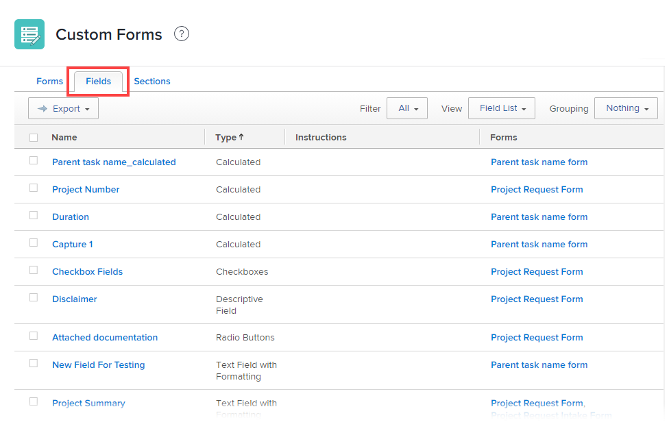

# 檢視使用特定自訂欄位或介面工具集的所有報表

您可以在「自訂Forms」區域中新增自訂檢視，顯示哪些報表使用特定自訂欄位或介面工具集。 當您需要編輯或刪除欄位或介面工具集時，這個功能會很實用，因為它可能已在一或多個報表中實作。 必須評估這些報告是否需要調整才能繼續正常工作。

如需自訂表單中自訂欄位和小工具的相關資訊，請參閱 [新增自訂欄位至自訂表單](../../../administration-and-setup/customize-workfront/create-manage-custom-forms/add-a-custom-field-to-a-custom-form.md) 和 [在自訂表單中新增或編輯資產介面工具集](../../../administration-and-setup/customize-workfront/create-manage-custom-forms/add-widget-or-edit-its-properties-in-a-custom-form.md).

## 存取需求

您必須具備下列條件才能執行本文所述步驟：

<table style="table-layout:auto"> 
 <col> 
 <col> 
 <tbody> 
  <tr data-mc-conditions=""> 
   <td role="rowheader"> 
Adobe Workfront計畫*
 </td> 
   <td>任何</td> 
  </tr> 
  <tr> 
   <td role="rowheader">Adobe Workfront授權*</td> 
   <td>計劃</td> 
  </tr> 
  <tr data-mc-conditions=""> 
   <td role="rowheader">訪問級別配置*</td> 
   <td> 
管理對自訂表單的存取
 
如需Workfront管理員如何授予此存取權的詳細資訊，請參閱 <a href="../../../administration-and-setup/add-users/configure-and-grant-access/grant-users-admin-access-certain-areas.md" class="MCXref xref">授予用戶對特定區域的管理訪問權限</a>.
 </td> 
  </tr> 
 </tbody> 
</table>

&#42;若要了解您擁有的計畫、授權類型或存取層級設定，請聯絡您的Workfront管理員。

## 列出使用特定自訂欄位或介面工具集的報表

1. 按一下 **主菜單** 圖示  在Adobe Workfront的右上角，然後按一下 **設定** .

1. 在左側面板中，按一下 **自訂Forms**.
1. 開啟 **欄位** 標籤，以顯示列出Workfront例項中所有自訂欄位和Widget的報表。

   

1. 按一下 **檢視** 下拉式功能表（位於清單頂端的標題中），然後檢查清單中是否有任何包含 **報表** 欄（這不是此標籤上的預設欄）。

   「報表」欄可讓您查看哪些報表正使用系統中已新增至自訂表單的每個自訂欄位和介面工具集。 有人可能已建立包含 **報表** 欄。

1. 如果您沒有看到包含 **報表** 欄，建立包含該檢視的新檢視：

   1. 按一下 **檢視** 下拉式功能表，然後按一下 **新建視圖**.

   1. 在 **新建視圖** 顯示的頁面，在左上角附近的方塊中取代 **新參數檢視** 的描述性名稱，例如 *欄位和小工具*.

   1. 按一下 **添加列** 靠近右下角。
   1. 在 **顯示在此列中** 框，開始鍵入 *報告*，然後選取 **報表** 框下方的清單中顯示。

   1. （條件性）如果您要移動 **報表** 欄，將其標題拖動到 **欄預覽** 區域。

   1. 按一下 **完成**，然後按一下 **保存視圖**.

1. 按一下 **檢視** 下拉式功能表，然後選取您剛建立的自訂檢視名稱。
1. 在 **名稱** 欄，找到您打算編輯或刪除的自訂欄位或介面工具集，然後查看 **報表** 欄，查看使用該報表的報表（如果有）。

   若要尋找此欄的資訊，Workfront會搜尋所有報表篩選器、檢視、群組中的自訂欄位和小工具。

   如果看到加號，可以按一下該行文本以顯示一個框，其中列出使用該欄位或介面工具集的所有其他報告。

   >[!NOTE]
   >
   >此工具的初始載入時間可能需要10秒到2.5分鐘，具體取決於您系統中的資料量。

   >[!TIP]
   >
   >如果您沒有時間調查使用自訂欄位或介面工具集的報表，可以按一下「匯出」以建立列出這些欄位或介面工具集的檔案。 您可以將此檔案與擁有使用欄位或Widget之報表的人共用，並討論需要進行的變更、它對報表的可能影響，以及需要執行哪些動作來確保報表可繼續正常運作。
   >
   >參數報表中也提供此檢視：
   >      
   > 1. 在主菜單中，按一下 **報表**.
   > 1. 在左上角附近，按一下 **新增報表**，然後按一下 **參數** 在顯示的清單中。
   > 1. 按一下 **添加列** 靠近右下角。
   > 1. 在 **顯示在此列中** 框，開始鍵入 *報告*，然後選取 **報表** 框下方的清單中顯示。
   > 1. （條件性）如果您要移動 **報表** 欄，將其標題拖動到 **欄預覽** 區域。
   > 1. 按一下 **完成**，然後按一下 **儲存並關閉**.
   > 1. 為報表輸入描述性名稱，例如 *欄位和小工具*.

