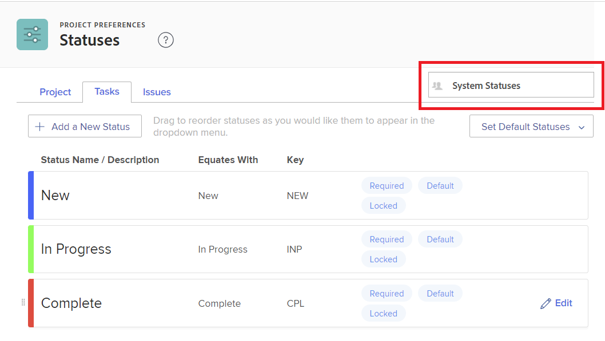

# 建立或編輯狀態

<!-- Audited: 1/2024 -->

<!--DON'T DELETE, DRAFT OR HIDE THIS ARTICLE. IT IS LINKED TO THE PRODUCT THROUGH CONTEXT SENSITIVE HELP LINKS.-->

作為Adobe Workfront管理員，您可以建立專案、任務和問題的自訂狀態。 這些選項適用於整個Workfront系統或特定群組或子群組的使用者。 如需有關狀態的詳細資訊，請參閱[狀態概觀](../../../administration-and-setup/customize-workfront/creating-custom-status-and-priority-labels/statuses-overview.md)。

>[!NOTE]
>
>群組管理員也可以建立自己的群組狀態，僅供其群組使用。 如需詳細資訊，請參閱[建立或編輯群組狀態](../../../administration-and-setup/manage-groups/manage-group-statuses/create-or-edit-a-group-status.md)。

## 存取需求

+++ 展開以檢視本文中功能的存取需求。

您必須具有下列存取權才能執行本文中的步驟：

<table style="table-layout:auto"> 
 <col> 
 <col> 
 <tbody> 
  <tr> 
   <td role="rowheader">Adobe Workfront計畫</td> 
   <td>任何</td> 
  </tr> 
  <tr> 
   <td role="rowheader">Adobe Workfront授權</td> 
   <td>
     
新增：標準

     
或

     
目前：計畫

   </td> 
  </tr> 
  <tr> 
   <td role="rowheader">存取層級設定</td> 
   <td> 
您必須是Workfront管理員。
  </td> 
  </tr> 
 </tbody> 
</table>

如需有關此表格的詳細資訊，請參閱Workfront檔案中的[存取需求](/help/quicksilver/administration-and-setup/add-users/access-levels-and-object-permissions/access-level-requirements-in-documentation.md)。

+++

## 建立或編輯自訂狀態

您可以新增自訂狀態，以供整個組織或單一群組使用。

當您建立整個組織的自訂狀態時，可以對其進行配置，以便系統中的所有群組都可以使用它而不需編輯它。 或者，您可以進行設定，讓群組管理員可以修改其群組的設定，如[建立或編輯群組狀態](../../../administration-and-setup/manage-groups/manage-group-statuses/create-or-edit-a-group-status.md)中所述。

1. 按一下Adobe Workfront右上角的&#x200B;**[!UICONTROL 主功能表]**&#x200B;圖示，或（如果有的話）按一下左上角的&#x200B;**[!UICONTROL 主功能表]**&#x200B;圖示，然後按一下&#x200B;**[!UICONTROL 設定]** 。

1. 在左側面板中，按一下&#x200B;**專案偏好設定** > **狀態**。

1. （視條件而定）如果您要建立或編輯全系統使用的狀態，請確定已在右上角的方塊中選取&#x200B;**系統狀態**。

   

   或

   如果狀態為群組或子群組，請在右上角開始輸入群組的名稱，然後在其出現時選取它。

   

1. 選取您想要與狀態關聯的物件型別（**專案**、**任務**&#x200B;或&#x200B;**問題**）的標籤。

1. 如果您正在建立新狀態，請按一下&#x200B;**新增狀態**。

   或

   如果您正在編輯現有狀態，請將滑鼠游標停留在現有狀態上，然後按一下顯示於最右側的&#x200B;**編輯**&#x200B;圖示。

   

1. 使用下列選項設定狀態：

   <table style="table-layout:auto"> 
    <col> 
    <col> 
    <tbody> 
     <tr> 
      <td role="rowheader">狀態名稱</td> 
      <td> 
輸入狀態的名稱。 這是必填欄位。
 
當您建立狀態名稱時，請注意，系統中的其他人可以建立具有相同名稱的狀態。 建議您使用唯一的名稱，以避免在Workfront中選取狀態時產生混淆。
 </td> 
     </tr> 
     <tr> 
      <td role="rowheader">說明</td> 
      <td>（選用）輸入狀態說明。 這會將其用途傳達給使用者。</td> 
     </tr> 
     <tr> 
      <td role="rowheader">顏色</td> 
      <td> 
按一下顏色欄位並從色票面板中選取顏色，以自訂狀態的顏色。 您也可以在欄位中輸入十六進位數字。
 
當使用者檢視物件時，狀態顏色會顯示在Workfront的右上角。
  
 </td> 
     </tr> 
     <tr> 
      <td role="rowheader">視為</td> 
      <td> 
從清單中選取最能描述狀態功能的選項之一。 例如，如果狀態名稱為Done，則其對應的選項應為Complete。
 
每個狀態都必須等同於其中一個選項，因為這會決定狀態如何運作。
 
建立狀態後就無法修改此選項。
 </td> 
     </tr> 
     <tr> 
      <td role="rowheader">索引鍵</td> 
      <td> 
如果您要建立新狀態，請輸入狀態的程式碼或縮寫，或使用為您產生的程式碼。 此索引鍵在Workfront中必須是唯一的，因為可用於報表用途。 如果您嘗試指定系統中已使用的金鑰，欄位會變成紅色。
 
使用將可使用的人可辨識的縮寫可能有所助益。
 
建立狀態後就無法修改此選項。
 
您無法變更Planning、Current及Complete狀態的索引鍵代碼。 如果您以文字模式建立報表，這一點很重要。
 </td> 
     </tr> 
     <tr> 
      <td role="rowheader">隱藏狀態</td> 
      <td> 
（僅限專案和任務狀態）
 
如果您希望使用者隱藏狀態，請啟用此選項。 停用此選項（預設設定）時，系統中的所有使用者都可以使用狀態。
 
您可以針對所有4種問題型別（錯誤報告、變更順序、問題、請求）停用此選項，以隱藏「問題」狀態。
 </td> 
     </tr> 
     <tr> 
      <td role="rowheader">鎖定所有群組</td> 
      <td>
       
當狀態鎖定時，整個系統的使用者可以看到並使用它，群組管理員無法為其群組自訂它。
 
       
當狀態解除鎖定時，群組管理員可以為其個別群組自訂狀態。

   

       
您可以在系統核准程式中使用鎖定和未鎖定狀態。 如果您建立的系統核准流程具有未鎖定的系統狀態，則整個系統的使用者可以將核准流程附加到系統中的任何專案、任務或問題。

       
 在下列情況下，會顯示警告訊息，以協助您和您的使用者瞭解解除鎖定狀態的結果：

       <ul>
       <li>管理員會解除鎖定核准流程中所使用的系統層級狀態。 訊息會警告，可能會刪除其群組的解除鎖定狀態，這會導致群組成員無法正確使用該核准流程來核准指派給其群組的物件。</li>
       <li>使用者開始編輯使用已解鎖狀態的核准流程。 訊息會提醒使用者解除鎖定的狀態，讓使用者評估重新鎖定或取代會是很好的做法。</li>
       <li>具有解鎖狀態的系統層級核准程式會附加至物件，且已針對指派給物件的群組刪除其狀態。 當群組成員前往物件的「核准」區段時，會出現一則訊息，說明無法為物件啟動核准流程。</li>
       </ul>
       
如需有關鎖定狀態的詳細資訊，請參閱<a href="../../../administration-and-setup/customize-workfront/creating-custom-status-and-priority-labels/lock-or-unlock-a-custom-system-level-status.md" class="MCXref xref">鎖定與解除鎖定系統層級狀態</a>。

       

      </td>
     </tr> 
    </tbody> 
   </table>

1. 按一下「**儲存**」。

   如需將此狀態設為預設狀態的指示，請參閱[使用自訂狀態做為預設狀態](../../../administration-and-setup/customize-workfront/creating-custom-status-and-priority-labels/use-custom-statuses-as-default-statuses.md)。

如需重新排序群組狀態的資訊，請參閱[重新排序系統層級和群組狀態](../../../administration-and-setup/customize-workfront/creating-custom-status-and-priority-labels/reorder-system-statuses.md)。
