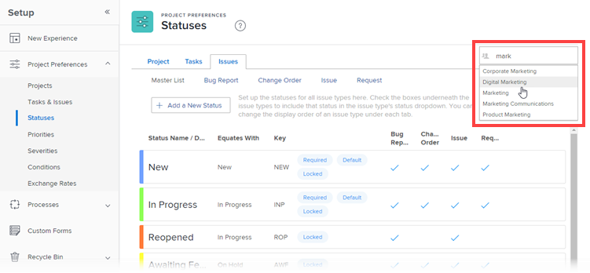

# 重新排序系統層次與群組狀態

作為Workfront管理員，您可以變更系統中每個人或單一群組的專案、任務和問題狀態的順序。

<!--The system version of this snippet mentions a single group because a sysadmin call also reorder statuses there. Group admin version of this article is still needed.-->

>[!NOTE]
>
>* 在系統層級重新排序狀態不會影響群組內的狀態順序。
>
>  但是，新建立的頂層群組內的狀態會繼承系統層級狀態的順序。 （新的子群組會繼承群組內上一層之狀態的順序。）
>
>* 您可以重新排序鎖定狀態。 如需有關鎖定狀態的資訊，請參閱[建立或編輯狀態](../../../administration-and-setup/customize-workfront/creating-custom-status-and-priority-labels/create-or-edit-a-status.md)。
>* 群組管理員也可以重新排序其群組中所使用的狀態。 如需詳細資訊，請參閱[重新排序群組狀態](../../../administration-and-setup/manage-groups/manage-group-statuses/reorder-group-statuses-from-groups-area.md)。
>

## 存取需求

您必須具備下列專案才能執行本文所述的步驟：

<table style="table-layout:auto"> 
 <col> 
 <col> 
 <tbody> 
  <tr> 
   <td role="rowheader">Adobe Workfront計畫* </td> 
   <td>任何</td> 
  </tr> 
  <tr data-mc-conditions="SnippetConditions-wf-groups.system-level"> 
   <td role="rowheader">Adobe Workfront授權*</td> 
   <td> 
計劃 
 
您必須是Workfront管理員。 如需Workfront管理員的相關資訊，請參閱<a href="../../../administration-and-setup/add-users/configure-and-grant-access/grant-a-user-full-administrative-access.md" class="MCXref xref">授予使用者完整管理存取權</a>。
 </td> 
  </tr> 
 </tbody> 
</table>

&#42;如果您需要瞭解您擁有的計畫或授權型別，請連絡您的Workfront管理員。

## 預設狀態順序

依預設，狀態會依下列順序顯示：

<table style="table-layout:auto"> 
 <col> 
 <col> 
 <col> 
 <thead> 
  <tr> 
   <th width="33.33%">專案</th> 
   <th width="33.33%">任務</th> 
   <th width="33.33%">問題</th> 
  </tr> 
 </thead> 
 <tbody> 
  <tr> 
   <td> 
    <ul> 
     <li>目前</li> 
     <li>廢棄</li> 
     <li> 保留 </li> 
     <li> 計畫 </li> 
     <li> 完成 </li> 
     <li> 已請求 </li> 
     <li> 已核准 </li> 
     <li> 已拒絕 </li> 
     <li> 構想 </li> 
    </ul> </td> 
   <td> 
    <ul> 
     <li>新增</li> 
     <li>進行中</li> 
     <li>完成</li> 
    </ul> </td> 
   <td> 
    <ul> 
     <li>新增</li> 
     <li>進行中</li> 
     <li>重新處理</li> 
     <li>等待意見反應</li> 
     <li>保留</li> 
     <li>無法複製</li> 
     <li>已關閉</li> 
     <li>已解決</li> 
     <li>確認完成</li> 
     <li>不會解決</li> 
    </ul> </td> 
  </tr> 
 </tbody> 
</table>

## 重新排序全系統或群組的任務和專案狀態

1. 按一下Adobe Workfront右上角的&#x200B;**主要功能表**&#x200B;圖示，然後按一下&#x200B;**設定** 。

1. 在左側面板中，按一下&#x200B;**專案偏好設定>狀態**。
1. （視條件而定）如果您要重新排序群組的狀態，請在右上角的方塊中開始輸入群組的名稱，然後在其出現時按一下名稱。

   

1. 在顯示的狀態清單上方，按一下&#x200B;**專案**&#x200B;或&#x200B;**任務**&#x200B;標籤。

1. 以您想要的順序拖放狀態。

   新的狀態順序會自動儲存。

1. 若要測試新的狀態順序，請前往任務或專案，按一下右上角的狀態，並確定顯示的狀態是按照您設定的順序。

## 重新排序問題的狀態

1. 按一下Adobe Workfront右上角的&#x200B;**主要功能表**&#x200B;圖示，然後按一下&#x200B;**設定** 。

1. 按一下&#x200B;**專案偏好設定>狀態。**
1. （視條件而定）如果您要重新排序群組的狀態，請在右上角的方塊中開始輸入群組的名稱，然後在其出現時按一下名稱。

   

1. 按一下&#x200B;**問題**&#x200B;標籤。
1. （選擇性）選取問題型別（**錯誤報告**、**變更順序**、**問題**&#x200B;或&#x200B;**要求**）。

   >[!NOTE]
   >
   >* 您無法自訂主清單的狀態順序。
   >* 我們建議您以相同方式排序每個問題型別的狀態。 如需問題型別的詳細資訊，請參閱[設定要求型別](../../../administration-and-setup/set-up-workfront/configure-system-defaults/configure-request-types.md)。

1. 以您想要的順序拖放狀態。

   新的狀態順序會自動儲存。

1. 若要測試新的狀態順序，請前往問題，按一下右上角的狀態，並確認顯示的狀態是您設定的順序。
