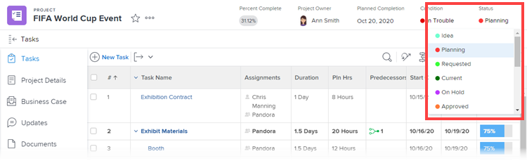

# 重新排序系統級和組狀態

身為Workfront管理員，您可以變更系統內或單一群組中每個人的專案順序、任務和問題狀態。

<!--The system version of this snippet mentions a single group because a sysadmin call also reorder statuses there. Group admin version of this article is still needed.-->

>[!NOTE]
>
>* 在系統層級重新排序狀態不會影響群組內的狀態順序。
>
>  但是，新建立的頂層組中的狀態將繼承系統層狀態的順序。 （新子組將繼承組中狀態的順序，向上一層。）
>
>* 您可以重新排序鎖定的狀態。 有關鎖定狀態的資訊，請參閱 [建立或編輯狀態](../../../administration-and-setup/customize-workfront/creating-custom-status-and-priority-labels/create-or-edit-a-status.md).
>* 群組管理員也可以重新排序群組中使用的狀態。 如需詳細資訊，請參閱 [重新排序組狀態](../../../administration-and-setup/manage-groups/manage-group-statuses/reorder-group-statuses-from-groups-area.md).
>

## 存取需求

您必須具備下列條件才能執行本文所述步驟：

<table style="table-layout:auto"> 
 <col> 
 <col> 
 <tbody> 
  <tr> 
   <td role="rowheader">Adobe Workfront計畫* </td> 
   <td>任何</td> 
  </tr> 
  <tr data-mc-conditions="SnippetConditions-wf-groups.system-level"> 
   <td role="rowheader">Adobe Workfront授權*</td> 
   <td> 
計劃 
 
您必須是Workfront管理員。 如需Workfront管理員的相關資訊，請參閱 <a href="../../../administration-and-setup/add-users/configure-and-grant-access/grant-a-user-full-administrative-access.md" class="MCXref xref">授予使用者完整的管理存取權</a>.
 </td> 
  </tr> 
 </tbody> 
</table>

&#42;如果您需要了解您擁有的計畫或授權類型，請聯絡Workfront管理員。

## 狀態的預設順序

依預設，狀態會依下列順序顯示：

<table style="table-layout:auto"> 
 <col> 
 <col> 
 <col> 
 <thead> 
  <tr> 
   <th width="33.33%">專案</th> 
   <th width="33.33%">任務</th> 
   <th width="33.33%">問題</th> 
  </tr> 
 </thead> 
 <tbody> 
  <tr> 
   <td> 
    <ul> 
     <li>目前</li> 
     <li>廢棄</li> 
     <li> 保留 </li> 
     <li> 計畫 </li> 
     <li> 已完成 </li> 
     <li> 已請求 </li> 
     <li> 已核准 </li> 
     <li> 已拒絕 </li> 
     <li> 構想 </li> 
    </ul> </td> 
   <td> 
    <ul> 
     <li>新增</li> 
     <li>進行中</li> 
     <li>已完成</li> 
    </ul> </td> 
   <td> 
    <ul> 
     <li>新增</li> 
     <li>進行中</li> 
     <li>重新打開</li> 
     <li>等待反饋</li> 
     <li>保留</li> 
     <li>無法複製</li> 
     <li>已關閉</li> 
     <li>已解決</li> 
     <li>確認完成</li> 
     <li>不會解決</li> 
    </ul> </td> 
  </tr> 
 </tbody> 
</table>

## 為任務和項目重新排序狀態（全系統或組）

1. 按一下 **主菜單** 圖示  在Adobe Workfront的右上角，然後按一下 **設定** .

1. 在左側面板中，按一下 **專案偏好設定>狀態**.
1. （條件性）如果您要重新排序群組的狀態，請開始在右上角的方塊中輸入群組名稱，然後在出現名稱時按一下名稱。

   

1. 在顯示的狀態清單上方，按一下 **專案** 或 **工作** 標籤。

1. 依您想要的順序拖放狀態。

   新狀態順序會自動保存。

1. 要測試新狀態順序，請轉至任務或項目，按一下右上角的狀態，並確保顯示的狀態按照您配置的順序。

## 重新排序問題的狀態

1. 按一下 **主菜單** 圖示  在Adobe Workfront的右上角，然後按一下 **設定** .

1. 按一下 **專案偏好設定>狀態。**
1. （條件性）如果您要重新排序群組的狀態，請開始在右上角的方塊中輸入群組名稱，然後在出現名稱時按一下名稱。

   

1. 按一下 **問題** 標籤。
1. （選用）選取問題類型(**錯誤報告**, **變更順序**, **問題**，或 **要求**)。

   >[!NOTE]
   >
   >* 不能自定義主清單的狀態順序。
   >* 建議您以相同方式，為每個問題類型排序狀態。 如需問題類型的詳細資訊，請參閱 [設定請求類型](../../../administration-and-setup/set-up-workfront/configure-system-defaults/configure-request-types.md).

1. 依您想要的順序拖放狀態。

   新狀態順序會自動保存。

1. 若要測試新狀態順序，請前往問題，按一下右上角的狀態，並確認顯示的狀態是按照您設定的順序。
