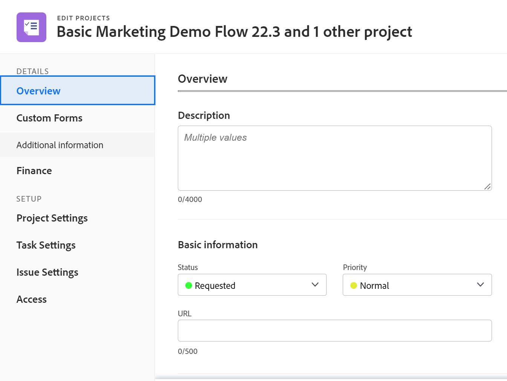
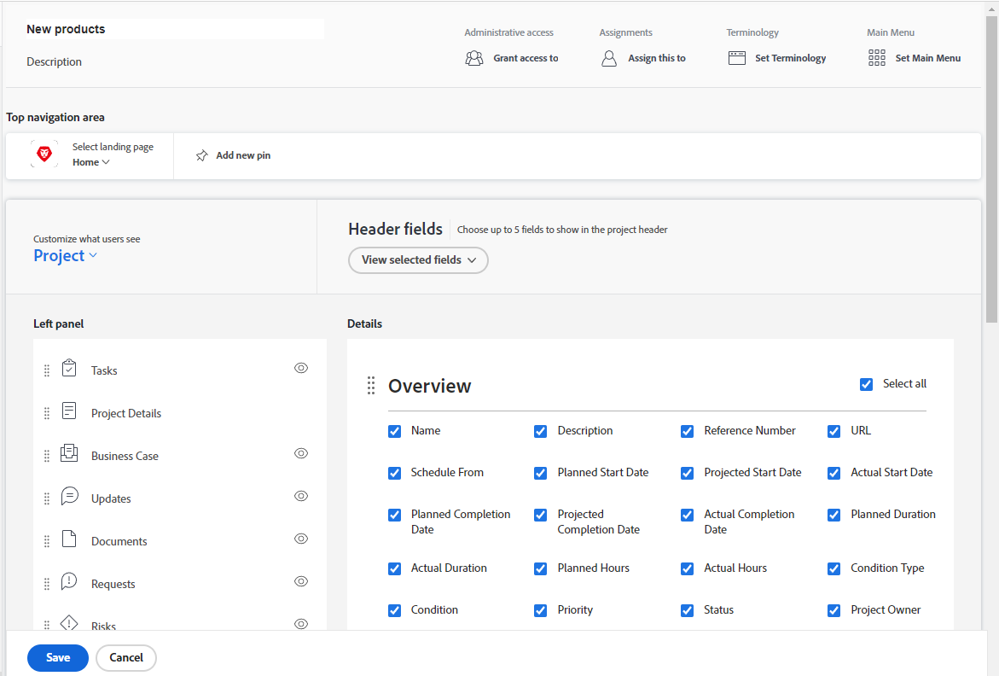

# 使用版面配置範本自訂詳細資料檢視

{{preview-fast-release-general}}

作為Adobe Workfront管理員，您可以使用版面配置範本來決定當使用者在檢視任務、問題、檔案、方案或投資組合時，按一下左側面板中的詳細資訊圖示時會出現哪些資訊。

<!--
or billing record
-->

您也可以變更此資訊顯示的順序。 例如，對於您的使用者所看到的所有任務，您可以針對您的使用者所看到的所有任務，將自訂Forms資訊移至詳細資訊檢視的頂端。

如需有關建立版面配置範本的資訊，請參閱[建立和管理版面配置範本](../use-layout-templates/create-and-manage-layout-templates.md)。

如需有關群組配置範本的資訊，請參閱[建立和修改群組的配置範本](../../../administration-and-setup/manage-groups/work-with-group-objects/create-and-modify-a-groups-layout-templates.md)。

配置版面範本後，您必須將其指派給使用者，才能讓其他人看到您所做的變更。 如需將配置範本指派給使用者的詳細資訊，請參閱[將使用者指派給配置範本](../use-layout-templates/assign-users-to-layout-template.md)。

您對物件的「詳細資訊」檢視所做的變更，也會決定使用者在下列區域中看到的欄位使用狀態和順序：

* 「建立物件」方塊，例如「建立任務」

  

* 編輯物件時顯示「編輯物件」畫面，例如「編輯任務」、「編輯問題」和「編輯專案」

  

* 大量編輯物件時顯示「編輯物件」畫面。 目前支援大量編輯專案。

  

* 摘要面板

  

  >[!NOTE]
  >
  >版面配置範本的變更只會影響指派給登入使用者的任務和問題，在「摘要」面板中的欄位順序和可用性。

* 「轉換」方塊，例如「將問題轉換為任務」或「將問題轉換為專案」方塊。

  

如需有關群組配置範本的資訊，請參閱[建立和修改群組的配置範本](../../../administration-and-setup/manage-groups/work-with-group-objects/create-and-modify-a-groups-layout-templates.md)。

## 存取需求

+++ 展開以檢視本文中功能的存取需求。

<table style="table-layout:auto"> 
 <col> 
 <col> 
 <tbody> 
  <tr> 
   <td>Adobe Workfront套件</td> 
   <td>
任何
</td> 
  </tr> 
  <tr> 
   <td>Adobe Workfront授權</td> 
   <td>
標準

       
規劃
</td>
  </tr> 
  </tr> 
  <tr> 
   <td>存取層級設定</td> 
   <td> 
若要在系統層級執行這些步驟，您需要系統管理員存取層級。

        
若要為群組執行這些動作，您必須是該群組的管理員。
 </td> 
  </tr> 
 </tbody> 
</table>

如需詳細資訊，請參閱Workfront檔案中的[存取需求](/help/quicksilver/administration-and-setup/add-users/access-levels-and-object-permissions/access-level-requirements-in-documentation.md)。

+++

## 自訂使用者在詳細資料檢視中看到的內容

1. 開始使用版面配置範本，如[建立和管理版面配置範本](../../../administration-and-setup/customize-workfront/use-layout-templates/create-and-manage-layout-templates.md)中所述。
1. 按一下下的向下箭頭&#x200B;**向下箭頭**，然後按一下&#x200B;**專案**、**任務**、**問題**、**方案**&#x200B;或&#x200B;**Portfolio。**
<!--
, or billing record
-->

1. 在&#x200B;**詳細資料**&#x200B;區段中，執行下列任一項作業以自訂使用者在「詳細資料」檢視中看到的內容：

   * 拖曳任何區段標題以變更其順序。
   * 啟用或停用不同區域(例如&#x200B;**總覽**、**財務**&#x200B;和&#x200B;**自訂Forms**)下的選項以顯示或隱藏它們。

     如果您隱藏其中一個區段中的所有欄位，則會隱藏整個區段。

     預設會啟用所有欄位。 您可以選取或清除區域中的&#x200B;**全選**&#x200B;核取方塊，以顯示或隱藏該區域中的所有欄位。

   

1. 在預覽環境中：繼續自訂版面範本。 您可以隨時按一下&#x200B;**套用**&#x200B;以儲存進度。

   或

   如果您已完成自訂，請按一下&#x200B;**儲存並關閉**。

1. 在生產環境中：繼續自訂版面範本。

   或

   如果您已完成自訂，請按一下&#x200B;**儲存**。

   >[!TIP]
   >
   >您可以隨時按一下[儲存]來儲存進度，然後再繼續修改範本。****
