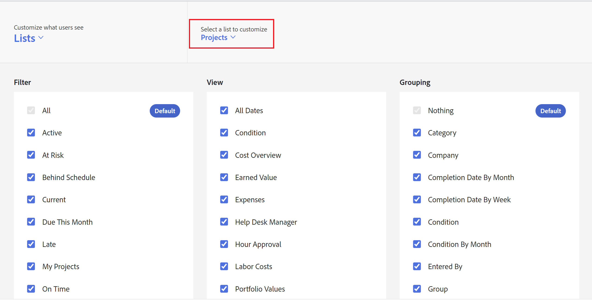

# 使用版面配置範本自訂篩選器、檢視和群組

作為Adobe Workfront管理員，您可以使用版面配置範本來指定哪些清單控制項會出現在篩選、檢視和分組下拉式功能表中。 這些功能表會出現在整個Workfront的上方清單中，例如專案的任務清單：

如需配置範本的詳細資訊，請參閱[建立和管理配置範本](../../../administration-and-setup/customize-workfront/use-layout-templates/create-and-manage-layout-templates.md)。

如需有關群組配置範本的資訊，請參閱[建立和修改群組的配置範本](../../../administration-and-setup/manage-groups/work-with-group-objects/create-and-modify-a-groups-layout-templates.md)。

配置版面範本後，您必須將其指派給使用者，才能讓其他人看到您所做的變更。 如需將配置範本指派給使用者的詳細資訊，請參閱[將使用者指派給配置範本](../use-layout-templates/assign-users-to-layout-template.md)。

## 存取需求

您必須具有下列存取權才能執行本文中的步驟：

<table style="table-layout:auto"> 
 <col> 
 <col> 
 <tbody> 
  <tr> 
   <td role="rowheader">Adobe Workfront計畫</td> 
   <td>任何</td> 
  </tr> 
  <tr> 
   <td role="rowheader">Adobe Workfront授權</td> 
   <td>計劃</td> 
  </tr> 
  <tr> 
   <td role="rowheader">存取層級設定</td> 
   <td> 
若要在系統層級執行這些步驟，您需要系統管理員存取層級。
若要為群組執行這些動作，您必須是該群組的管理員。
 
<b>注意</b>：如果您還是沒有存取權，請詢問您的Workfront管理員是否對您的存取層級設定了其他限制。 如需Workfront管理員如何修改存取層級的詳細資訊，請參閱<a href="../../../administration-and-setup/add-users/configure-and-grant-access/create-modify-access-levels.md" class="MCXref xref">建立或修改自訂存取層級</a>。
 </td> 
  </tr> 
 </tbody> 
</table>

## 自訂篩選器、檢視和群組清單控制項：

1. 開始使用版面配置範本，如[建立和管理版面配置範本](../../../administration-and-setup/customize-workfront/use-layout-templates/create-and-manage-layout-templates.md)中所述。
1. 按一下&#x200B;**自訂使用者看到的內容**&#x200B;下的向下箭頭，然後在顯示的下拉式功能表中按一下&#x200B;**清單**。

   

1. 按一下&#x200B;**下方的向下箭頭選取要自訂的清單**，然後選取您要自訂「篩選」、「檢視」和「群組」清單控制項的Workfront物件型別。

   

   >[!NOTE]
   >
   >如果您選取「專案」作為清單來自訂，然後停用「篩選」區段中的「我所在的專案」或「我擁有的專案」，使用者將無法再看見或無法使用該篩選：
   >
   >* 在按一下清單上方的篩選圖示時所顯示的篩選清單中：
   >   
   >  
   >   
   >* 在專案區域標題的標題中：
   >   
   >  

1. （選擇性）如果要變更版面配置範本的預設篩選、檢視或群組，請將滑鼠游標停留在篩選、檢視或群組上，然後按一下&#x200B;**設定為預設**。

   您選擇的預設值會決定指派版面配置範本給使用者時，使用者在整個Workfront的清單中看到的篩選、檢視和群組。 如果您不變更這些預設值，使用者會看到所有清單，如下所示：

   * **篩選器**：全部
   * **檢視**：標準（適用時；部分清單沒有此檢視）
   * **群組**：無

   選取不同的預設值（請參閱步驟5）後，您可以隱藏「全部」、「標準」和「無」選項，但無法刪除這些選項。

   您可以刪除用作預設的任何其他選項，但您必須先選取不同的預設值。

   如需有關刪除篩選器、檢視和群組的資訊，請參閱[建立、編輯和共用預設篩選器、檢視和群組](../../../administration-and-setup/set-up-workfront/configure-system-defaults/create-and-share-default-fvgs.md)。

1. 隱藏並新增清單控制項，如下所示：

   <table style="table-layout:auto"> 
    <col> 
    <col> 
    <tbody> 
     <tr> 
      <td role="rowheader">隱藏清單控制項</td> 
      <td> 
清除或勾選您要隱藏或顯示的清單控制項旁的方塊。
 
如果核取方塊變暗，則無法隱藏該清單控制項。 每個清單控制項的預設設定會變暗，因為您無法隱藏目前設定為預設的設定。
 </td> 
     </tr> 
     <tr> 
      <td role="rowheader">新增自訂清單控制項</td> 
      <td> 
 
        <ol> 
         <li value="1"> 按一下篩選器、檢視或群組清單底部的<strong>新增篩選器</strong>、<strong>新增檢視</strong>或<strong>新增群組</strong>。 在顯示的方塊中，開始輸入先前為您的組織建立的現有自訂清單控制項名稱，然後在其出現時按一下該名稱。</li> 
         <li value="2"> 如果您想要將新的自訂清單控制項設定為配置範本的預設篩選、檢視或群組，請按一下<strong>設定為預設</strong>。 </li> 
         <li value="3"> 
完成時，請按一下[新增] <strong></strong>。
 
<b>附註</b>： 
使用者可以將自訂清單控制項新增到自己的清單中。 如果您在版面配置範本中新增自訂清單控制項，您的清單控制項會新增，並移至面板底部；您的清單控制項不會取代它們的位置。
 
如果您將使用者指派給具有自訂清單控制項的新版面配置範本，也會發生這種情況。 
 
如需自訂清單控制項的資訊，請參閱<a href="../../../reports-and-dashboards/reports/reporting-elements/filters-overview.md" class="MCXref xref">篩選器總覽</a>、<a href="../../../reports-and-dashboards/reports/reporting-elements/views-overview.md" class="MCXref xref">Adobe Workfront中的檢視總覽</a>和<a href="../../../reports-and-dashboards/reports/reporting-elements/groupings-overview.md" class="MCXref xref">Adobe Workfront中的群組總覽</a>。
 
 </li> 
        </ol> 
 </td> 
     </tr> 
    </tbody> 
   </table>

1. 繼續自訂版面範本。

   或

   如果您已完成自訂，請按一下&#x200B;**儲存**。

   >[!TIP]
   >
   >您可以隨時按一下「儲存」以儲存進度，然後繼續修改範本。
