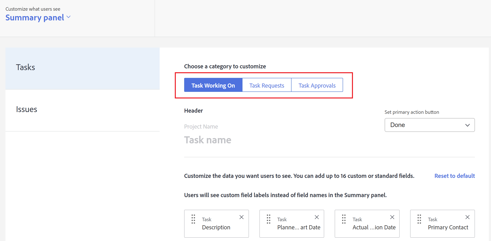

# 使用版面配置範本自訂摘要面板

<!--Audited: 11/2024-->

<!--The highlighted information on this page refers to functionality not yet generally available. It is available only in the Preview environment for all customers. After the monthly releases to Production, the same features are also available in the Production environment for customers who enabled fast releases.    

For information about fast releases, see [Enable or disable fast releases for your organization](/help/quicksilver/administration-and-setup/set-up-workfront/configure-system-defaults/enable-fast-release-process.md).    -->

您可以使用版面配置範本來設定使用者按一下任務或問題時可在摘要面板中看到的內容。 您使用下列步驟進行的每個設定都會影響「摘要」面板。 這些自訂不適用於「檔案摘要」面板。

您可以設定：

* 詳細資訊區域中針對任務或問題顯示哪些欄位，以及按照什麼順序
* 所選任務或問題的更新、記錄時間、附加檔案和時間戳記是否顯示

您也可以自訂當使用者按一下指派給他們的專案核准、檔案核准或檔案版本核準時，使用者在「首頁」區域中看到的欄位。

如需「摘要」面板的相關資訊，請參閱[摘要概觀](../../../workfront-basics/the-new-workfront-experience/summary-overview.md)。

如需有關建立版面配置範本的資訊，請參閱[建立和管理版面配置範本](../use-layout-templates/create-and-manage-layout-templates.md)。

如需有關群組配置範本的資訊，請參閱[建立和修改群組的配置範本](../../../administration-and-setup/manage-groups/work-with-group-objects/create-and-modify-a-groups-layout-templates.md)。

配置版面範本後，您必須將其指派給使用者，才能讓其他人看到您所做的變更。 如需將配置範本指派給使用者的詳細資訊，請參閱[將使用者指派給配置範本](../use-layout-templates/assign-users-to-layout-template.md)。

## 存取需求

+++ 展開以檢視本文中功能的存取需求。

您必須具有下列存取權才能執行本文中的步驟：

<table style="table-layout:auto"> 
 <col> 
 <col> 
 <tbody> 
  <tr> 
   <td role="rowheader">Adobe Workfront計畫</td> 
   <td>任何</td> 
  </tr> 
  <tr> 
   <td role="rowheader">Adobe Workfront授權*</td> 
   <td>
新增：標準

  
 目前：計畫

   </td> 
  </tr> 
  <tr> 
   <td role="rowheader">存取層級設定</td> 
   <td> 
若要在系統層級執行這些步驟，您需要系統管理員存取層級。
若要為群組執行這些動作，您必須是該群組的管理員。
 </td> 
  </tr> 
 </tbody> 
</table>

*如需詳細資訊，請參閱Workfront檔案中的[存取需求](/help/quicksilver/administration-and-setup/add-users/access-levels-and-object-permissions/access-level-requirements-in-documentation.md)。

+++

## 使用版面配置範本自訂摘要面板

1. 開始使用版面配置範本，如[建立和管理版面配置範本](../../../administration-and-setup/customize-workfront/use-layout-templates/create-and-manage-layout-templates.md)中所述。

1. 按一下下的向下箭頭&#x200B;**向下箭頭**，然後按一下&#x200B;**摘要面板**。

1. 在下方顯示的清單中，按一下您要自訂「摘要」面板的物件型別。

   下表說明您可以為每個物件自訂的專案

   <table style="table-layout:auto"> 
    <col> 
    <col> 
    <tbody> 
     <tr> 
      <td role="rowheader">任務</td> 
      <td> 
在任務清單中，此設定會影響當使用者選擇任務，然後按一下「開啟摘要」圖示時顯示在頁面右側的「摘要」面板。

   
  
 </td> 
     </tr> 
     <tr> 
      <td role="rowheader">問題</td> 
      <td>
在問題清單中，此設定會影響當使用者選擇問題，然後按一下「開啟摘要」圖示時顯示在頁面右側的「摘要」面板。
 </td> 
     </tr> 
    </tbody> 
   </table>

<!--These were removed with the new Home: 

<tr> 
      <td role="rowheader">Projects</td> 
      <td><ul><li>
In Home, when a user clicks a project approval assigned to them, your configuration for this setting affects the area to the right of the approval.

      
<b>IMPORTANT:</b> 

This is a deprecated feature. Any changes you make to this area are related to a feature that Workfront has removed. This option will be removed from Workfront with a later maintenance update.
</li>
      </ul> 
      </td> 
     </tr> 
     <tr> 
      <td role="rowheader">Documents</td> 
      <td>
     <ul><li>
In Home, when a user clicks a document approval assigned to them, your configuration for this setting affects the area to the right of the approval.

      
<b>IMPORTANT:</b> 

 This is a deprecated feature. Any changes you make to this area are related to a feature that Workfront has removed. This option will be removed from Workfront with a later maintenance update.
</li>
      </ul>
      </td> 
     </tr> 
     <tr> 
      <td role="rowheader">Document Versions</td> 
      <td><ul><li>
In Home, when a user clicks an approval assigned to them for a particular version of a document, your configuration for this setting affects the area to the right of the approval.

      

<b>IMPORTANT:</b>
 This is a deprecated feature. Any changes you make to this area are related to a feature that Workfront has removed. This option will be removed from Workfront with a later maintenance update.
</li>
      </ul>
      </td> 
     </tr> -->

>[!IMPORTANT]
>
>如果未指派任務，則指派給版面配置範本的使用者將不會在「摘要」中看到欄位自訂。

1. （視條件而定）如果您在上一步中按一下任務或問題，請選取您要自訂的任務或問題類別。

   

1. （視條件而定）如果出現「**設定主要動作」按鈕**」下拉式功能表（如果您在左側清單中選取「**任務**」或「**問題**」），請在使用者檢視任務或問題時，按一下「摘要」面板中您希望使用者可用的主要動作（**完成**&#x200B;或&#x200B;**狀態**）。

   

1. 新增或隱藏所選物件型別的欄位。

   

1. 重複步驟3-6以自訂任何其他物件型別的「摘要」面板。
1. 按一下左下角附近的&#x200B;**全域設定**，然後啟用或停用摘要中與Adobe Workfront物件相關的下列任何選項：

   <table style="table-layout:auto"> 
    <col> 
    <col> 
    <tbody> 
     <tr> 
      <td role="rowheader">顯示工作的更新</td> 
      <td>在「摘要」面板中顯示對選定任務或問題所做的任何更新。 這包括系統更新和使用者所做的更新。 使用者仍然可以篩選掉系統更新，如<a href="../../../workfront-basics/updating-work-items-and-viewing-updates/update-work.md#enable" class="MCXref xref">更新工作</a>中的<a href="../../../workfront-basics/updating-work-items-and-viewing-updates/update-work.md" class="MCXref xref">啟用或停用系統更新</a>中所述。</td> 
     </tr> 
     <tr> 
      <td role="rowheader">針對工作記錄時間</td> 
      <td>當選取任務或問題時，顯示「針對工作記錄時間」選項，可讓使用者直接從「首頁」和「摘要」區域記錄工作專案的時間。</td> 
     </tr> 
     <tr> 
      <td role="rowheader">檢視與工作相關的檔案</td> 
      <td>選擇任務或問題時在「摘要」面板中顯示「檔案」區域，列出附加到任務或問題的任何檔案。 使用者可以按一下檔案，在預覽視窗中檢視檔案。</td> 
     </tr> 
     <tr> 
      <td role="rowheader">隱藏時間戳記</td> 
      <td>在「摘要」面板中隱藏下列日期欄位的時間戳記：
       <ul>
        <li>規劃完成日期</li>
        <li>認可日期</li>
        <li>提交日期</li>
       </ul></td> 
     </tr> 
    </tbody> 
   </table>

1. 繼續自訂版面範本。

   或

   如果您已完成自訂，請按一下&#x200B;**儲存**。

如需配置範本的詳細資訊，請參閱[建立和管理配置範本](../../../administration-and-setup/customize-workfront/use-layout-templates/create-and-manage-layout-templates.md)。
