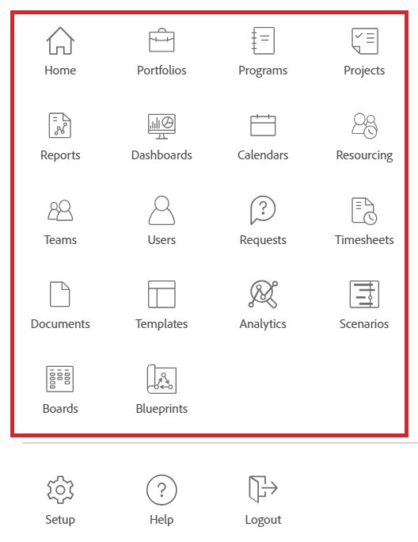

# 使用版面配置範本自訂主功能表

身為Adobe Workfront管理員或群組管理員，您可以使用版面配置範本來設定使用者在Workfront中開啟「主要功能表」時看到的選項：

>[!NOTE]
>
>使用者看到的主要功能表選項取決於其授權型別以及在其存取層級中設定的設定。 某些將使用此版面配置範本的使用者可能不會看見您在這裡選擇的所有選項。 如需詳細資訊，請參閱 [存取層級和許可權如何搭配運作](../../../administration-and-setup/add-users/access-levels-and-object-permissions/how-access-levels-permissions-work-together.md) 和 [可設定的每種物件型別功能存取權](../../../administration-and-setup/add-users/access-levels-and-object-permissions/configurable-functionality-in-each-access-level-by-object-type.md).

如需有關建立版面範本的資訊，請參閱 [建立和管理版面範本](../use-layout-templates/create-and-manage-layout-templates.md).

如需有關群組版面配置範本的資訊，請參閱 [建立和修改群組的版面配置範本](../../../administration-and-setup/manage-groups/work-with-group-objects/create-and-modify-a-groups-layout-templates.md).

設定版面範本後，您必須將其指派給使用者，才能讓其他人看見您所做的變更。 如需將版面配置範本指派給使用者的詳細資訊，請參閱 [將使用者指派至版面配置範本](../use-layout-templates/assign-users-to-layout-template.md).

## 存取需求

您必須具有下列存取權才能執行本文中的步驟：

<table style="table-layout:auto"> 
 <col> 
 <col> 
 <tbody> 
  <tr> 
   <td role="rowheader"><strong>Adobe Workfront計畫</strong></td> 
   <td>任何</td> 
  </tr> 
  <tr> 
   <td role="rowheader"><strong>Adobe Workfront授權</strong></td> 
   <td>計劃</td> 
  </tr> 
  <tr> 
   <td role="rowheader"><strong>存取層級設定</strong></td> 
   <td> 
若要在系統層級執行這些步驟，您需要系統管理員存取層級。
若要為群組執行這些動作，您必須是該群組的管理員。
 
<b>注意</b>：如果您還是沒有存取權，請洽詢Workfront管理員，瞭解他們是否對您的存取層級設定其他限制。 如需有關Workfront管理員如何修改您的存取層級的資訊，請參閱 <a href="../../../administration-and-setup/add-users/configure-and-grant-access/create-modify-access-levels.md" class="MCXref xref">建立或修改自訂存取層級</a>.
 </td> 
  </tr> 
 </tbody> 
</table>

## 自訂主要功能表

1. 開始使用版面範本，如所述 [建立和管理版面範本](../../../administration-and-setup/customize-workfront/use-layout-templates/create-and-manage-layout-templates.md).
1. 按一下 **設定主功能表** 右上角附近。

   在出現的「主功能表」方塊中，您可以在範本的「主功能表」中看到目前作用中的專案，以及可新增的專案。 以下是所有可新增的專案：

   * 首頁

     >[!TIP]
     >
     >依預設，「首頁」對「檢閱」授權使用者顯示為「我的更新」，除非他們有一個與其設定檔相關聯的版面範本，該範本包括「主功能表」中的「我的更新」區域。

   * 專案組合
   * 計劃
   * 專案
   * 報告
   * 儀表板
   * 行事曆
   * 資源分配
   * 情景

     >[!NOTE]
     >
     >Scenario Planner僅在新的Adobe Workfront體驗中可用，並且需要額外的授權。 如需Workfront Scenario Planner的相關資訊，請參閱 [情境規劃工具概觀](../../../scenario-planner/scenario-planner-overview.md).

   * 團隊
   * 使用者

     >[!NOTE]
     >
     >只有擁有計畫授權的使用者才能看到使用者  在主要功能表中。

   * 請求
   * 時程表
   * 文件
   * 範本
   * 分析
   * 校訂
   * 目標

     >[!NOTE]
     >
     >這需要額外的授權。 如需Workfront目標的相關資訊，請參閱 [Adobe Workfront目標總覽](../../../workfront-goals/goal-management/wf-goals-overview.md).

   * 我的更新
   * 展示板
   * 藍圖

1. 執行下列任一項作業：

   * 隱藏  **使用中的專案** 您不想顯示的專案
   * 顯示  **可用專案** 您確實想要顯示在主功能表上。
   * 拖曳  **使用中的專案** 以變更它們在主功能表上的顯示順序。

1. 按一下 **完成**.

   您也可以按一下 **取消** 任何時候放棄變更。

1. 繼續自訂版面範本。

   或

   如果您已完成自訂，請按一下 **儲存**.

   >[!TIP]
   >
   >您可以隨時按一下「儲存」以儲存進度，然後繼續稍後修改範本。

如需版面配置範本的詳細資訊，請參閱 [建立和管理版面範本](../../../administration-and-setup/customize-workfront/use-layout-templates/create-and-manage-layout-templates.md).
