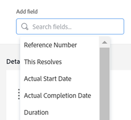

# 使用版面配置範本自訂物件標頭

{{preview-fast-release-general}}

身為Adobe Workfront管理員或群組管理員，您可以使用版面配置範本來設定使用者在開啟物件頁面時，在物件標題中看到的欄位。

>[!IMPORTANT]
>
>自訂物件標題目前可用於專案、任務和問題。

如需有關建立版面配置範本的資訊，請參閱[建立和管理版面配置範本](../use-layout-templates/create-and-manage-layout-templates.md)。

如需有關群組配置範本的資訊，請參閱[建立和修改群組的配置範本](../../../administration-and-setup/manage-groups/work-with-group-objects/create-and-modify-a-groups-layout-templates.md)。

配置版面範本後，您必須將其指派給使用者，才能讓其他人看到您所做的變更。 如需將配置範本指派給使用者的詳細資訊，請參閱[將使用者指派給配置範本](../use-layout-templates/assign-users-to-layout-template.md)。

## 存取需求

+++ 展開以檢視本文中功能的存取需求。

<table style="table-layout:auto"> 
 <col> 
 <col> 
 <tbody> 
  <tr> 
   <td>Adobe Workfront套件</td> 
   <td>
任何
</td> 
  </tr> 
  <tr> 
   <td>Adobe Workfront授權</td> 
   <td>
標準

       
規劃
</td>
  </tr> 
  </tr> 
  <tr> 
   <td>存取層級設定</td> 
   <td> 
若要在系統層級執行這些步驟，您需要系統管理員存取層級。

        
若要為群組執行這些動作，您必須是該群組的管理員。
 </td> 
  </tr> 
 </tbody> 
</table>

如需詳細資訊，請參閱Workfront檔案中的[存取需求](/help/quicksilver/administration-and-setup/add-users/access-levels-and-object-permissions/access-level-requirements-in-documentation.md)。

+++

## 自訂物件標頭

1. 開始使用版面配置範本，如[建立和管理版面配置範本](../../customize-workfront/use-layout-templates/create-and-manage-layout-templates.md)中所述。
1. 在&#x200B;**自訂使用者看到的內容**&#x200B;下拉式功能表中，選取&#x200B;**專案**、**任務**&#x200B;或&#x200B;**問題**。

   <!--when this will be possible for more than 3 objects, at production, make this more general: update the sentence above to say "select an object you want to customize in the Customize what users see drop-down menu). -->

1. 在[!UICONTROL 標題欄位]區段中，將滑鼠移至顯示的欄位上，然後執行下列任一項作業：
   * 按一下&#x200B;**x**&#x200B;圖示以移除欄位

     或

   * 按一下並按住&#x200B;**抓取**&#x200B;圖示，將欄位拖放到新位置。

   <!--(NOTE: make sure the default names of these fields have not changed; otherwise, update screen shot)-->

   

1. 一個物件的標頭中最多可以有五個欄位。
如果您已選取五個欄位，則必須先移除欄位，才能新增欄位。
1. 在&#x200B;**新增欄位**&#x200B;方塊中，開始輸入您要新增的不可編輯的Workfront欄位名稱，然後在其顯示在清單中時選取它。 該欄位會新增到「新增欄位」方塊的緊鄰右側，並將顯示為物件標題左上角的第一個欄位。

   >[!TIP]
   >
   >* 您只能新增顯示在物件「詳細資訊」區段的「概觀」區域中且不可編輯的欄位。 不可編輯的欄位是使用者無法手動編輯的欄位。 它們會由Workfront自動計算。
   >
   >* 您可以新增已經是預設標題一部分的可編輯欄位（例如，專案所有者、狀態、完成百分比、指派）。
   >
   >* 當您將「解決者」欄位新增到問題的標題時，當存在與問題關聯的解決物件時，欄位會變更為「解決問題、任務或專案」。

   

1. （選用）以不同順序拖放欄位。

1. 在預覽環境中：繼續自訂版面範本。 您可以隨時按一下&#x200B;**套用**&#x200B;以儲存進度。

   或

   如果您已完成自訂，請按一下&#x200B;**儲存並關閉**。

1. 在生產環境中：繼續自訂版面範本。

   或

   如果您已完成自訂，請按一下&#x200B;**儲存**。

   >[!TIP]
   >
   >您可以隨時按一下[儲存]來儲存進度，然後再繼續修改範本。**&#x200B;**
