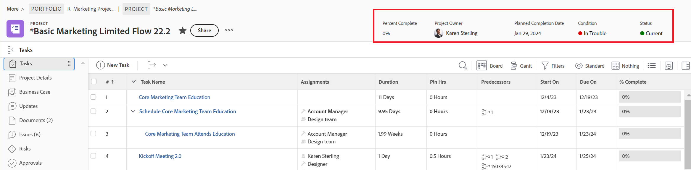

# 使用版面範本自訂物件標題

身為Adobe Workfront管理員或群組管理員，您可以使用配置範本，設定使用者開啟物件頁面時，在物件標題中看到的欄位。

>[!IMPORTANT]
>
>自訂物件標頭目前可用於專案、工作和問題。

如需群組版面範本的相關資訊，請參閱 [建立和修改群組的版面範本](../../manage-groups/work-with-group-objects/create-and-modify-a-groups-layout-templates.md).

## 存取需求

您必須具備下列存取權，才能執行本文中的步驟：

<table>
  <tr>
   <td><strong>Adobe Workfront計畫</strong>
   </td>
   <td>任何
   </td>
  </tr>
  <tr>
   <td><strong>Adobe Workfront授權</strong>
   </td>
   <td>計劃
   </td>
  </tr>
  <tr>
   <td><strong>訪問級別配置</strong>
   </td>
   <td>您必須是Workfront或群組管理員。

   </td>
  </tr>
</table>

如果您仍無權存取，請洽詢您的Workfront管理員，他們是否在您的存取層級設定其他限制。 如需Workfront管理員如何修改您的存取層級的詳細資訊，請參閱 [建立或修改自訂存取層級](../../add-users/configure-and-grant-access/create-modify-access-levels.md).

## 自訂物件標題

1. 開始使用版面範本，如 [建立和管理版面範本](../../customize-workfront/use-layout-templates/create-and-manage-layout-templates.md).
1. 在 **自訂使用者看見的項目** 下拉式功能表，選取 **專案**, **工作** 或 **問題**.

   <!--when this will be possible for more than 3 objects, at production, make this more general: update the sentence above to say "select an object you want to customize in the Customize what users see drop-down menu). -->

1. 在 [!UICONTROL 標題欄位] 區段，將滑鼠移至顯示的欄位上，並執行下列任一操作：
   * 按一下 **x** 圖示以移除欄位

      或

   * 按一下並按住 **抓住** 圖示將欄位拖放至新位置。

   <!--(NOTE: make sure the default names of these fields have not changed; otherwise, update screen shot)-->

   

1. 物件標題中最多可以有五個欄位。
如果您已選取五個欄位，則必須先移除欄位，才能新增欄位。
1. 在 **新增欄位** 框中，開始鍵入要添加的不可編輯的Workfront欄位的名稱，然後在該欄位顯示在清單中時將其選中。 欄位會新增至「新增」欄位方塊的正右側，並顯示為物件標題左上角的第一個欄位。

   >[!TIP]
   >
   >* 您只能添加對象「詳細資訊」部分的「概述」區域中顯示的、不可編輯的欄位。 不可編輯的欄位是使用者無法手動編輯的欄位。 這些值會由Workfront自動計算。
   >
   >* 您可以新增已屬於預設標題的可編輯欄位（例如，「項目擁有者」、「狀態」、「完成百分比」、「工作總攬」）。
   >
   >* 將「解決者」欄位新增至問題的標題時，如果有與問題相關聯的解決物件，欄位會變更為「解決問題、任務或專案」。

   

1. （選用）以不同順序拖放新增的欄位。

1. 繼續自訂配置範本。

   或

   如果您已完成自訂，請按一下 **儲存**.

   >[!TIP]
   >
   >您可以隨時按一下「儲存」以儲存進度，然後稍後繼續修改範本。
