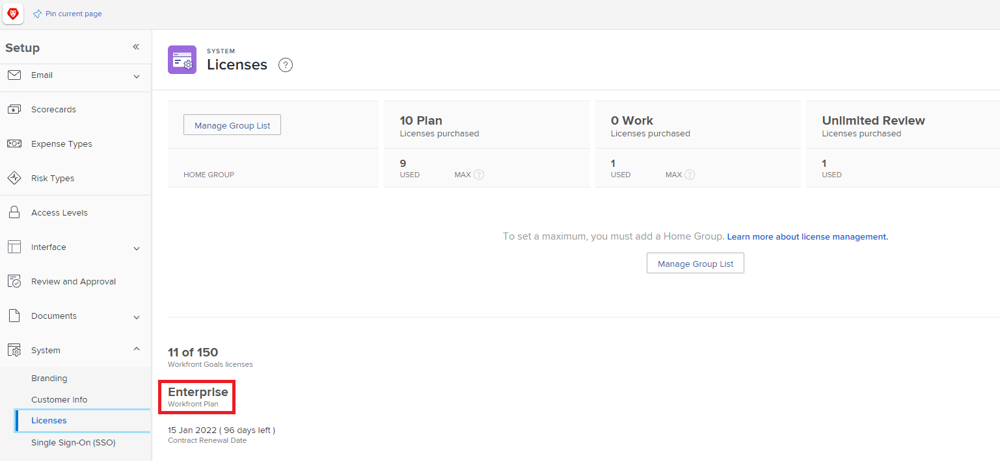

# 防火牆概述

由於Adobe Workfront會與貴組織的網路通訊，因此貴組織的防火牆必須設定為允許該通訊。 防火牆是高度有效的安全措施，可將組織的網路與網際網路隔離開來。 它們可確保只有選取的資料和網路流量可以移入或移出組織的網路。 防火牆會根據傳送或接收資料的網站，允許或封鎖資料。 身為Adobe Workfront管理員，您必須確保傳送至或來自Workfront的資料可透過您組織的防火牆。

這是透過允許清單來完成，其實質為「允許」透過防火牆傳送或接收資料的網站「清單」。 您可以使用下列兩種方式之一來識別網站：

* **IP位址**：一系列數字，例如52.31.132.175
* **網域**： URL的一部分，例如www.thisdomain.com中的「thisdomain」

Workfront使用特定的IP位址和網域進行網頁通訊。 必須先將這些專案新增到貴組織的允許清單中，您才能在組織中使用Workfront。

一般而言，允許清單是由網路管理員所設定。 請與貴組織的網路管理員合作，確保您的防火牆允許這些IP位址。 如果您不知道您的網路管理員是誰，貴組織的IT部門可以引導您往正確的方向前進。

>[!IMPORTANT]
>
>身為Workfront管理員，您必須確保將這些IP位址和網域新增至貴組織的允許清單。 即使您自己不新增這些專案，也是如此。 Workfront無法設定您組織的允許清單。

## 收集設定防火牆的資訊

若要設定Workfront的防火牆，您的網路管理員需要知道要新增哪些IP位址和網域。 此資訊中的一部分僅供Workfront管理員使用。 身為Workfront管理員，您必須找到此資訊並提供給網路管理員。

>[!NOTE]
>
>安全性最佳實務是僅新增連線至您的組織正在使用的功能的IP位址和網域。 提供這項資訊可確保遵循此最佳實務。

向網路管理員提供下列資訊：

<table style="table-layout:auto"> 
 <col> 
 <col> 
 <tbody> 
  <tr> 
   <td role="rowheader">允許的特定IP位址和網域</td> 
   <td> 
文章<a href="../../administration-and-setup/get-started-wf-administration/configure-your-firewall.md" class="MCXref xref">設定防火牆的允許清單</a>包含貴組織必須新增至允許清單的IP位址和網域清單。 
 
您的網路管理員可能沒有「設定防火牆的允許清單」文章的存取權。 在這種情況下，您必須將其提供給他們。 我們不建議列印硬式（紙張）的復本。 數位復本可讓您的網路管理員複製並貼上位址，這比從硬複製輸入更快速、更準確。
 </td> 
  </tr> 
  <tr> 
   <td role="rowheader">您的叢集</td> 
   <td>若要尋找組織的叢集，請參閱<a href="#view-your-organization-s-cluster-and-workfront-plan" class="MCXref xref">檢視組織的叢集和Workfront計畫</a>。</td> 
  </tr> 
  <tr> 
   <td role="rowheader">您的Workfront計畫</td> 
   <td> 
若要尋找您組織的計畫，請參閱<a href="#view-your-organization-s-cluster-and-workfront-plan" class="MCXref xref">檢視您組織的叢集和Workfront計畫。</a>
 </td> 
  </tr> 
  <tr> 
   <td role="rowheader">您的網域</td> 
   <td> 
若要尋找您的網域，請檢視您用來連線至Workfront的網址。
 
範例：在網址<code>greatcompany.my.workfront.com</code>中，網域為「greatcompany」
 </td> 
  </tr> 
  <tr> 
   <td role="rowheader">其他Adobe Workfront產品</td> 
   <td> 
如果您擁有下列任一專案的授權，請通知您的網路管理員：
 
    <ul> 
     <li> 
Adobe Workfront Proof
 </li> 
     <li> 
Adobe Workfront Fusion 
 </li> 
    </ul> </td> 
  </tr> 
  <tr> 
   <td role="rowheader">Adobe Workfront整合</td> 
   <td>如果您使用下列任何一項，請通知您的網路管理員：
    <ul>
     <li>
適用於 Jira 的 Workfront
</li>
     <li>
適用於Google Workspace的Workfront
</li>
     <li>
適用於 Microsoft Teams 的 Workfront
</li>
     <li>
適用於Outlook的Workfront
</li>
     <li>
適用於Salesforce的Workfront
</li>
    </ul></td> 
  </tr> 
  <tr> 
   <td role="rowheader">其他功能</td> 
   <td> 
如果您使用下列專案，請通知您的網路管理員：
 
    <ul> 
     <li> 
Workfront測試工具
 </li> 
    </ul> </td>
  </tr> 
 </tbody> 
</table>

>[!IMPORTANT]
>
>如果您在稍後新增這些產品、整合或功能，您必須聯絡您的網路管理員，讓他們可以調整允許清單。

### 檢視貴組織的叢集和Workfront計畫 {#view-your-organization-s-cluster-and-workfront-plan}

1. 按一下Adobe Workfront右上角的&#x200B;**[!UICONTROL 主功能表]**&#x200B;圖示，或（如果有的話）按一下左上角的&#x200B;**[!UICONTROL 主功能表]**&#x200B;圖示，然後按一下&#x200B;**[!UICONTROL 設定]** 。

1. 按一下左側面板中的&#x200B;**系統**
1. 若要檢視您的叢集，請選取&#x200B;**客戶資訊**。

   您的叢集會顯示在&#x200B;**基本資訊**&#x200B;區段的右上角附近。

   

1. 若要檢視您的Workfront計畫，請選取&#x200B;**授權**。

   您的計畫會顯示在頁面右上角附近。

   
