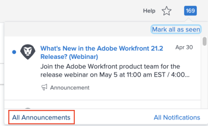

# 傳送公告

身為Adobe Workfront管理員，您可以使用「公告」頁面，將公告傳送給使用者。

來自Workfront的公告訊息通常包含新功能與發行、程式變更等相關資訊。

如需檢視公告的詳細資訊，請參閱 [檢視及管理應用程式內通知](../../workfront-basics/using-notifications/view-and-manage-in-app-notifications.md).

## 存取需求

您必須具備下列存取權，才能執行本文中的步驟：

<table style="table-layout:auto"> 
 <col> 
 <col> 
 <tbody> 
  <tr> 
   <td role="rowheader">Adobe Workfront計畫</td> 
   <td>任何</td> 
  </tr> 
  <tr> 
   <td role="rowheader">Adobe Workfront授權</td> 
   <td>計劃</td> 
  </tr> 
  <tr> 
   <td role="rowheader">訪問級別配置</td> 
   <td> 
您必須是Workfront管理員。 如需詳細資訊，請參閱 <a href="../../administration-and-setup/add-users/configure-and-grant-access/grant-a-user-full-administrative-access.md" class="MCXref xref">授予使用者完整的管理存取權</a>.
 
<b>注意</b>:如果您仍無權存取，請洽詢您的Workfront管理員，他們是否在您的存取層級設定其他限制。 如需Workfront管理員如何修改您的存取層級的詳細資訊，請參閱 <a href="../../administration-and-setup/add-users/configure-and-grant-access/create-modify-access-levels.md" class="MCXref xref">建立或修改自訂存取層級</a>.
 </td> 
  </tr> 
 </tbody> 
</table>

## 傳送公告給使用者

您可以使用 **公告** 頁面，透過轉送從Workfront傳送的公告及撰寫新公告，與您的Workfront系統中的使用者通訊。 您可以傳送公告給Workfront系統內的特定使用者、群組、團隊或公司。

* [將Workfront公告轉送給使用者](#forward-workfront-announcements-to-users)
* [撰寫新公告](#compose-new-announcements)

### 將Workfront公告轉送給使用者 {#forward-workfront-announcements-to-users}

您可以輕鬆將從Workfront收到的訊息轉送給系統中的使用者。

1. 按一下 **通知** 圖示(位於Workfront介面的右上角)，然後按一下 **所有公告**.

   

1. 在 **公告** 頁，選擇要轉發的消息。
1. 按一下 **前進**.
1. 在 **傳送至** 框中，開始鍵入要接收公告消息的用戶、組、團隊或公司的名稱，然後在下拉清單中顯示該名稱時按一下該名稱。 重複此程式以新增多個使用者、群組、團隊或公司。

   或

   要將公告轉發給系統中的所有用戶，請開始鍵入 **每個人**，然後在下拉式清單中出現時按一下。

1. 繼續步驟3，於 [撰寫新公告](#compose-new-announcements).

### 撰寫新公告 {#compose-new-announcements}

1. 按一下 **通知** 圖示(位於Workfront介面的右上角)，然後按一下 **所有公告**.

   

1. 在 **公告** 頁面，按一下 **新公告。**

1. 在 **傳送至** 框中，開始鍵入要接收公告消息的用戶、組、團隊或公司的名稱，然後在下拉清單中顯示該名稱時按一下該名稱。 重複此程式以新增多個使用者、群組、團隊或公司。

   依預設，傳送新公告訊息時， **每個人** 已預先填入此欄位。 如果您不希望系統中的所有用戶都收到公告消息，請刪除 **每個人** 從清單中。

1. 指定下列其他資訊：

   | 主旨 | 指定公告的主題。 |
   |---|---|
   | 在此處輸入訊息 | 指定訊息的內容。 訊息編輯器可讓您包含通用標籤，包括粗體、斜體、底線、項目符號和編號清單，以及超連結。 |
   | 附件 | 按一下&#x200B;**添加附件，** 然後瀏覽並選擇要附加到消息的檔案。 |

   {style=&quot;table-layout:auto&quot;}

1. （選用）按一下 **另存為草稿** 將訊息（包括收件者清單、主旨和附件）儲存為草稿。

1. （可選）若要檢視草稿，請在 **公告** 按一下 **草稿**.

1. 按一下 **傳送。**

   使用者現在可以檢視公告訊息，如 [檢視及管理應用程式內通知](../../workfront-basics/using-notifications/view-and-manage-in-app-notifications.md).

## 限制您收到的Workfront公告類型

如果您是Workfront管理員，則可取消訂閱以接收特定類型的訊息。

依預設，您會收到從Workfront傳送的所有訊息。 這是建議的設定。

1. 在 **公告** 頁面，按一下 **設定。**
1. 選取您不想再接收訊息的主題。
1. 按一下 **儲存設定。**
