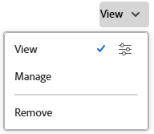

# 共用費率卡

您可以和使用者、工作角色、群組、團隊、公司和企業設定檔共用費率卡。

## 存取權要求

+++ 展開以檢視這篇文章中所述功能的存取權要求。

<table style="table-layout:auto"> 
 <col> 
 <col> 
 <tbody> 
  <tr> 
   <td>[!DNL Adobe Workfront] 封裝</td> 
   <td>Workflow Ultimate</td> 
  </tr> 
  <tr> 
   <td>[!DNL Adobe Workfront] 授權</td> 
   <td>[！UICONTROL標準]</td>
  </tr> 
  <tr> 
   <td>存取層級設定</td> 
   <td>檢視或更高許可權的[！UICONTROL費率卡]</td> 
  </tr> 
  <tr> 
   <td>物件許可權</td> 
   <td>檢視您要共用之費率卡的許可權或更高版本</td> 
  </tr> 
 </tbody> 
</table>

如需詳細資訊，請參閱Workfront檔案中的[存取需求](/help/quicksilver/administration-and-setup/add-users/access-levels-and-object-permissions/access-level-requirements-in-documentation.md)。

+++

## 共用費率卡

{{step-1-to-setup}}

1. 在左側面板中，按一下&#x200B;[!UICONTROL **分級卡**]。
1. 選取清單中一或多個費率卡旁的核取方塊，然後按一下&#x200B;**共用**&#x200B;圖示。
1. 在顯示的方塊中，在&#x200B;[!UICONTROL **授與費率卡存取權**]&#x200B;下方，開始輸入您要與其共用費率卡的實體名稱，然後從選項清單中選取它。
1. 按一下實體名稱右側的下拉式清單，然後選取其對此費率卡的許可權層級：

   * 檢視：可以檢視並共用費率卡。
   * 管理：可以編輯費率卡。

1. 若要調整存取權，請按一下您已授與的許可權層級旁的進階選項圖示，以設定費率卡上的特定許可權。

   

1. 按一下「[!UICONTROL **儲存**]」。

   如需共用的詳細資訊，請參閱[共用物件](/help/quicksilver/workfront-basics/grant-and-request-access-to-objects/share-an-object.md)。
