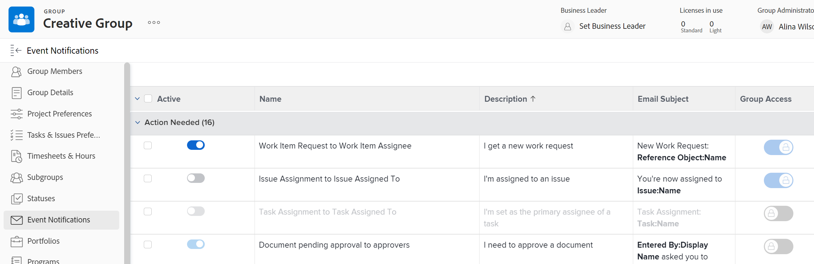

# 檢視和設定群組的事件通知

作為群組管理員，您可以檢視針對您管理的群組啟用的事件通知。

此外，如果Adobe Workfront管理員解除鎖定事件通知，您可以為您管理的最上層群組設定該通知。 事件通知的設定包含啟用或停用。

Workfront管理員也可以為任何群組執行此動作。

為群組設定事件通知會影響該群組或其子群組之一為其主群組的使用者。 在其使用者設定檔中，這些使用者會看到為其主群組啟用的事件通知，而不是在整個系統內啟用的事件通知。

如需Workfront管理員如何解除鎖定事件通知的詳細資訊，請參閱 [解鎖或鎖定所有群組的事件通知設定](../../../administration-and-setup/manage-workfront/emails/unlock-configuration-of-event-notifications-for-groups.md).

如需有關事件預設通知設定的資訊，請參閱 [事件通知型別](../../../administration-and-setup/manage-workfront/emails/event-notifications-available-in-wf.md).

## 存取需求

您必須具備下列專案才能執行本文所述的步驟：

<table style="table-layout:auto"> 
 <col> 
 <col> 
 <tbody> 
  <tr> 
   <td role="rowheader">Workfront計畫*</td> 
   <td> 
任何
 </td> 
  </tr> 
  <tr> 
   <td role="rowheader">Adobe Workfront授權*</td> 
   <td> 
計劃 
 
您必須是群組的群組管理員或Workfront管理員。 如需詳細資訊，請參閱 <a href="../../../administration-and-setup/manage-groups/group-roles/group-administrators.md" class="MCXref xref">群組管理員</a> 和 <a href="../../../administration-and-setup/add-users/configure-and-grant-access/grant-a-user-full-administrative-access.md" class="MCXref xref">授予使用者完整管理存取權</a>.
 </td> 
  </tr> 
 </tbody> 
</table>

&#42;如果您需要瞭解自己的計畫或授權型別，請聯絡Workfront管理員。

## 檢視及設定群組的事件通知

1. （條件式與選擇性）如果您是Workfront管理員，且您已位於「電子郵件通知」頁面（「設定>電子郵件>通知」），您可以執行下列動作，然後跳至步驟6：刪除 **系統事件通知** 在清單上方的方塊中，開始在方塊中輸入群組名稱，然後在其出現時按一下它。
1. 按一下 **主要功能表** 圖示  (位於Adobe Workfront的右上角)，然後按一下 **設定** .

1. 在左側面板中，按一下 **群組** .

1. 按一下最上層群組的名稱。
1. 在左側功能表中，按一下 **事件通知**.

   在顯示的清單中， **作用中** 左邊的欄顯示群組的作用中（藍色）和非作用中（灰色）通知。

1. 若要啟用或停用已解除鎖定的事件通知：請按一下 <strong>作用中</strong> 要啟動的欄  或停用  it.

   >[!INFO]
   >
   >**範例：** 您可以設定下面顯示已為群組解鎖的前兩個行銷群組事件通知。
 
 
   >* 如果 <strong>作用中</strong> 欄是灰色且變暗的 ，則所有使用者都無法啟用事件通知，且群組管理員無法啟用或編輯其電子郵件主旨列
   >* 如果 <strong>作用中</strong> 欄是灰色的，而且不會變暗 ，事件通知為 <strong>已針對所有使用者停用，並且</strong> 群組管理員可以為其群組啟用它。
   >* 如果 <strong>作用中</strong> 欄為藍色且變暗 ，則事件通知已針對所有使用者啟用，且群組管理員無法停用或編輯其群組的電子郵件主旨列。
   >* 如果 <strong>作用中</strong> 欄為藍色且未變暗 ，事件通知為 <strong>已針對所有使用者啟用並</strong> 群組管理員可以為其群組停用它。

<!--
This step (with substeps) is for functionality from a Sprint 3 2021 story that got put on hold. Also see the PDF on the story for some text earlier in the article that needs to be added. 

1. To customize the email subject line of an event notification,
  1. Click the name of the event notification.
  1. In the <strong>Event Notification</strong> box that displays, in the <strong>Email Subject Line</strong> box, change the text and fields, including custom fields, then click <strong>Update</strong> to save the new subject lines for your emails.
  IMPORTANT: The names of the fields added must match the camel case syntax of our database structure. For more information about how our objects and their fields are named in the Workfront database, see the <a href="../../../wf-api/workfront-api.md" class="MCXref xref">Adobe Workfront API</a>.
  For more information about customizing the email subject line of an event notification, see <a href="../../../administration-and-setup/manage-workfront/emails/custom-email-subjects-event-notification.md" class="MCXref xref">Customize email subjects for event notifications</a>. 
-->

