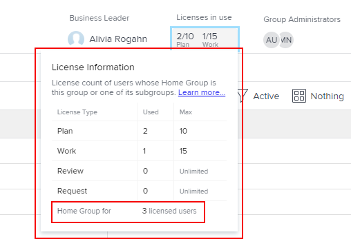

# 查看組中分配和使用的許可證數

身為Adobe Workfront管理員，您可以檢視群組及其子群組中目前使用之個別授權類型的計數。 當您需要評估是否要重新分配許可證時，這個方法非常有用。

如果您管理的群組上方有任何群組，其管理員也可以對您的群組執行此動作。 Workfront管理員（適用於任何群組）也是如此。

>[!IMPORTANT]
>
>只有在該群組是使用者的首頁群組時，才會在特定群組中計算該使用者的授權。

## 存取需求

您必須具備下列條件才能執行本文所述步驟：

<table style="table-layout:auto"> 
 <col> 
 <col> 
 <tbody> 
  <tr> 
   <td role="rowheader"><a href="https://www.workfront.com/plans" target="_blank">Workfront計畫</a>*</td> 
   <td> 
團隊或更高
 </td> 
  </tr> 
  <tr> 
   <td role="rowheader"><a href="https://one.workfront.com/s/document-item?bundleId=the-new-workfront-experience&amp;topicId=Content%2FAdministration_and_Setup%2FAdd_users%2FAccess_levels_and_object_permissions%2Fwf-licenses.html&amp;_LANG=en" target="_blank">Adobe Workfront授權</a>*</td> 
   <td> 
計劃 
 
您必須是群組的群組管理員或Workfront管理員。 如需詳細資訊，請參閱 <a href="../../../administration-and-setup/manage-groups/group-roles/group-administrators.md" class="MCXref xref">群組管理員</a> 和 <a href="../../../administration-and-setup/add-users/configure-and-grant-access/grant-a-user-full-administrative-access.md" class="MCXref xref">授予使用者完整的管理存取權</a>.
 </td> 
  </tr> 
 </tbody> 
</table>

&#42;如果您需要了解您擁有的計畫或授權類型，請聯絡Workfront管理員。

## 查看組中使用的許可證數

1. 按一下 **主菜單** 圖示  在Adobe Workfront的右上角，然後按一下 **設定** .

1. 在左側面板中，按一下 **群組** .

1. 按一下群組的名稱。
1. 在顯示的頁面上，在右上角附近的標題區域中，檢視 **使用中的許可證** 區域來查看 **計畫** 和 **工作** 當前正在使用的許可證。

   如果您正在檢視頂層群組，而Workfront管理員為群組定義了每個授權類型的最大數量，則也會顯示這些數字。 例如，在以下組中，最多10個用戶可以擁有計畫許可證，15個用戶可以擁有工作許可證：

   

   如需Workfront管理員如何定義群組之已分配授權數上限的相關資訊，請參閱 [設定家庭組的最大許可證計數](../../../administration-and-setup/get-started-wf-administration/manage-available-licenses-in-your-system.md#set) 在文章中 [管理系統中的可用許可證](../../../administration-and-setup/get-started-wf-administration/manage-available-licenses-in-your-system.md).

   >[!NOTE]
   >
   >如果您正在查看的組是子組，則只能查看正在使用的許可證數，而不能查看為組分配的許可證的最大數量。 這是因為Workfront管理員並未定義子群組的最大授權計數。
   >
   >

1. 對於組中當前使用的每種許可證類型（包括審閱和請求）的單獨計數，請按一下正下方的文本區域 **使用中的許可證：**

   

   顯示的方塊會針對所有四種Workfront授權類型提供相同的資訊：計畫、工作、審閱和請求。 在框的底部，您可以看到此組的成員或其子組正在使用的許可證總數：

   

   若為「檢閱」和「要求」授權，「上限」欄一律顯示「無限制」。
