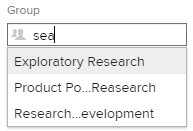

# 建立子群組

您可以在管理的群組下建立子群組，以組織使用者和專案，以及在Adobe Workfront中指派存取許可權。

如果您管理的群組之上有任何群組，其管理員也可以為您的群組執行此動作。 Workfront管理員也是如此（適用於任何群組）。

不過，通常群組管理員會管理群組和子群組。 他們可以利用「群組」頁面，集中管理群組和子群組。 若要瞭解群組與子群組在Workfront中的運作方式，請參閱[群組總覽](../../../administration-and-setup/manage-groups/groups-overview/groups.md)與[子群組總覽](../../../administration-and-setup/manage-groups/groups-overview/subgroups.md)。

## 存取需求

+++ 展開以檢視本文中功能的存取需求。

您必須具有下列存取權才能執行本文中的步驟：

<table style="table-layout:auto"> 
 <col> 
 <col> 
 <tbody> 
  <tr> 
   <td role="rowheader">Adobe Workfront計畫</td> 
   <td>任何</td> 
  </tr> 
  <tr> 
  <tr> 
   <td role="rowheader">Adobe Workfront授權</td> 
   <td>
新增：標準

       
或

       
目前：計畫
</td>
  </tr> 
  </tr> 
  <tr> 
   <td role="rowheader">存取層級設定</td> 
   <td>您必須是群組的群組管理員或系統管理員。</td>
  </tr> 
 </tbody> 
</table>

如需有關此表格的詳細資訊，請參閱Workfront檔案中的[存取需求](/help/quicksilver/administration-and-setup/add-users/access-levels-and-object-permissions/access-level-requirements-in-documentation.md)。

+++

## 新增子群組

{{step-1-to-setup}}

1. 按一下&#x200B;**群組**。

   在顯示的清單中，您可以看到您管理的群組及其擁有的任何子群組。 Adobe Workfront管理員可檢視所有群組。

1. 選取要新增子群組的現有群組或子群組。
1. 按一下&#x200B;**新增子群組**。
1. 在出現的&#x200B;**新子群組**&#x200B;方塊中，輸入子群組的&#x200B;**群組名稱**。
1. （選擇性）指定下列任一資訊：

   <table style="table-layout:auto"> 
    <col> 
    <col> 
    <tbody> 
     <tr> 
      <td role="rowheader">群組名稱</td> 
      <td>變更群組的名稱。</td> 
     </tr> 
     <tr> 
      <td role="rowheader">說明</td> 
      <td>輸入子群組的說明。 最多可輸入512個字元。</td> 
     </tr> 
     <tr> 
      <td role="rowheader">為作用中</td> 
      <td> 
（預設為啟用）在您的Workfront執行個體中啟用群組。
 
在類似下面所示的預先輸入欄位中，當一般使用者搜尋群組以將其附加至物件或與其共用物件時，清單中只會顯示作用中的群組。
 
  
 
若要簡化使用者的這項作業，您可以停用目前未使用之群組的[作用中]選項。
 
您可以使用此欄位，根據作用中或非作用中狀態輕鬆檢視、篩選及分組群組清單。 如需有關在清單中使用檢視、篩選和群組的資訊，請參閱<a href="../../../reports-and-dashboards/reports/reporting-elements/reporting-elements-filters-views-groupings.md" class="MCXref xref" data-mc-variable-override="">報告元素：篩選器、檢視和群組</a>。
  </td> 
     </tr> 
     <tr> 
      <td role="rowheader">將此群組及其子群組設定為公開</td> 
      <td> 
（只有當您檢視最上層群組而非子群組的「詳細資訊」時，才可使用）。 啟用此選項可允許子群組中具有編輯使用者存取許可權的使用者（不是群組的管理員）將此群組及其子群組新增到其他使用者的使用者設定檔中。
 
對於公用群組，任何擁有編輯使用者存取許可權的使用者（在群組內或群組外），都可以將該群組新增到其他使用者的設定檔中。 他們無法為私人群組執行此操作。
 
您只能在具有多個層級的群組階層中的頂層父群組上編輯此選項。 父群組的所有子群組都會繼承其設定。
 
<b>附註</b>：  
        <ul> 
         <li>您不能將子群組本身設為公用，但您可以將它的最上層父群組設為公用，這樣也會將父項的所有子群組設為公用。</li> 
         <li>依預設，屬於公用群組的子群組是公用的，因此任何具有編輯使用者存取許可權的使用者也可以將該子群組新增到其他使用者。</li> 
        </ul> 
 
如果您需要有關編輯使用者所需存取許可權的資訊，請參閱<a href="../../../administration-and-setup/add-users/configure-and-grant-access/grant-access-other-users.md" class="MCXref xref" data-mc-variable-override="">授予使用者存取許可權</a>。 如需有關編輯使用者的資訊，請參閱<a href="../../../administration-and-setup/add-users/create-and-manage-users/edit-a-users-profile.md" class="MCXref xref" data-mc-variable-override="">編輯使用者的設定檔</a>。
 </td> 
     </tr> 
     <tr> 
      <td role="rowheader">業務領導者 </td> 
      <td> 
您可以將一位使用者指派為您管理的子群組的業務領導者。 業務主管是負責制定子群組業務決策的人。 如需詳細資訊，請參閱<a href="../../../administration-and-setup/manage-groups/group-roles/business-leader-overview.md" class="MCXref xref" data-mc-variable-override="">業務負責人概觀</a>.
 
如果人員不是子群組的成員，將他們的名稱新增至此欄位也會將他們新增至群組。
 
<b>附註</b>：  
        <ul> 
         <li>您必須先從「業務領導者」欄位中移除其名稱，才能從子群組中移除「業務領導者」。</li> 
         <li>如果您從「業務領導者」欄位中移除名稱，除非您將其從子群組中移除，否則該使用者會保留子群組的成員。 如需從群組移除某人的相關指示，請參閱<a href="../../../administration-and-setup/manage-groups/create-and-manage-groups/manage-a-group.md" class="MCXref xref" data-mc-variable-override="">管理群組</a>一文中的<a href="../../../administration-and-setup/manage-groups/create-and-manage-groups/manage-a-group.md#manage" class="MCXref xref" data-mc-variable-override="">管理群組成員資格</a>小節。</li> 
        </ul> 
 
如需詳細資訊，請參閱<a href="../../../administration-and-setup/manage-groups/group-roles/business-leader-overview.md" class="MCXref xref" data-mc-variable-override="">業務負責人概觀</a>。
 </td> 
     </tr> 
     <tr> 
      <td role="rowheader">群組成員和群組管理員</td> 
      <td> 
       <ul> 
        <li> 
群組成員：若要新增使用者和群組至子群組，請開始輸入您要新增的現有使用者或群組的名稱，然後在其出現時選取名稱。
 
您新增的使用者和群組可存取與該群組共用的所有物件。
 </li> 
        <li> 
群組管理員：子群組會繼承其上方群組的群組管理員，因此指定使用者為子群組的群組管理員是選擇性的。 您可以使用使用者名稱右側的下拉式功能表，將群組成員指派為群組管理員。
 </li> 
       </ul> </td> 
     </tr> 
     <tr> 
      <td role="rowheader">在清單中搜尋人員和群組</td> 
      <td> 如果您需要尋找已指派給此子群組的使用者或群組，您可以在此處輸入其名稱，並在其出現時選取它。</td> 
     </tr> 
    </tbody> 
   </table>

1. 按一下&#x200B;**儲存。**
