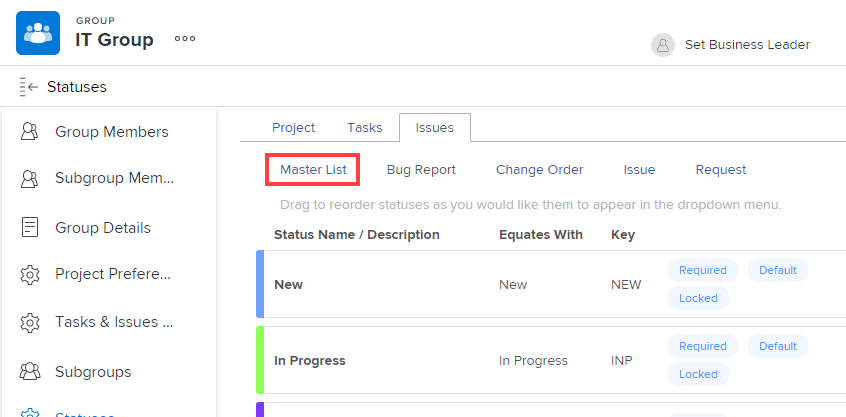
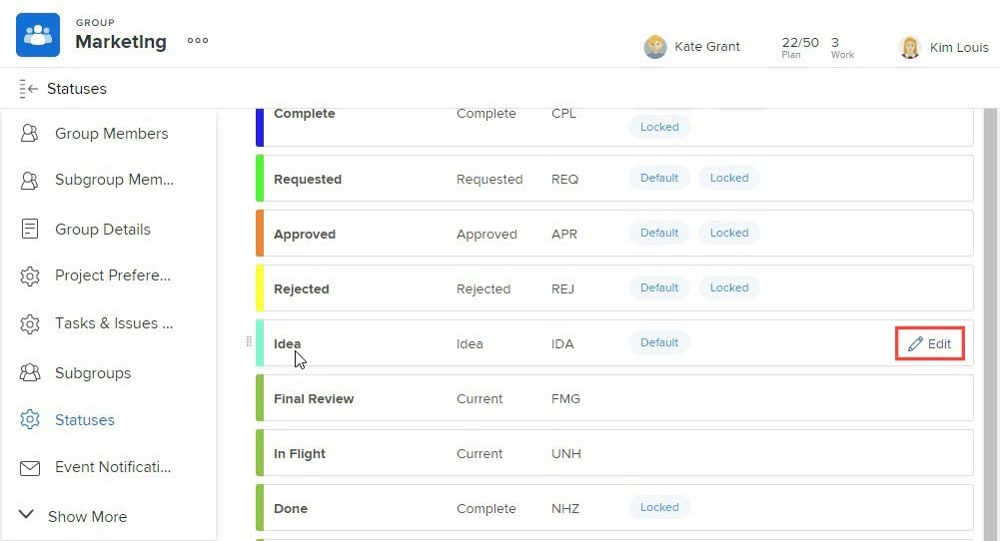
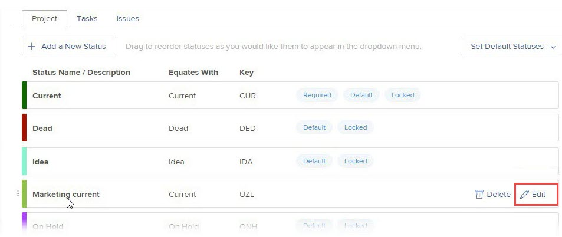

# 建立或編輯群組狀態

身為群組管理員，您可以為管理的群組建立自訂狀態。 如此一來，您就不需要數十種全公司的自訂狀態，且群組階層擁有更多自主權。

如果Workfront管理員已解除鎖定狀態，您也可以編輯所管理群組的系統層級狀態。 如需詳細資訊，請參閱[鎖定與解除鎖定的系統層級狀態](../../../administration-and-setup/customize-workfront/creating-custom-status-and-priority-labels/lock-or-unlock-a-custom-system-level-status.md)。

如果您的群組之上有任何群組，其管理員也可以為您的群組執行下列動作。 Workfront管理員也是如此（適用於任何群組）。

>[!NOTE]
>
>在敏捷檢視中檢視專案時，專案上無法顯示自訂群組狀態。 在敏捷檢視中檢視專案時，只能看到預設和自訂鎖定狀態。 如需有關自訂專案的敏捷檢視的資訊，請參閱文章[在Adobe Workfront中建立或編輯檢視](/help/quicksilver/reports-and-dashboards/reports/reporting-elements/create-edit-views.md#create-or-customize-an-agile-view)中的[建立或自訂敏捷檢視](/help/quicksilver/reports-and-dashboards/reports/reporting-elements/create-edit-views.md)小節。

如需狀態的一般資訊，請參閱[狀態概觀](../../../administration-and-setup/customize-workfront/creating-custom-status-and-priority-labels/statuses-overview.md)。

## 存取需求

+++ 展開以檢視本文中功能的存取需求。

<table style="table-layout:auto"> 
 <col> 
 <col> 
 <tbody> 
  <tr> 
   <td>Adobe Workfront套件</td> 
   <td>
任何
</td> 
  </tr> 
  <tr> 
   <td>Adobe Workfront授權</td> 
   <td>
標準

       
規劃
</td>
  </tr>
  <tr> 
   <td>存取層級設定</td> 
   <td>您必須是群組的群組管理員或系統管理員。</td>
  </tr>
 </tbody> 
</table>

如需詳細資訊，請參閱Workfront檔案中的[存取需求](/help/quicksilver/administration-and-setup/add-users/access-levels-and-object-permissions/access-level-requirements-in-documentation.md)。

+++

## 建立或編輯群組的狀態

{{step-1-to-setup}}

1. 在左側面板中，按一下&#x200B;**群組** 。

1. 按一下要建立或自訂狀態的群組名稱。
1. 在左側面板中，按一下&#x200B;**狀態**。

   如果您檢視的群組是頂層群組，則顯示的清單包含下列專案：

   * 系統層級的鎖定狀態。
   * 已為群組建立自訂狀態。

   此外，如果您檢視的群組是子群組，清單中也會包含：

   * 屬於子群組上方群組的鎖定狀態。
   * 建立子群組時，屬於該子群組上方群組的解除鎖定狀態。

     建立子群組後，在其上方的群組中建立的解除鎖定狀態不會包含在子群組的狀態清單中。 但是，如果有人稍後鎖定其中一個，它就會包含在子群組的狀態清單中。 如需詳細資訊，請參閱[群組如何繼承狀態](../../../administration-and-setup/manage-groups/manage-group-statuses/how-groups-inherit-statuses.md)。

1. 選取您想要與狀態關聯的物件型別（**專案**、**任務**&#x200B;或&#x200B;**問題**）的標籤。

1. （視條件而定）如果狀態是問題狀態，請確定已選取&#x200B;**主要清單**。

   

   如需自訂其他問題型別（錯誤報告、變更順序、問題、請求）的相關資訊，請參閱[自訂預設問題型別](../../../administration-and-setup/set-up-workfront/configure-system-defaults/customize-default-issue-types.md)。

1. （視條件而定）若要建立新狀態，請按一下&#x200B;**新增狀態**。

   或

   若要編輯現有狀態，請將滑鼠移至您要編輯的狀態，然後按一下顯示於最右邊的&#x200B;**編輯**&#x200B;選項。

   

   >[!NOTE]
   >只有符合以下條件時，您才能編輯群組的狀態：
   >      
   >* 您管理已為其建立狀態的群組
   >* Workfront管理員在系統層級上解除鎖定狀態
   >* 群組上方群組的群組管理員已解除鎖定狀態
   >      
   >      
   >編輯現有狀態時，只能變更其名稱、說明和顏色。
   >
   >編輯已鎖定狀態時，您的變更會影響從您的群組繼承狀態的所有子群組。
   >   
   >相反地，編輯已解除鎖定狀態不會影響從您的群組繼承狀態的子群組。

1. 指定下列資訊。

   如果您正在編輯狀態，則只能變更前3個設定。

   <table style="table-layout:auto"> 
    <col> 
    <col> 
    <tbody> 
     <tr> 
      <td role="rowheader">狀態名稱</td> 
      <td> 
輸入狀態的名稱。 這是必填欄位。
 
當您建立狀態名稱時，請注意，系統中的其他人可以建立具有相同名稱的狀態。 建議您使用唯一的名稱，以避免在Workfront中選取狀態時產生混淆。

如果存在重複的狀態，群組管理員應更新名稱以區分這些狀態。 系統中的唯一性指示器是狀態鍵。
 </td> 
     </tr> 
     <tr> 
      <td role="rowheader">說明</td> 
      <td>（選用）輸入狀態說明。 這會將其用途傳達給使用者。</td> 
     </tr> 
     <tr> 
      <td role="rowheader">顏色</td> 
      <td> 
按一下顏色欄位並從色票面板中選取顏色，以自訂狀態的顏色。 您也可以在欄位中輸入十六進位數字。
 
當使用者檢視物件時，狀態顏色會顯示在Workfront的右上角。
 
  
 </td> 
     </tr> 
     <tr> 
      <td role="rowheader">視為</td> 
      <td> 
從清單中選取最能描述狀態功能的選項之一。 例如，如果狀態名稱為Done，則其對應的選項應為Complete。
 
每個狀態都必須等同於其中一個選項，因為這會決定狀態如何運作。
 
建立狀態後就無法修改此選項。
 </td> 
     </tr> 
     <tr> 
      <td role="rowheader">索引鍵</td> 
      <td> 
如果您要建立新狀態，請輸入狀態的程式碼或縮寫，或使用為您產生的程式碼。 此索引鍵在Workfront中必須是唯一的，因為可用於報表用途。 如果您嘗試指定系統中已使用的金鑰，欄位會變成紅色。
 
使用將可使用的人可辨識的縮寫可能有所助益。
 
建立狀態後就無法修改此選項。
 
您無法變更Planning、Current及Complete狀態的索引鍵代碼。 如果您以文字模式建立報表，這一點很重要。
 </td> 
     </tr> 
     <tr> 
      <td role="rowheader">隱藏狀態</td> 
      <td> 
（僅限專案和任務狀態）
 
如果您希望使用者隱藏狀態，請啟用此選項。 當停用（預設設定）時，群組下的所有子群組都可以使用狀態。
 
提示：您可以停用全部4種問題型別（錯誤報告、變更順序、問題、請求）來隱藏「問題」狀態。
 </td> 
     </tr> 
     <tr> 
      <td role="rowheader">鎖定所有群組</td> 
      <td> 
       
如果您讓此選項保持啟用，則您群組及其子群組中的使用者可以檢視和使用狀態，而群組管理員無法對較低子群組自訂它。
 
       
停用此選項時，群組管理員可以自訂較低層子群組的狀態。
 
       
<b>注意</b>：您可以在群組核准程式中使用鎖定和未鎖定的狀態。 如果您建立的群組核准流程具有未鎖定的群組狀態，則使用者可以將核准流程附加至與群組相關聯的任何專案、任務或問題。
 
       
如需鎖定狀態的詳細資訊，請參閱<a href="../../../administration-and-setup/manage-groups/manage-group-statuses/lock-or-unlock-a-custom-group-status.md" class="MCXref xref">鎖定與解除鎖定群組狀態</a>。
 
       </td> 
     </tr>
    </tbody> 
   </table>

1. 按一下「**儲存**」。

   現在，與您群組或子群組相關聯的所有專案都可使用狀態。 如果您將其鎖定，則任何較低階的子群組都可使用它。

   您可以將狀態設定為群組的預設狀態。 如需詳細資訊，請參閱[使用自訂狀態作為群組](../../../administration-and-setup/manage-groups/manage-group-statuses/use-custom-statuses-as-default-statuses-group.md)的預設狀態。

## 為多個群組建立自訂狀態

如果您是Workfront管理員，可以建立系統範圍的狀態，然後隱藏該狀態，讓不需要該狀態的群組無法存取，藉此為多個群組建立自訂狀態。

如果您是群組管理員(或Workfront管理員)，您可以為您管理的群組階層內的多個子群組建立自訂狀態，方法為建立較高層級群組的狀態，然後隱藏該狀態，讓任何不需要該狀態的較低子群組。

1. 如果您是Workfront管理員，請依照[建立或編輯狀態](../../../administration-and-setup/customize-workfront/creating-custom-status-and-priority-labels/create-or-edit-a-status.md)中的說明建立系統範圍的解除鎖定狀態。
1. 在右上角的方塊中，刪除&#x200B;**系統狀態**，開始輸入您要隱藏狀態的群組名稱，然後在名稱出現時按一下。
1. 暫留在您要隱藏群組的狀態上，然後按一下&#x200B;**編輯** （當它出現時）。

   

1. 啟用顯示的&#x200B;**隱藏狀態**&#x200B;選項。

   

1. 按一下「**儲存**」。

   狀態會變暗，且不再對該群組中的所有使用者可見。

1. 重複步驟3到5以隱藏自訂狀態，不讓任何不需要該狀態的其他群組看到。

