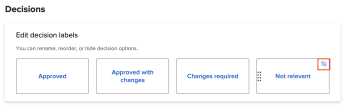

# 設定預設校訂設定

這些設定允許您設定適用於使用者建立的所有新校樣的預設值。 但是，使用者可以在建立校訂時覆寫這些設定中的大部分。

## 存取需求

+++ 展開以檢視本文中功能的存取需求。

您必須具有下列存取權才能執行本文中的步驟：

<table style="table-layout:auto"> 
 <col> 
 <col> 
 <tbody> 
  <tr> 
   <td role="rowheader">Adobe Workfront計畫*</td> 
   <td>任何</td> 
  </tr> 
  <tr> 
   <td role="rowheader">Adobe Workfront授權*</td> 
   <td>
   
新增：標準

   或
   
目前：計畫
</td> 
  </tr> 
  <tr> 
   <td role="rowheader">存取層級設定*</td> 
   <td> 
您必須是Workfront管理員。 如需Workfront管理員的相關資訊，請參閱<a href="../../../administration-and-setup/add-users/configure-and-grant-access/grant-a-user-full-administrative-access.md" class="MCXref xref">授予使用者完整管理存取權</a>。
 </td> 
  </tr> 
 </tbody> 
</table>

&#42;若要瞭解您擁有的計畫、授權型別或存取權，請連絡您的Workfront管理員。

+++

## 設定新校訂預設設定

1. 按一下Adobe Workfront右上角的&#x200B;**主要功能表**&#x200B;圖示，然後按一下&#x200B;**設定**。
1. 在左側面板中，按一下&#x200B;**校訂** > **校訂設定**。
1. 在&#x200B;**新校訂預設值**&#x200B;區段中，設定下列設定：

   <table style="table-layout:auto"> 
    <col> 
    <col> 
    <tbody> 
     <tr> 
      <td role="rowheader" colspan="2"><b>收件者</b></td> 
     </tr> 
     <tr> 
      <td role="rowheader">需要登入</td> 
      <td> 
稽核者必須先使用他們的電子郵件和密碼登入，才能檢視在您組織的帳戶中建立的校訂。 啟用後，使用者無法與訪客檢閱者共用校訂。
 
<b>重要</b>：啟用時，所有新建立的校訂都需要登入。
 </td> 
     </tr> 
     <tr> 
      <td role="rowheader">從原始校樣中複製所有者以取得新版本</td> 
      <td> 
第一個版本的校訂所有者也是所有連續版本的校訂所有者，無論這些版本的建立者為何。 此設定預設為啟用。
 </td> 
     </tr> 
     <tr> 
      <td role="rowheader">允許使用者刪除他們的校訂評論</td> 
      <td>使用者可以刪除自己的評論。 此設定預設為啟用。</td> 
     </tr> 
     <tr> 
      <td role="rowheader">需要以電子方式簽署決策 </td> 
      <td> 
當決策者在校訂上做出決定時，系統會提示您輸入其Workfront登入認證。
 
<b>重要</b>：啟用時，使用者無法與沒有登入認證的訪客檢閱者共用校訂。
 </td> 
     </tr> 
     <tr> 
      <td role="rowheader" colspan="2"><b>期限</b></td> 
     </tr> 
     <tr> 
      <td role="rowheader">設定預設期限</td> 
      <td> 
系統會將此截止日期套用至您的帳戶中沒有自動化工作流程的所有新校樣。
 </td> 
     </tr> 
     <tr> 
      <td role="rowheader">在證明有風險之前通知收件者</td> 
      <td>根據以上指定的截止日期，在證明被視為有風險之前，收件者會透過電子郵件收到通知。</td> 
     </tr> 
     <tr> 
      <td role="rowheader" colspan="2"><b>電子郵件通知</b></td> 
     </tr> 
     <tr> 
      <td role="rowheader">當收件者被新增至校訂時通知他們</td> 
      <td>收件者新增至校訂時，會透過電子郵件收到通知。</td> 
     </tr> 
    </tbody> 
   </table>

1. 按一下「**儲存**」。

## 設定校訂決定

使用者可以使用校訂決定來指示檢閱後的校訂狀態。

>[!NOTE]
>
>如果有多個不同層級的決策，則校訂決策背後的邏輯將用於計算校訂工作流程的整體狀態。 「已核准」和「已核准變更」的決定會觸發自動工作流程中的下一個階段。

若要設定校訂決定：

1. 按一下Adobe Workfront右上角的&#x200B;**主要功能表**&#x200B;圖示，然後按一下&#x200B;**設定**。
1. 在左側面板中，按一下&#x200B;**校訂** > **校訂設定**。
1. 在&#x200B;**決定**&#x200B;區段中，您可以

   1. **重新命名決定**：按一下決定方塊內的文字，開始輸入新的決定標籤。

      >[!TIP]
      >
      >重新命名決定時，請保留決定的邏輯。 例如，已拒絕的預設決定可變更為&#x200B;*需要新版本*，但不應變更為&#x200B;*傳送至印表機*。

      

   1. **重新排列決定順序**：以您想要的決定方塊在校訂檢視器中的顯示順序拖曳決定方塊。

      

   1. **隱藏決定**：將游標暫留在決定方塊上，然後按一下右上角的「隱藏」圖示。

      

1. （選擇性）若要返回Workfront預設值，請按一下[還原預設值]。****
1. 按一下「**儲存**」。
