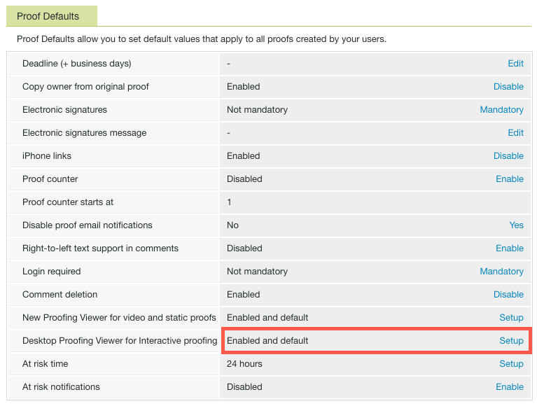
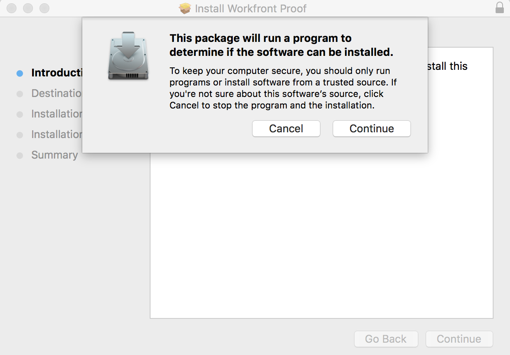

# 為您的組織安裝案頭校訂檢視器

<!--Audited: 05/2024-->

案頭校訂檢視器是主要針對校訂互動式內容而設計的應用程式，必須安裝在每位使用者的本機電腦上。 身為Adobe Workfront管理員或Workfront Proof管理員，您可以執行此安裝。

## 存取需求

您必須具有下列存取權才能執行本文中的步驟：

<table style="table-layout:auto">
 <col> 
 <col> 
 <tbody> 
  <tr> 
   <td role="rowheader">Adobe Workfront計畫</td> 
   <td> 
目前計畫：Pro或更高版本
 
或
 
舊版計畫：Premium或選取
 
如需有關不同方案的校訂存取許可權的詳細資訊，請參閱<a href="../../../administration-and-setup/manage-workfront/configure-proofing/access-to-proofing-functionality.md" class="MCXref xref">存取Workfront中的校訂功能</a>。
 </td> 
  </tr> 
  <tr> 
   <td role="rowheader">Adobe Workfront授權</td> 
   <td> 
目前計畫：工作或計畫
 
舊版計畫：任何（您必須為使用者啟用校訂）
 </td> 
  </tr> 
  <tr> 
   <td role="rowheader">存取層級設定</td> 
   <td> 
您必須在校訂許可權設定檔中選取管理員。 如需詳細資訊，請參閱<a href="../../../administration-and-setup/manage-workfront/configure-proofing/configure-a-users-proofing-access.md" class="MCXref xref">設定使用者的校訂存取權</a>。
 </td> 
  </tr> 
 </tbody> 
</table>

如需有關此表格的詳細資訊，請參閱Workfront檔案中的[存取需求](/help/quicksilver/administration-and-setup/add-users/access-levels-and-object-permissions/access-level-requirements-in-documentation.md)。

## 系統需求

下列作業系統支援Desktop Proofing Viewer：

* Windows 7和更新版本，32位元和64位元
* Mac OS X 10.9和更新版本，64位元

## 先決條件

若要讓使用者能夠使用「案頭校訂檢視器」，您必須設定系統以啟動「案頭校訂檢視器」作為安裝前互動式校訂的預設檢視。

## 設定案頭校訂檢視器為互動校訂的預設值

為您的組織安裝案頭校訂檢視器後，可將其設定為互動校訂的預設檢視器。

{{step1-to-proofing}}

1. 按一下Workfront Proof右上角附近的&#x200B;**帳戶設定**，然後按一下&#x200B;**設定**&#x200B;標籤。

1. 在&#x200B;**校訂預設值**&#x200B;下，在&#x200B;**互動式校訂的案頭校訂檢視器**&#x200B;列的結尾處，按一下&#x200B;**設定**。

   

1. 按一下[已啟用]及[預設&#x200B;**]，然後按一下[儲存]。******

## 為您的使用者安裝案頭校訂檢視器

* [在Mac上安裝案頭校訂檢視器](#installing-the-desktop-proofing-viewer-on-mac)
* [在Windows上安裝案頭校訂檢視器](#installing-the-desktop-proofing-viewer-on-windows)

### 在Mac上安裝案頭校訂檢視器 {#installing-the-desktop-proofing-viewer-on-mac}

1. 在使用者的電腦上，執行下列任一項作業來下載應用程式：

   * 如果您使用生產環境，請按一下案頭校訂檢視器的[Mac生產下載](https://assets.proofhq.com/nativeviewer/desktop_viewer/Workfront+Proof-2.1.19.pkg)。
   * 如果您使用預覽環境，請按一下案頭校訂檢視器的[Mac預覽下載](https://assets.preview.proofhq.com/nativeviewer/desktop_viewer/Workfront+Proof+Preview-2.1.19.pkg)。

1. 開啟您剛下載的檔案，開始安裝。
1. 在出現的安裝方塊中，按一下[繼續]****，然後按一下[安裝]****。

   

1. 確保每位使用者透過從Workfront的檔案區域開啟互動式校樣來完成安裝。

### 在Windows上安裝案頭校訂檢視器 {#installing-the-desktop-proofing-viewer-on-windows}

1. 在使用者的電腦上，執行下列任一項作業來下載應用程式：

   * 在生產環境中，按一下案頭校訂檢視器的[Windows生產下載](https://assets.proofhq.com/nativeviewer/desktop_viewer/Workfront+Proof+Setup+2.1.19.exe)。
   * 在預覽環境中，按一下案頭校訂檢視器的[Windows預覽下載](https://assets.preview.proofhq.com/nativeviewer/desktop_viewer/Workfront+Proof+Preview+Setup+2.1.19.exe)。

1. 開啟您剛下載的檔案，開始安裝。
1. 在出現的安全性警告方塊中，按一下&#x200B;**執行**。

   

   案頭校訂檢視器會安裝並執行。

1. （條件式）如果您使用Internet Explorer安裝應用程式，請在應用程式安裝後，重新整理瀏覽器中的啟動頁面。
1. 確保每位使用者透過從Workfront的檔案區域開啟互動式校樣來完成安裝。
