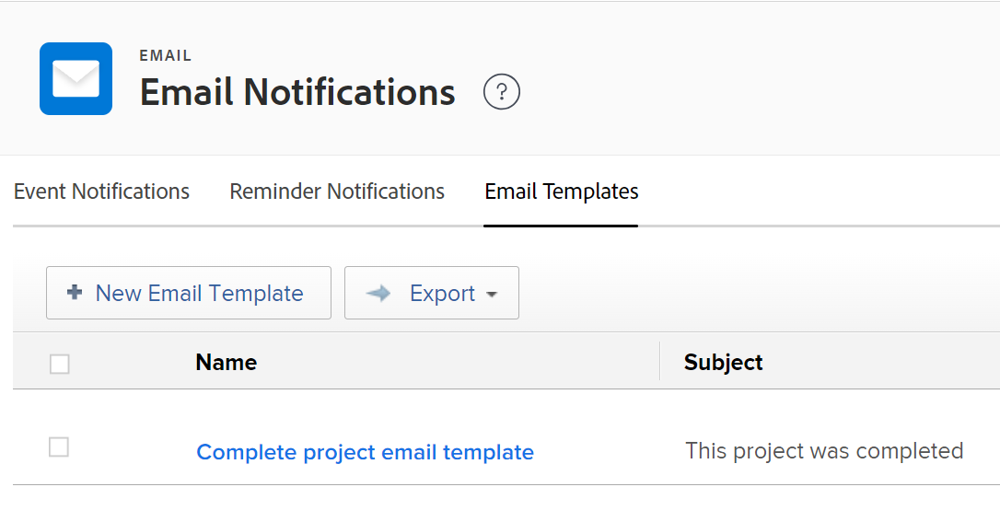

# 設定電子郵件範本

作為Adobe Workfront管理員，您可以設定電子郵件範本以支援提醒通知。

電子郵件範本包含啟動提醒通知時傳送給使用者的訊息。\
如果沒有電子郵件範本，提醒通知將會以空白內容的形式在電子郵件內文中傳送。

電子郵件範本可與問題、任務、專案和時程表的提醒通知相關聯。 建立電子郵件範本時，您的Workfront管理員可提供電子郵件內容及主旨列。

## 存取需求

+++ 展開以檢視本文中功能的存取需求。

您必須具有下列存取權才能執行本文中的步驟：

<table style="table-layout:auto"> 
 <col> 
 <col> 
 <tbody> 
  <tr> 
   <td role="rowheader">Adobe Workfront計畫</td> 
   <td>任何</td> 
  </tr> 
  <tr> 
   <td role="rowheader">Adobe Workfront授權*</td> 
   <td><p>目前：計畫</p>
   或
   <p>新增：標準</p></td> 
  </tr> 
  <tr> 
   <td role="rowheader">存取層級設定</td> 
   <td> <p>系統管理員</p> </td> 
  </tr> 
 </tbody> 
</table>

*如需存取需求的詳細資訊，請參閱Workfront檔案中的[存取需求](/help/quicksilver/administration-and-setup/add-users/access-levels-and-object-permissions/access-level-requirements-in-documentation.md)。

+++

## 建立電子郵件範本 {#create-an-email-template}

{{step-1-to-setup}}

1. 在左側面板中，按一下&#x200B;**電子郵件** > **通知**> **電子郵件範本**。

   

1. 按一下&#x200B;**新增電子郵件範本**。

1. 在&#x200B;**新電子郵件範本**&#x200B;方塊中，指定下列資訊：

   <table style="table-layout:auto"> 
    <col> 
    <col> 
    <tbody> 
     <tr> 
      <td role="rowheader">姓名</td> 
      <td>新增電子郵件範本的標題。 這是必填欄位。</td> 
     </tr> 
     <tr> 
      <td role="rowheader">物件類型</td> 
      <td>指定要與範本關聯的物件型別。 從下列物件中選擇：
      <ul>
      <li>專案</li>
      <li>任務</li>
      <li>問題</li>
      <li>時程表</li> </ul>

   這是必填欄位，預設情況下設為「專案」。</td>
   </tr>
     <tr> 
      <td role="rowheader">說明</td> 
      <td>新增更多有關電子郵件範本、其用途和預期對象的資訊。</td> 
     </tr>

   <tr> 
      <td role="rowheader">主旨 </td> 
      <td>當範本產生的電子郵件訊息傳送時，新增顯示在電子郵件主旨列中的文字。 這是必填欄位。</td> 
     </tr> 
     <tr> 
      <td role="rowheader">內文 </td> 
      <td> <p>新增電子郵件訊息內容的文字。</p> <p>您可以對電子郵件內容使用HTML格式，如本文中<a href="#add-html-formatting-to-an-email-template" class="MCXref xref">新增HTML格式至電子郵件範本</a>一節所述。</p> </td> 
     </tr> 
    </tbody> 
   </table>

1. 按一下「**儲存**」。

## 新增HTML格式至電子郵件範本 {#add-html-formatting-to-an-email-template}

您可以將HTML標籤新增至電子郵件範本，以產生自訂通知。\
開始建立電子郵件範本，如[建立新的電子郵件範本](#create-a-new-email-template)中所述。

HTML格式設定可豐富您的電子郵件範本，如下列章節所示。

* [連結至Workfront物件](#link-to-workfront-objects)
* [連結到具有HTML](#link-to-custom-fields-with-html)的自訂欄位
* [HTML電子郵件範例](#html-email-examples)

### 連結至Workfront物件 {#link-to-workfront-objects}

您可以使用`$$`萬用字元加入Workfront欄位的連結，以告知電子郵件產生器從與特定物件關聯的資料庫中尋找值。

例如，通知的電子郵件內文會提醒工作受指派人工作即將開始，其結構如下所示：

```html
<html>
<p>$$assignedTo:firstName$$</p>
<p>You are assigned to work on <b><a href="https://<your domain>.my.workfront.com/task/view?ID=$$ID$$">$$name$$</a></b>, which is due to start on $$plannedStartDate$$.</p>
<table width="350" style="font-size:12px;">
<tr>
<td><b><strong>HEADING</b></td>
<td>$$WILDCARD$$</td>
</tr>
<tr>
<td><b>HEADING</b></td>
<td>$$WILDCARD$$</td>
</tr>
<tr>
<td><b>HEADING</b></td>
<td>$$WILDCARD$$</td></tr>
</table>
</html>
```

若要取得物件的「萬用字元」值，請執行下列任一項作業：

* 參考API Explorer，並從任何物件的「欄位」標籤中選取物件名稱。 如需API總管的詳細資訊，請參閱[API總管](/help/quicksilver/wf-api/general/api-explorer.md)。

* 使用您在報告的文字模式檢視中找到的`valuefield`值。 如需文字模式值的詳細資訊，請參閱[文字模式概觀](../../../reports-and-dashboards/reports/text-mode/understand-text-mode.md)。

`heading`值可以是物件的名稱，如同您想要其顯示在電子郵件內文中的名稱。

### 具有HTML的自訂欄位連結 {#link-to-custom-fields-with-html}

您可以使用`$$`萬用字元來指示電子郵件產生器從與物件關聯的資料庫中尋找值，以包含使用者連結和自訂欄位。 它們必須出現在資料庫屬性參考的兩側。

例如，將以下文字新增為HTML會將指派使用者的名字新增至與任務關聯的提醒通知：

`assignedTo:firstName`

若要使用相同格式新增自訂欄位，您可以在電子郵件通知中新增下列內容：

`DE:Custom Field As It Appears in Workfront`

例如，這是電子郵件範本，其中包含對名為「傳送日期」的自訂欄位的參考，並假設欄位「傳送日期」屬於任務。

將`<your domain>`取代為您公司的Workfront網域（不含括弧）：

```html
<html>
<p>$$assignedTo:firstName$$</p>
<p>You are assigned to work on <b><a href="https://<your domain>.my.workfront.com/task/view?ID=$$ID$$">$$name$$</a></b>, which has a Delivery Date of $$DE:Task:Delivery Date$$.</p>
<table width="350" style="font-size:12px;">
<tr>
<td><b>Project Name:</b></td>
<td>$$project:name$$</td>
</tr>
<tr>
<td><b>Description:</b></td>
<td>$$description$$</td>
<tr>
<td><b>Estimated Effort:</b></td>
<td>$$work$$ hours</td>
</tr>
<tr>
<td><b>Planned Completion Date:</b></td>
<td>$$plannedCompletionDate$$</td>
<td><b>Delivery Date:</b></td>
<td>$$DE:Task:Delivery Date$$</td>
</tr>
</table>
</html>
```

>[!NOTE]
>
>如果欄位屬於專案，請將任務取代為專案：
>
>`DE:Project:Delivery Date`

### HTML電子郵件範例 {#html-email-examples}

* [延遲專案提醒通知（範例）](#late-project-reminder-notification-example)
* [即將開始的任務或問題提醒（範例）](#task-or-issue-about-to-start-reminder-example)

#### 延遲專案提醒通知（範例） {#late-project-reminder-notification-example}

若要編輯延遲專案提醒的電子郵件範本，請考慮主旨與內容欄位的這項資訊。

將`<your domain>`取代為您公司的Workfront網域，不含括弧。

**主旨：**

您管理的專案已延遲

**內容：**

```html
<html>
<p>The <b><a href="https://<your domain>.my.workfront.com/project/view?ID=$$ID$$">$$name$$</a></b> project you are assigned as the owner of just became late.</p>
<table width="350" style="font-size:12px;">
<tr>
<td><b>Project Name:</b></td>
<td>$$project:name$$</td>
</tr>
</tr>
<tr>
<td><b>Planned Completion Date:</b></td>
<td>$$plannedCompletionDate$$</td>
</tr>
</table>
<p>Please review the task plan and bring it up to date to reflect the progress made so far. If it is necessary to update the plan to bring it reflect reality going forward, be sure to speak to $$sponsor:name$$ for approval before make these changes to the work breakdown structure.</p>
</html>
```

這會產生類似下列的電子郵件：


#### 即將開始的任務或問題提醒 {#task-or-issue-about-to-start-reminder-example}

您可能也想要為即將發生的任務或問題建立提醒通知。

以下代碼可以包含在電子郵件範本中，以用於在任務或問題的計劃開始日期之前任何天數傳送的任務和問題提醒通知。

將`<your domain>`取代為您公司的Workfront網域，不含括弧。

若要將此用於問題電子郵件，請將工作專案連結中的`/task/view.`值變更為`/issue/view`。

**主旨：**

`$$name$$ to start on $$plannedStartDate$$`

**內容：**

```html
<html>
<p>$$assignedTo:firstName$$</p>
<p>You are assigned to work on <b><ahref=https://<your domain>.my.workfront.com/task/view?ID=$$ID$$">$$name$$</a></b>, which is due to start on $$plannedStartDate$$.</p>
<tablewidth=350"style=font-size:12px;">
<tr>
<td><b>Task Name:</b></td>
<td>$$name$$</td>
</tr>
<td><b>Project Name:</b></td>
<td>$$project:name$$</td>
</tr>
</tr>
<td><b>Created on:</b></td>
<td>$$entryDate$$</td>
</tr>
<tr>
<td><b>Project Manager:</b></td>
<td>$$project:owner:name$$</td>
<tr>
<td><b>Priority:</b></td>
<td>$$priority$$</td>
</tr>
<tr>
<td><b>Who is assigned to:</b></td>
<td>$$assignedTo:name$$</td>
</tr>
<tr>
<td><b>When it's due:</b></td>
<td>$$estCompletionDate$$</td>
</tr>
</table>
</html>
```


建立電子郵件範本後，使用者可以將其與提醒通知建立關聯，如[設定提醒通知](../../../administration-and-setup/manage-workfront/emails/set-up-reminder-notifications.md)中所述。
