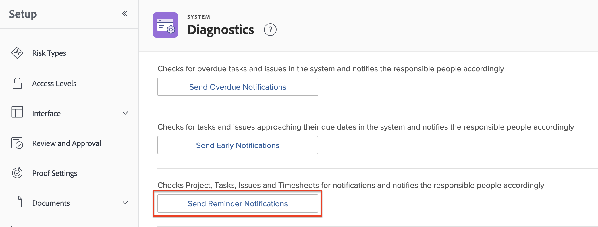

# 設定提醒通知

<!-- Audited: 1/2024 -->

身為Workfront管理員，您可以為使用者建立提醒通知，並將其與您希望使用者特別注意的物件建立關聯。

提醒通知會根據指定條件產生傳送給使用者的電子郵件。 提醒通知會提醒使用者針對任務、問題、專案或時程表所需採取的動作。

建立提醒通知後，使用者可以手動將其與工作專案建立關聯，例如專案、任務、問題和時程表。 如需詳細資訊，請參閱[將提醒通知附加至物件](/help/quicksilver/workfront-basics/using-notifications/attach-reminder-notification-object.md)。

<!--
DRAFTED IN FLARE:
An example of how this can be used would be helpful here and/or in the section 
<a href="../../../workfront-basics/using-notifications/wf-notifications.md#reminder-notifications" class="MCXref xref">Reminder notifications</a>
 in 
<a href="../../../workfront-basics/using-notifications/wf-notifications.md" class="MCXref xref">Adobe Workfront notifications</a>

-->

## 存取需求

+++ 展開以檢視本文中功能的存取需求。

您必須具有下列存取權才能執行本文中的步驟：

<table style="table-layout:auto"> 
 <col> 
 <col> 
 <tbody> 
  <tr> 
   <td role="rowheader">Adobe Workfront計畫*</td> 
   <td>任何</td> 
  </tr> 
  <tr> 
   <td role="rowheader">Adobe Workfront授權</td> 
   <td> 
新增：標準 

 
或
 

目前：計畫
 
</td> 
  </tr> 
  <tr> 
   <td role="rowheader">存取層級設定</td> 
   <td> 
計畫者或以上，具有提醒通知的管理存取權
</td> 
  </tr> 
 </tbody> 
</table>

*如需此表格中資訊的詳細資訊，請參閱Workfront檔案中的[存取需求](/help/quicksilver/administration-and-setup/add-users/access-levels-and-object-permissions/access-level-requirements-in-documentation.md)。

+++

## 自訂提醒電子郵件

您可以自訂提醒通知電子郵件中的主旨、內文和HTML。

或者，您可以使用提醒通知隨附的預設電子郵件。 預設電子郵件使用提醒通知名稱作為電子郵件主旨，並在電子郵件內文中使用物件名稱，包括觸發通知的事件。

如果您想要自訂提醒電子郵件，則需要建立電子郵件範本，並將其附加至提醒通知。

如需有關如何建立電子郵件範本的資訊，請參閱[設定電子郵件範本](../../../administration-and-setup/manage-workfront/emails/configure-email-templates.md)。

## 建立提醒通知

{{step-1-to-setup}}

1. 按一下&#x200B;**電子郵件** > **通知** > **提醒通知**。

   

1. 按一下&#x200B;**新提醒通知**。

1. 在下拉式清單中，按一下您要與提醒通知關聯的物件型別。

   例如，如果您想要將提醒通知附加至時程表，請按一下&#x200B;**時程表**。

1. 在出現的&#x200B;**新提醒通知**&#x200B;方塊中，指定下列資訊。

   <table style="table-layout:auto"> 
    <col> 
    <col> 
    <tbody> 
     <tr> 
      <td role="rowheader">提醒通知名稱</td> 
      <td>指定提醒通知的名稱。</td> 
     </tr> 
     <tr> 
      <td role="rowheader">符合資格的期間</td> 
      <td> 
在<strong>計時</strong>欄位中，指定日期之前或之後的小時數、工作日數、日數（行事曆日數）、周數或月數。
 
<b>附註</b>：  
        <ul> 
         <li> 
提醒通知會在指定日期後24小時開始，並在符合所有條件後開始。
 </li> 
         <li> 
美國山區時間每天午夜觸發專案、任務和問題的提醒通知。 當天起符合提醒通知資格的所有物件會在當天不久之後觸發通知給指定的使用者。
 </li> 
         <li> 
時程表的提醒通知會根據您的時區與時程表的結束日期、開始日期或上次更新日期，在指定時間傳送。
 </li> 
        </ul> 
 </td> 
     </tr> 
     <tr> 
      <td role="rowheader">定時</td> 
      <td> 
選取觸發提醒通知（要排程）的事件。
 
如果提醒通知是針對專案、任務或問題，則可用選項與完成日期或開始日期相關。 提醒通知會考量專案、任務和問題的完成和開始日期上的時間戳記。

   
如果提醒通知是針對時程表，則可用選項與結束日期、開始日期或上次更新日期有關。 時程表的提醒通知會考慮時程表結束、開始和上次更新日期的時間戳記。 時程表從開始日期的午夜開始(12:00 AM)，並在結束日期的午夜之前(11:59 PM)結束。

   
<b>附註</b>

      
時程表提醒通知每24小時只傳送一次。
 
當您在24小時內設定多個提醒通知時，Workfront會傳送一封通知電子郵件，其中包含該通知中的所有提醒。

      
例如，如果您設定三個提醒通知在到期日前10小時、前2小時及前1小時觸發，則這三個提醒如果都發生在同一天，則會合併到相同通知中。
 
但是，如果您在到期日之前設定26小時的提醒通知，並在到期日之前設定1小時的另一個提醒通知，則使用者將收到兩個單獨的通知。 

   </td> 
     </tr> 
     <tr> 
      <td role="rowheader">條件</td> 
      <td> 
選取條件以符合要排程的提醒通知資格。 除非符合條件選擇，否則不會排程提醒通知。
 
根據您在步驟4中選取的物件型別，可使用下列條件選項：
 
       <ul> 
        <li><strong>目前專案中未完成：</strong> <i>（可用於任務和問題提醒）</i>提醒通知已排定為僅當與提醒通知關聯的物件狀態未完成且專案狀態為目前時才傳送。</li> 
        <li><strong>目前專案中的所有專案：</strong> <i>（可用於任務和問題提醒）</i>提醒通知已排程傳送，不論物件狀態為何，且僅當提醒通知關聯的專案狀態為「目前」時。</li> 
        <li><strong>未完成的專案：</strong> <i>（可供專案提醒使用）</i>提醒通知已排定在專案狀態為完成以外的狀況時傳送。</li> 
        <li><strong>所有專案：</strong> <i>（可用於專案提醒）</i>提醒通知已排定傳送，不論專案狀態為何。</li> 
        <li><strong>未完成的時程表：</strong> <i>（可用於時程表提醒）</i>已排程在時程表狀態為「未完成」時傳送提醒通知。</li> 
        <li><strong>已提交的時程表：</strong> <i>（可用於時程表提醒）</i>已排程在提交時程表狀態時傳送提醒通知。</li> 
        <li><strong>未完成的時程表或每週少於40小時：</strong> <i>（適用於時程表提醒）</i>已排程在時程表狀態為「未完成」或時程表記錄少於40小時時傳送提醒通知。</li> 
        <li><strong>電子郵件範本：</strong>從下拉式清單中，選取要附加至提醒的電子郵件範本。 如需如何建立電子郵件範本的詳細資訊，請參閱<a href="../../../administration-and-setup/manage-workfront/emails/configure-email-templates.md" class="MCXref xref">設定電子郵件範本</a>。</li> 
       </ul> </td> 
     </tr> 
     <tr> 
      <td role="rowheader">收件者</td> 
      <td>
根據提醒通知的物件，從下列您要接收通知的使用者型別中選取：

      <ul>
      <li>指派至</li>
      <li>輸入者</li>
      <li>專案團隊（專案團隊中的所有使用者都會收到提醒）</li>
      <li>依存性任務受指派人（受指派給依存性任務的使用者會收到提醒）</li>
      <li>專案所有者</li>
      <li>指派給（指派給任務或問題的使用者會收到提醒）</li>
      <li>時程表所有人</li>
      <li>時程表核准者</li>
      <li>時程表所有人的經理</li></ul>
      </td> 
     </tr> 
    </tbody> 
   </table>

1. 按一下「**儲存**」。
1. 將提醒通知附加至工作專案，如[將提醒通知附加至物件](../../../workfront-basics/using-notifications/attach-reminder-notification-object.md)中所述。

## 接收提醒通知

當附加了提醒通知的專案符合條件時，會觸發電子郵件通知給在提醒通知中定義的使用者。

如需接收提醒通知的詳細資訊，請參閱[Adobe Workfront通知](../../../workfront-basics/using-notifications/wf-notifications.md)中的[提醒通知](../../../workfront-basics/using-notifications/wf-notifications.md#reminder-notifications)區段。

## 測試提醒通知傳遞

提醒通知會在山地時間的每個午夜觸發。 所有符合提醒通知資格的物件都會在稍後觸發通知給指定的使用者。

若要導致手動觸發提醒通知，必須首先滿足提醒條件。\
例如，如果設定提醒是在專案計畫完成日期後一小時觸發，該時間必須在設定提醒與現在之間經過。 任何在啟動提醒前已超過計畫完成日期的專案都不會觸發通知。

若要手動觸發提醒通知：

{{step-1-to-setup}}

1. 按一下Workfront左下角的&#x200B;**系統** > **診斷**。

1. 按一下&#x200B;**傳送提醒通知**，然後在熒幕上方等待已傳送通知的確認。

   在提醒通知中指定的使用者會收到電子郵件。

