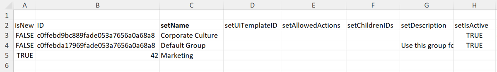

# 使用Kick-Start範本將資料匯入Adobe Workfront

Kick-Start是特別格式化的Excel活頁簿，可填入您要匯入Workfront的資料。 Adobe Workfront提供您可用來執行此動作的Kick-Start範本，如中所述 [Kick-Start資料匯入工具](../../../administration-and-setup/manage-workfront/using-kick-starts/kick-starts-data-importer.md).

此程式分為3項主要工作：

* 首先，您將Kick-Start範本匯出為試算表檔案
* 接著，將您的資料填入試算表中
* 最後，將填入的試算表匯入Workfront

本文會以適當的順序概述其中的每個程式。

## 存取需求

您必須具有下列存取權才能執行本文中的步驟：

<table style="table-layout:auto"> 
 <col> 
 <col> 
 <tbody> 
  <tr> 
   <td role="rowheader">Adobe Workfront計畫</td> 
   <td>任何</td> 
  </tr> 
  <tr> 
   <td role="rowheader">Adobe Workfront授權</td> 
   <td>計劃</td> 
  </tr> 
  <tr> 
   <td role="rowheader">存取層級設定</td> 
   <td> 
您必須是Workfront管理員。
 
<b>附註</b>:
 
   
 如果您還是沒有存取權，請詢問您的Workfront管理員，他們是否在您的存取層級中設定其他限制。 如需有關Workfront管理員如何修改您的存取層級的資訊，請參閱 <a href="../../../administration-and-setup/add-users/configure-and-grant-access/create-modify-access-levels.md" class="MCXref xref">建立或修改自訂存取層級</a>.
 </td> 
  </tr> 
 </tbody> 
</table>

## 限制

您可以使用Kick-Start範本，將大量物件匯入Workfront。 但是，請考量下列限制：

* 以這種方式匯入資料不會更新Workfront中已存在的記錄資訊
* 您只能匯入新記錄及其資訊
* 一次匯入不超過2,000筆記錄，以確保匯入不會逾時

## 將Kick-Start範本匯出為試算表檔案

匯出Kick-Start範本時，您會收到空白的Excel試算表活頁簿。 在本文的後續程式中，您會將資訊填入活頁簿中，然後將其匯回Workfront。

匯出Kick-Start範本：

1. 按一下 **主要功能表** 圖示  (位於Adobe Workfront的右上角)，然後按一下 **設定** .

1. 按一下 **系統** > **匯出資料(Kick-Start)**.

1. 按一下 **更多選項**，然後選取您要包含的資訊型別。

   您選取的每個選項代表匯出試算表中多個索引標籤的集合。 例如，如果您選取「報表」選項，則建立報表所需的所有物件皆會納入試算表（檢視、篩選器、群組、報表）中。

   您可以使用下列所有物件型別，將資料匯入Workfront。 (唯一的例外是「存取層級」選項。 匯出中的「存取層級」資料表僅供參考之用，可讓您依ID將存取層級指派給新的使用者帳戶。)

   每個物件型別的範本都可以以下列檔案格式匯出，並包含下列頁面：

   <table style="table-layout:auto"> 
    <col> 
    <col> 
    <col> 
    <thead> 
     <tr> 
      <th> 
<strong>物件</strong> 
 </th> 
      <th> 
<strong>匯出為</strong> 
 </th> 
      <th> 
<strong>匯出的試算表中的工作表</strong> 
 </th> 
     </tr> 
    </thead> 
    <tbody> 
     <tr> 
      <td scope="col"> 
儀表板
 
系統中的所有儀表板都可以匯出。 您在一次匯出中最多可以選取100個特定儀表板。
 </td> 
      <td scope="col">匯出為ZIP檔案</td> 
      <td scope="col"> 
參數
 
參數選項
 
參數群組
 
類別參數
 
類別
 
報告
 
入口網站頁籤區段
 
儀表板
 
偏好設定
 </td> 
     </tr> 
     <tr> 
      <td scope="col"> 
報告
 
系統中的所有報表都可以匯出。 您在一次匯出中最多可以選取100個特定報告。
 </td> 
      <td scope="col">匯出為ZIP檔案 </td> 
      <td scope="col"> 
參數
 
參數選項
 
參數群組
 
類別參數
 
類別
 
報告
 
偏好設定
 </td> 
     </tr> 
     <tr> 
      <td scope="col"> 
核准
 </td> 
      <td scope="col"> 
匯出為Excel檔案
 </td> 
      <td scope="col"> 
步驟核准者
 
核准步驟
 
核准
 
核准流程
 
偏好設定
 </td> 
     </tr> 
     <tr> 
      <td scope="col"> 
自訂資料
 </td> 
      <td scope="col"> 
匯出為Excel檔案
 </td> 
      <td scope="col"> 
參數
 
參數選項
 
參數群組
 
類別參數
 
類別
 
偏好設定
 </td> 
     </tr> 
     <tr> 
      <td scope="col"> 
費用類型
 </td> 
      <td scope="col"> 
匯出為Excel檔案
 </td> 
      <td> 
費用類型
 
偏好設定
 </td> 
     </tr> 
     <tr> 
      <td> 
時數類型
 </td> 
      <td scope="col"> 
匯出為Excel檔案
 </td> 
      <td> 
時數類型
 
偏好設定
 </td> 
     </tr> 
     <tr> 
      <td> 
團隊
 </td> 
      <td scope="col"> 
匯出為Excel檔案
 </td> 
      <td> 
 小組成員
 
團隊
 
偏好設定 
 </td> 
     </tr> 
     <tr> 
      <td> 
使用者
 </td> 
      <td> 
匯出為Excel檔案。 若要檢視完整的選項清單，請按一下 <strong>更多選項</strong>.
 </td> 
      <td> 
使用者
 
偏好設定
 </td> 
     </tr> 
     <tr> 
      <td>存取層級</td> 
      <td>匯出為Excel檔案</td> 
      <td> 
存取層級
 
偏好設定
 </td> 
     </tr> 
     <tr> 
      <td>指派</td> 
      <td>匯出為Excel檔案</td> 
      <td> 
指派
 
偏好設定
 </td> 
     </tr> 
     <tr> 
      <td>公司</td> 
      <td>匯出為Excel檔案</td> 
      <td> 
 公司
 
偏好設定 
 </td> 
     </tr> 
     <tr> 
      <td>電子郵件範本</td> 
      <td>匯出為Excel檔案</td> 
      <td> 
電子郵件範本
 
偏好設定 
 </td> 
     </tr> 
     <tr> 
      <td>費用</td> 
      <td>匯出為Excel檔案</td> 
      <td> 
 費用'
 
偏好設定 
 </td> 
     </tr> 
     <tr> 
      <td>外部頁面</td> 
      <td>匯出為Excel檔案</td> 
      <td> 
 外部頁面
 
偏好設定 
 </td> 
     </tr> 
     <tr> 
      <td>篩選器</td> 
      <td>匯出為ZIP檔案</td> 
      <td> 
 篩選器
 
偏好設定 
 </td> 
     </tr> 
     <tr> 
      <td>群組</td> 
      <td>匯出為Excel檔案</td> 
      <td> 
 群組
 
偏好設定 
 </td> 
     </tr> 
     <tr> 
      <td>分組</td> 
      <td>匯出為ZIP檔案</td> 
      <td> 
 分組
 
偏好設定 
 </td> 
     </tr> 
     <tr> 
      <td>小時</td> 
      <td>匯出為Excel檔案</td> 
      <td> 
 小時
 
偏好設定 
 </td> 
     </tr> 
     <tr> 
      <td>問題</td> 
      <td>匯出為Excel檔案</td> 
      <td> 
 問題
 
偏好設定 
 </td> 
     </tr> 
     <tr> 
      <td>職務角色</td> 
      <td>匯出為Excel檔案</td> 
      <td> 
 工作角色
 
偏好設定 
 </td> 
     </tr> 
     <tr> 
      <td>里程碑路徑</td> 
      <td> 匯出為Excel檔案</td> 
      <td> 
 里程碑
 
里程碑路徑
 
偏好設定 
 </td> 
     </tr> 
     <tr> 
      <td>備註</td> 
      <td>匯出為Excel檔案</td> 
      <td> 
 備註
 
偏好設定 
 </td> 
     </tr> 
     <tr> 
      <td>專案組合</td> 
      <td>匯出為Excel檔案</td> 
      <td> 
 專案組合
 
偏好設定 
 </td> 
     </tr> 
     <tr> 
      <td>專案</td> 
      <td>匯出為Excel檔案</td> 
      <td> 
 佇列
 
專案
 
路由規則
 
佇列主題
 
偏好設定 
 </td> 
     </tr> 
     <tr> 
      <td>資源估計</td> 
      <td>匯出為Excel檔案</td> 
      <td> 
 資源估計
 
偏好設定 
 </td> 
     </tr> 
     <tr> 
      <td>資源集區</td> 
      <td>匯出為Excel檔案</td> 
      <td> 
 資源集區
 
偏好設定 
 </td> 
     </tr> 
     <tr> 
      <td>風險</td> 
      <td>匯出為Excel檔案</td> 
      <td> 
 風險
 
偏好設定 
 </td> 
     </tr> 
     <tr> 
      <td>風險類型</td> 
      <td> 匯出為Excel檔案</td> 
      <td> 
 風險類型
 
偏好設定
 </td> 
     </tr> 
     <tr> 
      <td>計分卡</td> 
      <td>匯出為Excel檔案</td> 
      <td> 
計分卡問題
 
計分卡選項
 
計分卡
 
偏好設定 
 </td> 
     </tr> 
     <tr> 
      <td>任務</td> 
      <td>匯出為Excel檔案</td> 
      <td> 
 任務
 
偏好設定 
 </td> 
     </tr> 
     <tr> 
      <td>範本</td> 
      <td> 匯出為Excel檔案</td> 
      <td> 
 佇列
 
範本
 
路由規則
 
佇列主題
 
偏好設定 
 </td> 
     </tr> 
     <tr> 
      <td>範本指派</td> 
      <td>匯出為Excel檔案</td> 
      <td> 
 範本指派
 
偏好設定 
 </td> 
     </tr> 
     <tr> 
      <td>範本任務</td> 
      <td>匯出為Excel檔案</td> 
      <td> 
 範本任務
 
偏好設定 
 </td> 
     </tr> 
     <tr> 
      <td>時程表</td> 
      <td> 匯出為Excel檔案</td> 
      <td> 
 時間表設定檔
 
時程表
 
偏好設定 
 </td> 
     </tr> 
     <tr> 
      <td>檢視 </td> 
      <td> 
匯出為ZIP檔案
 </td> 
      <td> 
 檢視
 
偏好設定 
 </td> 
     </tr> 
    </tbody> 
   </table>

1. 按一下 **下載**.
1. 繼續使用 [將您的資料填入試算表範本中](#populate-the-spreadsheet-template-with-your-data) 以使用您的資訊填入範本。

## 將您的資料填入試算表範本中 {#populate-the-spreadsheet-template-with-your-data}

* [關於試算表中包含的標籤（資料表）](#about-the-tabs-data-sheets-included-in-the-spreadsheet)
* [匯入記錄](#import-a-record)
* [包含日期](#include-dates)
* [使用萬用字元](#use-wildcards)
* [ID的屬性名稱替代](#attribute-name-substitution-for-ids)

### 關於試算表中包含的標籤（資料表） {#about-the-tabs-data-sheets-included-in-the-spreadsheet}

>[!TIP]
>
>若要更清楚瞭解當您填入Kick-Start範本時如何需要格式化每個欄中的資訊，請考慮執行一個練習，使用您嘗試匯入物件上的現有Workfront資料匯出Kick-Start。 如需指示，請參閱 [透過Kick-Start從Adobe Workfront匯出資料](../../../administration-and-setup/manage-workfront/using-kick-starts/export-data-from-wf-via-kick-starts.md).

當您開啟空白的Kick-Start範本時，會有許多標籤（資料表）可供使用。 它們取決於您選取要下載的物件。 每一個都代表應用程式中的物件，例如專案、任務、小時、控制面板和使用者：

當您開啟其中一個標籤時，第2列會顯示每個物件在匯入期間可設定的欄位。 在欄標題中，在「set」一詞之後，欄位名稱會依其在資料庫中的顯示方式顯示。 這些欄位可作為欄標題。

>[!IMPORTANT]
>
>若要避免錯誤，請確定下列事項：
>
>* 請勿刪除或修改這些欄位。 例如，請勿變更其順序或名稱。
>* 以粗體顯示的欄標題填入每個欄位。 這些代表必填欄位。
>
>  但是，如果必要欄位包含系統偏好設定中設定的預設值，則不需要填入該欄位。
>
>  例如，在 **專案專案** 標籤， **setCondition** 和 **setConditionType** 欄位可留空，但 **setGroupID** 和 **setName** 欄不能。
>

### 匯入記錄  {#import-a-record}

工作表的每一列都對應一個唯一物件。

1. 完成中的儲存格 **isNew** 欄：

   * 如果您要匯入的物件是新的，請鍵入 **TRUE** 匯入列中的資料。
   * 如果物件已存在於Workfront中，請輸入 **假** 以忽略列。

1. 完成中的儲存格 **ID** 欄，方法如下：

   * 如果您要匯入的物件是新的(而且您鍵入了 **TRUE** 在 **isNew** 欄)，為ID指定任何數字。 此數字在試算表中必須是唯一的。

   * 如果您要匯入的物件已存在於Workfront系統中(且您輸入了 **假** 在 **isNew** 欄)，ID必須是該物件在Workfront中存在的英數字元GUID。

     

   * 匯入專案時，您必須指定群組ID。

      * 如果群組已存在於Workfront中，您必須將其唯一ID新增至 **setGroupID** 專案的欄位。
      * 如果Workfront中沒有該群組，您可以新增 **群組群組** 將工作表放到匯入檔案中，設定 **isNew** 欄位至 **TRUE** 在「群組」工作表上，並在下列欄位中指定新群組的數值ID： **ID** 欄。 此 **setGroupID** 新專案的欄位必須與數值相符 **ID** 用於新群組。

     **範例：** 若為專案，此值顯示在 **setGroupID** 欄必須為下列其中一項：

      * Workfront例項中現有群組的GUID
      * 「 」上ID欄中的值（數字） **群組群組** 表（如果在匯入期間建立新群組）

1. 必要欄位的輸入值，以及您要在匯入期間填入的任何其他欄位。
1. （選用）若要新增自訂資料：

   * 為您要納入匯入程式的每個自訂欄位建立新欄。
   * 為其對應的自訂欄位命名每個新欄，如下所示： **DE：[顯示在Workfront中的自訂欄位名稱]**.
   * 在欄中 **setCategoryId**，鍵入此自訂欄位所在的現有自訂表單的GUID。 匯入自訂資料時，此欄位是必填欄位。
   * 如果您需要在自訂欄位中新增多個資料值（例如單選按鈕、核取方塊或清單），請使用「偏好設定」標籤中列出的垂直列自訂資料分隔符號「|」來分隔值。

     **範例：** 在DE：Departments欄下輸入A|D以填入自訂表單中的部門A和部門D。

### 包含日期  {#include-dates}

Workfront可以處理大部分的日期格式。 不過，您必須確保試算表中的日期欄會格式化為日期。 如果欄的格式是一般、數字或文字，匯入將會失敗。

>[!TIP]
>
>大部分人會發現，使用YYYY/MM/DD格式最容易（例如：07/10/2022）。

Workfront也接受時間值作為日期的一部分（例如：07/10/2022 01:30或07/10/2022 1:00 PM）。

如果您在日期中省略時間，Workfront會執行下列任一項作業：

* 假設午夜12:00。 為了檢視您預期的日期結果，系統時區必須與您的時區相符。
* 如果它位在與排程相關聯的物件上，則時間會遞延至排程允許的最早時間。

>[!NOTE]
>
>使用UNIX時間戳記時，必須在值的末尾加上三個額外的零。
>
>例如，如果您的時間戳記是7336899000的，您會在儲存格中輸入7336899000000。

### 使用萬用字元 {#use-wildcards}

填入Kick-Start範本試算表時，您可以使用下列萬用字元：

<table style="table-layout:auto"> 
 <col> 
 <col> 
 <thead> 
  <tr> 
   <th> 
<strong>萬用字元</strong> 
 </th> 
   <th> 
<strong>行為</strong> 
 </th> 
  </tr> 
 </thead> 
 <tbody> 
  <tr> 
   <td> 
$$今天
 </td> 
   <td> 
當用於 <strong>setDate</strong> 欄位，此萬用字元會將日期設定為您匯入Kick-Start當天的午夜。
 
您可以使用篩選器上允許搭配萬用字元的標準語法，來修改萬用字元。
 
Example: </b>"><b>範例： </b>如果您希望專案在匯入當週的星期一開始，無論您實際執行匯入的日期為何，都可使用 <strong>$$TODAYbw</strong>. 這會將您的專案計劃開始日期設定為星期日凌晨12:00。 由於專案排程此時可能不允許工作，因此將於星期一上午9:00開始。
 </td> 
  </tr> 
  <tr> 
   <td> 
$$NOW
 </td> 
   <td> 
當用於 <strong>setDate</strong> 欄位，此萬用字元會根據您在Kick-Start匯入期間建立記錄的時刻來設定日期。
 
您可以使用篩選器上允許搭配萬用字元的標準語法，來修改萬用字元。
 
Example: </b>"><b>範例： </b>如果您希望專案在匯入後3小時開始，您可使用 <strong>$$NOW+3h</strong>.
 </td> 
  </tr> 
  <tr> 
   <td> 
$$USER.ID
 </td> 
   <td> 
當用於 <strong>setAssignedToID</strong> 或其他以userID為基礎的欄位，此萬用字元會指派工作或以其他方式將記錄與執行匯入的個人建立關聯。
 </td> 
  </tr> 
  <tr> 
   <td> 
$$客戶
 </td> 
   <td> 
這是特別為Kick-Start使用者匯入新增的萬用字元。 建立Workfront帳戶時，會建立具有系統管理員存取層級的使用者。 在帳戶中建立其他使用者時，指派給預設管理員的使用者名稱可以當做前置詞。
 
由於使用者名稱在所有客戶中必須是唯一的，因此如果您有多個個人使用非常常見的使用者名稱，例如John Smith，他可能會有一個使用者名稱「jsmith」，這個選項會很有用。 在使用者名稱指派前面加上預設的管理員使用者名稱，可以保證每個使用者名稱都是唯一的(例如： <strong>$$CUSTOMER.jsmith</strong>)。
 
提示：若要確保使用者名稱在整個系統內是唯一的，更輕鬆的方式是在以下位置輸入個人的電子郵件地址： <strong>設定使用者名稱</strong> 欄位。
 </td> 
  </tr> 
 </tbody> 
</table>

### ID的屬性名稱替代  {#attribute-name-substitution-for-ids}

雖然最佳做法是儘可能使用ID，但有時在設定 **setattributeid** 值。 只要變更欄標題，您就可以依名稱參考值。

**範例:**

* **（專案匯入）**

  匯入專案時，設定 **setGroupID** ，方法是前往 **群組群組** 工作表，記下個別群組ID，並將它們貼到正確的儲存格中(**setGroupID** 欄) **專案專案** 工作表。

  這在僅處理幾個群組和專案時是可行的，但如果您處理每個群組和專案，則不太現實。

  若要對上述範例進行屬性名稱替代，請變更 **setGroupID** 欄標題至 **#setGroupID GROUP****name**. 然後，您可以依名稱參照每個專案的群組。

  >[!NOTE]
  >
  >使用「屬性名稱替代」的選項僅限於現有記錄的參照。 您無法在相同匯入中建立的物件使用名稱替代。

* **（使用者匯入）**

  匯入使用者時，請填寫 **setRoleID** 從 **角色角色** 標籤。

  有些角色ID是用於帳戶中已存在的記錄，而其他角色ID則在匯入期間建立。

  對於指派給現有角色的新使用者記錄，您可以使用名稱替代。 對於指派給新匯入角色的新使用者記錄，您無法。

  以下說明如何在相同的匯入檔案中使用這兩種方法：

   * 在試算表左側新增一欄 **setRoleID** 欄。
   * 命名新欄 **#setRoleID角色名稱**.
   * 若要將角色指派給現有記錄，請在 **#setRoleID角色名稱** 欄。

     對於新角色記錄的角色指派，請在setRoleID中輸入您在ROLE Role工作表中指派的ID。

     

## 將試算表資料匯入Workfront

將資料填入Excel範本中後，您就可以將資料上傳至Workfront。

Kick-Start匯入支援下列檔案型別：

* XML型Excel (.xlsx)
* 舊版Excel (.xls)
* 壓縮的(.ZIP)檔案（僅包含.xlsx或.xls檔案）

  >[!NOTE]
  >
  >匯入參照下列物件的Excel試算表時，您必須使用.ZIP檔案：
  >
  >* 報告
  >* 文件
  >* 頭像
  >* 檢視、篩選或分組屬性檔案。
  >
  >使用壓縮的匯入檔案時，.ZIP檔案的名稱必須與.xlsx或.xls檔案相同，而且所有檔案都必須處於相同的結構層級（沒有資料夾）。

若要將範本試算表資料匯入Workfront：

1. 按一下 **主要功能表** 圖示  (位於Adobe Workfront的右上角)，然後按一下 **設定** .

1. 按一下 **系統** >**匯入資料(Kick-Start)**.

1. 在 **使用Kick-Start試算表上傳資料** 區段，按一下 **選擇檔案**，然後瀏覽並選取填入的試算表。

1. 按一下 **上傳。**

   如果Excel檔案上傳至Workfront需要5分鐘以上的時間，應用程式會逾時，且檔案無法上傳。

   嘗試以較小的物件批次匯入資料。

1. （視條件而定）如果您正在使用Workfront Fusion，現在可以開啟FLO或情境。
